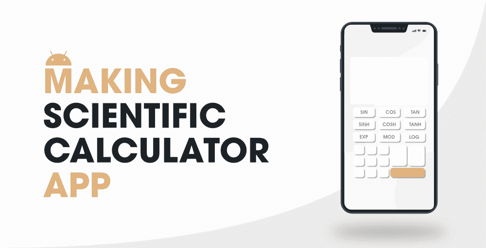

# 如何用安卓工作室制作科学计算器安卓 App？

> 原文:[https://www . geeksforgeeks . org/如何制作科学计算器-Android-app-use-Android-studio/](https://www.geeksforgeeks.org/how-to-make-a-scientific-calculator-android-app-using-android-studio/)

计算器是每个安卓设备上都有的应用程序。这个应用程序是预装的，或者我们也可以从 Play Store 安装另一个应用程序。对于大学生来说，做任何计算都是最常用的应用之一。在本文中，我们将看一下使用 **Kotlin** 在 Android 中构建一个简单的科学计算器应用。



> **注意:**要构建一个简单的计算器应用请参考这篇文章[如何使用 Android Studio 构建一个简单的计算器应用？](https://www.geeksforgeeks.org/how-to-build-a-simple-calculator-app-using-android-studio/)

### 我们将在本文中构建什么？

我们将构建一个科学计算器，在其中我们将执行一些数学运算，如加法、减法、平方根、阶乘等。下面给出了一个示例视频，以了解我们将在本文中做什么。

### **分步实施**

**第一步:创建新项目**

要在安卓工作室创建新项目，请参考[如何在安卓工作室创建/启动新项目](https://www.geeksforgeeks.org/android-how-to-create-start-a-new-project-in-android-studio/)。注意选择 **Java** 作为编程语言。

**第二步:给 colors.xml 文件添加新的颜色**

导航到**应用程序>RES>values>colors . XML**文件，并为不同的颜色添加下面的代码。代码中添加了注释，以便更详细地了解。

## 可扩展标记语言

```kt
<?xml version="1.0" encoding="utf-8"?>
<resources>

    <color name="purple_200">#0F9D58</color>
    <color name="purple_500">#0F9D58</color>
    <color name="purple_700">#0F9D58</color>
    <color name="teal_200">#FF03DAC5</color>
    <color name="teal_700">#FF018786</color>
    <color name="black">#FF000000</color>
    <color name="white">#FFFFFFFF</color>

    <!--three different shades of black color-->
    <color name="blac_shade_1">#292D36</color>
    <color name="black_shade_2">#272B33</color>
    <color name="black_shade_3">#22252D</color>
    <color name="yellow">#ffa500</color>

</resources>
```

**步骤 3:使用 activity_main.xml 文件**

导航到**应用程序> res >布局> activity_main.xml** 并将下面的代码添加到该文件中。下面是 **activity_main.xml** 文件的代码。

## 可扩展标记语言

```kt
<?xml version="1.0" encoding="utf-8"?>
<RelativeLayout
    xmlns:android="http://schemas.android.com/apk/res/android"
    xmlns:app="http://schemas.android.com/apk/res-auto"
    xmlns:tools="http://schemas.android.com/tools"
    android:layout_width="match_parent"
    android:layout_height="match_parent"
    android:background="@color/black_shade_3"
    tools:context=".MainActivity">

    <TextView
        android:id="@+id/idTVSecondary"
        android:layout_width="match_parent"
        android:layout_height="70dp"
        android:background="@color/black_shade_3"
        android:gravity="bottom"
        android:maxLines="1"
        android:padding="10dp"
        android:paddingTop="30dp"
        android:text=""
        android:textAlignment="viewEnd"
        android:textColor="@color/white"
        android:textSize="15sp"
        tools:ignore="RtlCompat" />

    <TextView
        android:id="@+id/idTVprimary"
        android:layout_width="match_parent"
        android:layout_height="100dp"
        android:layout_below="@id/idTVSecondary"
        android:background="@color/black_shade_3"
        android:gravity="bottom"
        android:maxLines="1"
        android:padding="10dp"
        android:text=""
        android:textAlignment="viewEnd"
        android:textColor="#fff"
        android:textSize="50sp"
        tools:ignore="RtlCompat" />

    <androidx.cardview.widget.CardView
        android:layout_width="match_parent"
        android:layout_height="match_parent"
        android:layout_below="@id/idTVprimary"
        android:background="@color/blac_shade_1"
        app:cardCornerRadius="4dp"
        app:cardElevation="2dp">

        <LinearLayout
            android:layout_width="match_parent"
            android:layout_height="match_parent"
            android:layout_weight="7"
            android:background="@color/blac_shade_1"
            android:orientation="vertical">

            <LinearLayout
                android:layout_width="match_parent"
                android:layout_height="match_parent"
                android:orientation="vertical"
                android:weightSum="7">

                <LinearLayout
                    android:layout_width="match_parent"
                    android:layout_height="match_parent"
                    android:layout_weight="1"
                    android:orientation="horizontal">

                    <LinearLayout
                        android:layout_width="match_parent"
                        android:layout_height="match_parent"
                        android:orientation="horizontal"
                        android:weightSum="4">

                        <Button
                            android:id="@+id/bac"
                            android:layout_width="match_parent"
                            android:layout_height="match_parent"
                            android:layout_margin="3dp"
                            android:layout_weight="1"
                            android:backgroundTint="@color/black_shade_2"
                            android:padding="6dp"
                            android:text="AC"
                            android:textColor="@color/yellow"
                            android:textSize="15sp"
                            tools:targetApi="lollipop" />

                        <Button
                            android:id="@+id/bc"
                            android:layout_width="match_parent"
                            android:layout_height="match_parent"
                            android:layout_margin="3dp"
                            android:layout_weight="1"
                            android:backgroundTint="@color/black_shade_2"
                            android:padding="6dp"
                            android:text="C"
                            android:textColor="@color/yellow"
                            android:textSize="15sp" />

                        <Button
                            android:id="@+id/bbrac1"
                            android:layout_width="match_parent"
                            android:layout_height="match_parent"
                            android:layout_margin="3dp"
                            android:layout_weight="1"
                            android:backgroundTint="@color/black_shade_2"
                            android:padding="6dp"
                            android:text="("
                            android:textColor="#ffa500"
                            android:textSize="15sp" />

                        <Button
                            android:id="@+id/bbrac2"
                            android:layout_width="match_parent"
                            android:layout_height="match_parent"
                            android:layout_margin="3dp"
                            android:layout_weight="1"
                            android:backgroundTint="@color/black_shade_2"
                            android:padding="6dp"
                            android:text=")"
                            android:textColor="#ffa500"
                            android:textSize="15sp" />

                    </LinearLayout>

                </LinearLayout>

                <LinearLayout
                    android:layout_width="match_parent"
                    android:layout_height="match_parent"
                    android:layout_weight="1"
                    android:orientation="horizontal">

                    <LinearLayout
                        android:layout_width="match_parent"
                        android:layout_height="match_parent"
                        android:orientation="horizontal"
                        android:weightSum="5">

                        <Button
                            android:id="@+id/bsin"
                            android:layout_width="match_parent"
                            android:layout_height="match_parent"
                            android:layout_margin="3dp"
                            android:layout_weight="1"
                            android:backgroundTint="@color/black_shade_2"
                            android:padding="6dp"
                            android:text="sin"
                            android:textAllCaps="false"
                            android:textColor="#ffa500"
                            android:textSize="15sp" />

                        <Button
                            android:id="@+id/bcos"
                            android:layout_width="match_parent"
                            android:layout_height="match_parent"
                            android:layout_margin="3dp"
                            android:layout_weight="1"
                            android:backgroundTint="@color/black_shade_2"
                            android:padding="6dp"
                            android:text="cos"
                            android:textAllCaps="false"
                            android:textColor="#ffa500"
                            android:textSize="15sp" />

                        <Button
                            android:id="@+id/btan"
                            android:layout_width="match_parent"
                            android:layout_height="match_parent"
                            android:layout_margin="3dp"
                            android:layout_weight="1"
                            android:backgroundTint="@color/black_shade_2"
                            android:padding="6dp"
                            android:text="tan"
                            android:textAllCaps="false"
                            android:textColor="#ffa500"
                            android:textSize="15sp" />

                        <Button
                            android:id="@+id/blog"
                            android:layout_width="match_parent"
                            android:layout_height="match_parent"
                            android:layout_margin="3dp"
                            android:layout_weight="1"
                            android:backgroundTint="@color/black_shade_2"
                            android:padding="6dp"
                            android:text="log"
                            android:textAllCaps="false"
                            android:textColor="#ffa500"
                            android:textSize="15sp" />

                        <Button
                            android:id="@+id/bln"
                            android:layout_width="match_parent"
                            android:layout_height="match_parent"
                            android:layout_margin="3dp"
                            android:layout_weight="1"
                            android:backgroundTint="@color/black_shade_2"
                            android:padding="6dp"
                            android:text="ln"
                            android:textAllCaps="false"
                            android:textColor="#ffa500"
                            android:textSize="15sp" />

                    </LinearLayout>

                </LinearLayout>

                <LinearLayout
                    android:layout_width="match_parent"
                    android:layout_height="match_parent"
                    android:layout_weight="1"
                    android:orientation="horizontal">

                    <LinearLayout
                        android:layout_width="match_parent"
                        android:layout_height="match_parent"
                        android:orientation="horizontal"
                        android:weightSum="5">

                        <Button
                            android:id="@+id/bfact"
                            android:layout_width="match_parent"
                            android:layout_height="match_parent"
                            android:layout_margin="3dp"
                            android:layout_weight="1"
                            android:backgroundTint="@color/black_shade_2"
                            android:padding="6dp"
                            android:text="x!"
                            android:textAllCaps="false"
                            android:textColor="#ffa500"
                            android:textSize="15sp" />

                        <Button
                            android:id="@+id/bsquare"
                            android:layout_width="match_parent"
                            android:layout_height="match_parent"
                            android:layout_margin="3dp"
                            android:layout_weight="1"
                            android:backgroundTint="@color/black_shade_2"
                            android:padding="6dp"
                            android:text="x²"
                            android:textAllCaps="false"
                            android:textColor="#ffa500"
                            android:textSize="15sp" />

                        <Button
                            android:id="@+id/bsqrt"
                            android:layout_width="match_parent"
                            android:layout_height="match_parent"
                            android:layout_margin="3dp"
                            android:layout_weight="1"
                            android:backgroundTint="@color/black_shade_2"
                            android:padding="6dp"
                            android:text="√"
                            android:textColor="#ffa500"
                            android:textSize="15sp" />

                        <Button
                            android:id="@+id/binv"
                            android:layout_width="match_parent"
                            android:layout_height="match_parent"
                            android:layout_margin="3dp"
                            android:layout_weight="1"
                            android:backgroundTint="@color/black_shade_2"
                            android:padding="6dp"
                            android:text="1/x"
                            android:textAllCaps="false"
                            android:textColor="#ffa500"
                            android:textSize="15sp" />

                        <Button
                            android:id="@+id/bdiv"
                            android:layout_width="match_parent"
                            android:layout_height="match_parent"
                            android:layout_margin="3dp"
                            android:layout_weight="1"
                            android:backgroundTint="@color/black_shade_2"
                            android:padding="6dp"
                            android:text="÷"
                            android:textColor="#ffa500"
                            android:textSize="15sp" />

                    </LinearLayout>

                </LinearLayout>

                <LinearLayout
                    android:layout_width="match_parent"
                    android:layout_height="match_parent"
                    android:layout_weight="1"
                    android:orientation="horizontal">

                    <LinearLayout
                        android:layout_width="match_parent"
                        android:layout_height="match_parent"
                        android:orientation="horizontal"
                        android:weightSum="4">

                        <Button
                            android:id="@+id/b7"
                            android:layout_width="match_parent"
                            android:layout_height="match_parent"
                            android:layout_margin="3dp"
                            android:layout_weight="1"
                            android:backgroundTint="@color/black_shade_2"
                            android:padding="6dp"
                            android:text="7"
                            android:textColor="#fff"
                            android:textSize="15sp" />

                        <Button
                            android:id="@+id/b8"
                            android:layout_width="match_parent"
                            android:layout_height="match_parent"
                            android:layout_margin="3dp"
                            android:layout_weight="1"
                            android:backgroundTint="@color/black_shade_2"
                            android:padding="6dp"
                            android:text="8"
                            android:textColor="#fff"
                            android:textSize="15sp" />

                        <Button
                            android:id="@+id/b9"
                            android:layout_width="match_parent"
                            android:layout_height="match_parent"
                            android:layout_margin="3dp"
                            android:layout_weight="1"
                            android:backgroundTint="@color/black_shade_2"
                            android:padding="6dp"
                            android:text="9"
                            android:textColor="#fff"
                            android:textSize="15sp" />

                        <Button
                            android:id="@+id/bmul"
                            android:layout_width="match_parent"
                            android:layout_height="match_parent"
                            android:layout_margin="3dp"
                            android:layout_weight="1"
                            android:backgroundTint="@color/black_shade_2"
                            android:padding="6dp"
                            android:text="×"
                            android:textColor="#ffa500"
                            android:textSize="15sp" />

                    </LinearLayout>

                </LinearLayout>

                <LinearLayout
                    android:layout_width="match_parent"
                    android:layout_height="match_parent"
                    android:layout_weight="1"
                    android:orientation="horizontal">

                    <LinearLayout
                        android:layout_width="match_parent"
                        android:layout_height="match_parent"
                        android:orientation="horizontal"
                        android:weightSum="4">

                        <Button
                            android:id="@+id/b4"
                            android:layout_width="match_parent"
                            android:layout_height="match_parent"
                            android:layout_margin="3dp"
                            android:layout_weight="1"
                            android:backgroundTint="@color/black_shade_2"
                            android:padding="6dp"
                            android:text="4"
                            android:textColor="#fff"
                            android:textSize="15sp" />

                        <Button
                            android:id="@+id/b5"
                            android:layout_width="match_parent"
                            android:layout_height="match_parent"
                            android:layout_margin="3dp"
                            android:layout_weight="1"
                            android:backgroundTint="@color/black_shade_2"
                            android:padding="6dp"
                            android:text="5"
                            android:textColor="#fff"
                            android:textSize="15sp" />

                        <Button
                            android:id="@+id/b6"
                            android:layout_width="match_parent"
                            android:layout_height="match_parent"
                            android:layout_margin="3dp"
                            android:layout_weight="1"
                            android:backgroundTint="@color/black_shade_2"
                            android:padding="6dp"
                            android:text="6"
                            android:textColor="#fff"
                            android:textSize="15sp" />

                        <Button
                            android:id="@+id/bminus"
                            android:layout_width="match_parent"
                            android:layout_height="match_parent"
                            android:layout_margin="3dp"
                            android:layout_weight="1"
                            android:backgroundTint="@color/black_shade_2"
                            android:padding="6dp"
                            android:text="-"
                            android:textColor="#ffa500"
                            android:textSize="15sp" />

                    </LinearLayout>

                </LinearLayout>

                <LinearLayout
                    android:layout_width="match_parent"
                    android:layout_height="match_parent"
                    android:layout_weight="1"
                    android:orientation="horizontal">

                    <LinearLayout
                        android:layout_width="match_parent"
                        android:layout_height="match_parent"
                        android:orientation="horizontal"
                        android:weightSum="4">

                        <Button
                            android:id="@+id/b1"
                            android:layout_width="match_parent"
                            android:layout_height="match_parent"
                            android:layout_margin="3dp"
                            android:layout_weight="1"
                            android:backgroundTint="@color/black_shade_2"
                            android:padding="6dp"
                            android:text="1"
                            android:textColor="#fff"
                            android:textSize="15sp" />

                        <Button
                            android:id="@+id/b2"
                            android:layout_width="match_parent"
                            android:layout_height="match_parent"
                            android:layout_margin="3dp"
                            android:layout_weight="1"
                            android:backgroundTint="@color/black_shade_2"
                            android:padding="6dp"
                            android:text="2"
                            android:textColor="#fff"
                            android:textSize="15sp" />

                        <Button
                            android:id="@+id/b3"
                            android:layout_width="match_parent"
                            android:layout_height="match_parent"
                            android:layout_margin="3dp"
                            android:layout_weight="1"
                            android:backgroundTint="@color/black_shade_2"
                            android:padding="6dp"
                            android:text="3"
                            android:textColor="#fff"
                            android:textSize="15sp" />

                        <Button
                            android:id="@+id/bplus"
                            android:layout_width="match_parent"
                            android:layout_height="match_parent"
                            android:layout_margin="3dp"
                            android:layout_weight="1"
                            android:backgroundTint="@color/black_shade_2"
                            android:padding="6dp"
                            android:text="+"
                            android:textColor="#ffa500"
                            android:textSize="15sp" />

                    </LinearLayout>

                </LinearLayout>

                <LinearLayout
                    android:layout_width="match_parent"
                    android:layout_height="match_parent"
                    android:layout_weight="1"
                    android:orientation="horizontal">

                    <LinearLayout
                        android:layout_width="match_parent"
                        android:layout_height="match_parent"
                        android:orientation="horizontal"
                        android:weightSum="4">

                        <Button
                            android:id="@+id/bpi"
                            android:layout_width="match_parent"
                            android:layout_height="match_parent"
                            android:layout_margin="3dp"
                            android:layout_weight="1"
                            android:backgroundTint="@color/black_shade_2"
                            android:padding="6dp"
                            android:text="π"
                            android:textColor="#fff"
                            android:textSize="15sp" />

                        <Button
                            android:id="@+id/b0"
                            android:layout_width="match_parent"
                            android:layout_height="match_parent"
                            android:layout_margin="3dp"
                            android:layout_weight="1"
                            android:backgroundTint="@color/black_shade_2"
                            android:padding="6dp"
                            android:text="0"
                            android:textColor="#fff"
                            android:textSize="15sp" />

                        <Button
                            android:id="@+id/bdot"
                            android:layout_width="match_parent"
                            android:layout_height="match_parent"
                            android:layout_margin="3dp"
                            android:layout_weight="1"
                            android:backgroundTint="@color/black_shade_2"
                            android:padding="6dp"
                            android:text="."
                            android:textColor="#fff"
                            android:textSize="15sp" />

                        <Button
                            android:id="@+id/bequal"
                            android:layout_width="match_parent"
                            android:layout_height="match_parent"
                            android:layout_margin="3dp"
                            android:layout_weight="1"
                            android:backgroundTint="@color/black_shade_2"
                            android:padding="6dp"
                            android:text="="
                            android:textColor="#ffa500"
                            android:textSize="15sp" />

                    </LinearLayout>

                </LinearLayout>

            </LinearLayout>

        </LinearLayout>

    </androidx.cardview.widget.CardView>

</RelativeLayout>
```

**第 4 步:使用**T2【主活动. kt】文件

转到 **MainActivity.kt** 文件，参考以下代码。下面是 **MainActivity.kt** 文件的代码。代码中添加了注释，以更详细地理解代码。

## 我的锅

```kt
import android.os.Bundle
import android.widget.Button
import android.widget.TextView
import android.widget.Toast
import androidx.appcompat.app.AppCompatActivity

class MainActivity : AppCompatActivity() {

    // creating variables for our text view and button
    lateinit var tvsec: TextView
    lateinit var tvMain: TextView
    lateinit var bac: Button
    lateinit var bc: Button
    lateinit var bbrac1: Button
    lateinit var bbrac2: Button
    lateinit var bsin: Button
    lateinit var bcos: Button
    lateinit var btan: Button
    lateinit var blog: Button
    lateinit var bln: Button
    lateinit var bfact: Button
    lateinit var bsquare: Button
    lateinit var bsqrt: Button
    lateinit var binv: Button
    lateinit var b0: Button
    lateinit var b9: Button
    lateinit var b8: Button
    lateinit var b7: Button
    lateinit var b6: Button
    lateinit var b5: Button
    lateinit var b4: Button
    lateinit var b3: Button
    lateinit var b2: Button
    lateinit var b1: Button
    lateinit var bpi: Button
    lateinit var bmul: Button
    lateinit var bminus: Button
    lateinit var bplus: Button
    lateinit var bequal: Button
    lateinit var bdot: Button
    lateinit var bdiv: Button

    override fun onCreate(savedInstanceState: Bundle?) {
        super.onCreate(savedInstanceState)
        setContentView(R.layout.activity_main)

        // initializing all our variables.
        tvsec = findViewById(R.id.idTVSecondary)
        tvMain = findViewById(R.id.idTVprimary)
        bac = findViewById(R.id.bac)
        bc = findViewById(R.id.bc)
        bbrac1 = findViewById(R.id.bbrac1)
        bbrac2 = findViewById(R.id.bbrac2)
        bsin = findViewById(R.id.bsin)
        bcos = findViewById(R.id.bcos)
        btan = findViewById(R.id.btan)
        blog = findViewById(R.id.blog)
        bln = findViewById(R.id.bln)
        bfact = findViewById(R.id.bfact)
        bsquare = findViewById(R.id.bsquare)
        bsqrt = findViewById(R.id.bsqrt)
        binv = findViewById(R.id.binv)
        b0 = findViewById(R.id.b0)
        b9 = findViewById(R.id.b9)
        b8 = findViewById(R.id.b8)
        b7 = findViewById(R.id.b7)
        b6 = findViewById(R.id.b6)
        b5 = findViewById(R.id.b5)
        b4 = findViewById(R.id.b4)
        b3 = findViewById(R.id.b3)
        b2 = findViewById(R.id.b2)
        b1 = findViewById(R.id.b1)
        bpi = findViewById(R.id.bpi)
        bmul = findViewById(R.id.bmul)
        bminus = findViewById(R.id.bminus)
        bplus = findViewById(R.id.bplus)
        bequal = findViewById(R.id.bequal)
        bdot = findViewById(R.id.bdot)
        bdiv = findViewById(R.id.bdiv)

        // adding on click listener to our all buttons.
        b1.setOnClickListener {
            // on below line we are appending 
            // the expression to our text view.
            tvMain.text = (tvMain.text.toString() + "1")
        }
        b2.setOnClickListener {
            // on below line we are appending 
            // the expression to our text view.
            tvMain.text = (tvMain.text.toString() + "2")
        }
        b3.setOnClickListener {
            // on below line we are appending 
            // the expression to our text view.
            tvMain.text = (tvMain.text.toString() + "3")
        }
        b4.setOnClickListener {
            tvMain.text = (tvMain.text.toString() + "4")
        }
        b5.setOnClickListener {
            tvMain.text = (tvMain.text.toString() + "5")
        }
        b6.setOnClickListener {
            tvMain.text = (tvMain.text.toString() + "6")
        }
        b7.setOnClickListener {
            tvMain.text = (tvMain.text.toString() + "7")
        }
        b8.setOnClickListener {
            tvMain.text = (tvMain.text.toString() + "8")
        }
        b9.setOnClickListener {
            tvMain.text = (tvMain.text.toString() + "9")
        }
        b0.setOnClickListener {
            tvMain.text = (tvMain.text.toString() + "0")
        }
        bdot.setOnClickListener {
            tvMain.text = (tvMain.text.toString() + ".")
        }
        bplus.setOnClickListener {
            tvMain.text = (tvMain.text.toString() + "+")
        }
        bdiv.setOnClickListener {
            tvMain.text = (tvMain.text.toString() + "/")
        }
        bbrac1.setOnClickListener {
            tvMain.text = (tvMain.text.toString() + "(")
        }
        bbrac2.setOnClickListener {
            tvMain.text = (tvMain.text.toString() + ")")
        }
        bpi.setOnClickListener {
            // on clicking on pi button we are adding 
            // pi value as 3.142 to our current value.
            tvMain.text = (tvMain.text.toString() + "3.142")
            tvsec.text = (bpi.text.toString())
        }
        bsin.setOnClickListener {
            tvMain.text = (tvMain.text.toString() + "sin")
        }
        bcos.setOnClickListener {
            tvMain.text = (tvMain.text.toString() + "cos")
        }
        btan.setOnClickListener {
            tvMain.text = (tvMain.text.toString() + "tan")
        }
        binv.setOnClickListener {
            tvMain.text = (tvMain.text.toString() + "^" + "(-1)")
        }
        bln.setOnClickListener {
            tvMain.text = (tvMain.text.toString() + "ln")
        }
        blog.setOnClickListener {
            tvMain.text = (tvMain.text.toString() + "log")
        }

        bminus.setOnClickListener {
            // on clicking on minus we are checking if
            // the user has already a minus operation on screen.
            // if minus operation is already present 
            // then we will not do anything.
            val str: String = tvMain.text.toString()
            if (!str.get(index = str.length - 1).equals("-")) {
                tvMain.text = (tvMain.text.toString() + "-")
            }
        }
        bmul.setOnClickListener {
            // if mul sign is not present in our 
            // text view then only we are adding
            // the multiplication operator to it.
            val str: String = tvMain.text.toString()
            if (!str.get(index = str.length - 1).equals("*")) {
                tvMain.text = (tvMain.text.toString() + "*")
            }
        }
        bsqrt.setOnClickListener {
            if (tvMain.text.toString().isEmpty()) {
                // if the entered number is empty we are displaying an error message.
                Toast.makeText(this, "Please enter a valid number..", Toast.LENGTH_SHORT).show()
            } else {
                val str: String = tvMain.text.toString()
                // on below line we are calculation
                // square root of the given number.
                val r = Math.sqrt(str.toDouble())
                // on below line we are converting our double
                // to string and then setting it to text view.
                val result = r.toString()
                tvMain.setText(result)
            }
        }
        bequal.setOnClickListener {
            val str: String = tvMain.text.toString()
            // on below line we are calling an evaluate
            // method to calculate the value of expressions.
            val result: Double = evaluate(str)
            // on below line we are getting result
            // and setting it to text view.
            val r = result.toString()
            tvMain.setText(r)
            tvsec.text = str
        }
        bac.setOnClickListener {
            // on clicking on ac button we are clearing 
            // our primary and secondary text view.
            tvMain.setText("")
            tvsec.setText("")
        }
        bc.setOnClickListener {
            // on clicking on c button we are clearing 
            // the last character by checking the length.
            var str: String = tvMain.text.toString()
            if (!str.equals("")) {
                str = str.substring(0, str.length - 1)
                tvMain.text = str
            }
        }
        bsquare.setOnClickListener {
            if (tvMain.text.toString().isEmpty()) {
                // if the entered number is empty we are displaying an error message.
                Toast.makeText(this, "Please enter a valid number..", Toast.LENGTH_SHORT).show()
            } else {
                // on below line we are getting the expression and then calculating the square of the number
                val d: Double = tvMain.getText().toString().toDouble()
                // on below line we are calculating the square.
                val square = d * d
                // after calculating the square we
                // are setting it to text view.
                tvMain.setText(square.toString())
                // on below line we are setting 
                // the d to secondary text view.
                tvsec.text = "$d²"
            }
        }
        bfact.setOnClickListener {
            if (tvMain.text.toString().isEmpty()) {
                // if the entered number is empty we are displaying an error message.
                Toast.makeText(this, "Please enter a valid number..", Toast.LENGTH_SHORT).show()
            } else {
                // on below line we are getting int value
                // and calculating the factorial value of the entered number.
                val value: Int = tvMain.text.toString().toInt()
                val fact: Int = factorial(value)
                tvMain.setText(fact.toString())
                tvsec.text = "$value`!"
            }

        }

    }

    fun factorial(n: Int): Int {
        // this method is use to find factorial
        return if (n == 1 || n == 0) 1 else n * factorial(n - 1)
    }

    fun evaluate(str: String): Double {
        return object : Any() {
            // on below line we ar creating variable 
            // for tracking the position and char pos.
            var pos = -1
            var ch = 0

            // below method is for moving to next character.
            fun nextChar() {
                // on below line we are incrementing our position
                // and moving it to next position.
                ch = if (++pos < str.length) str[pos].toInt() else -1
            }

            // this method is use to check the extra space 
            // present int the expression and removing it.
            fun eat(charToEat: Int): Boolean {
                while (ch == ' '.toInt()) nextChar()
                // on below line we are checking the char pos 
                // if both is equal then we are returning it to true.
                if (ch == charToEat) {
                    nextChar()
                    return true
                }
                return false
            }

            // below method is to parse our 
            // expression and to get the ans
            // in this we are calling a parse 
            // expression method to calculate the value.
            fun parse(): Double {
                nextChar()
                val x = parseExpression()
                if (pos < str.length) throw RuntimeException("Unexpected: " + ch.toChar())
                return x
            }

            // in this method we will only perform addition and 
            // subtraction operation on the expression.
            fun parseExpression(): Double {
                var x = parseTerm()
                while (true) {
                    if (eat('+'.toInt())) x += parseTerm() // addition
                    else if (eat('-'.toInt())) x -= parseTerm() // subtraction
                    else return x
                }
            }

            // in below method we will perform 
            // only multiplication and division operation.
            fun parseTerm(): Double {
                var x = parseFactor()
                while (true) {
                    if (eat('*'.toInt())) x *= parseFactor() // multiplication
                    else if (eat('/'.toInt())) x /= parseFactor() // division
                    else return x
                }
            }

            // below method is use to parse the factor
            fun parseFactor(): Double {
                //on below line we are checking for addition 
                // and subtraction and performing unary operations.
                if (eat('+'.toInt())) return parseFactor() // unary plus
                if (eat('-'.toInt())) return -parseFactor() // unary minus
                // creating a double variable for ans.
                var x: Double
                // on below line we are creating 
                // a variable for position.
                val startPos = pos
                // on below line we are checking 
                // for opening and closing parenthesis.
                if (eat('('.toInt())) { // parentheses
                    x = parseExpression()
                    eat(')'.toInt())
                } else if (ch >= '0'.toInt() && ch <= '9'.toInt() || ch == '.'.toInt()) {
                    // numbers
                    while (ch >= '0'.toInt() && ch <= '9'.toInt() || ch == '.'.toInt()) nextChar()
                    // on below line we are getting sub string from our string using start and pos.
                    x = str.substring(startPos, pos).toDouble()
                } else if (ch >= 'a'.toInt() && ch <= 'z'.toInt()) {
                    // on below function we are checking for the operator in our expression.
                    while (ch >= 'a'.toInt() && ch <= 'z'.toInt()) nextChar()
                    val func = str.substring(startPos, pos)
                    // calling a method to parse our factor.
                    x = parseFactor()
                    // on below line we are checking for square root.
                    x =
                        if (func == "sqrt") Math.sqrt(x)
                        // on below line we are checking for sin function 
                        // and calculating sin function using Math class.
                        else if (func == "sin") Math.sin(
                            Math.toRadians(x)
                            // on below line we are calculating the cos value
                        ) else if (func == "cos") Math.cos(
                            Math.toRadians(x)
                            // on below line we are calculating
                            // the tan value of our expression.
                        ) else if (func == "tan")
                            Math.tan(Math.toRadians(x))
                        // on below line we are calculating 
                        // log value of the expression.
                        else if (func == "log")
                            Math.log10(x)
                        // on below line we are calculating
                        // ln value of expression.
                        else if (func == "ln") Math.log(x)
                        // f we get any error then
                        // we simply return the exception.
                        else throw RuntimeException(
                            "Unknown function: $func"
                        )
                } else {
                    // if the condition not satisfy then we are returning the exception
                    throw RuntimeException("Unexpected: " + ch.toChar())
                }
                // on below line we are calculating the power of the expression.
                if (eat('^'.toInt())) x = Math.pow(x, parseFactor()) // exponentiation
                return x
            }
            // at last calling a parse for our expression.
        }.parse()
    }
}
```

现在运行您的应用程序，查看应用程序的输出。

**输出:**

<video class="wp-video-shortcode" id="video-605779-1" width="640" height="360" preload="metadata" controls=""><source type="video/mp4" src="https://media.geeksforgeeks.org/wp-content/uploads/20210515140312/20210515_140129.mp4?_=1">[https://media.geeksforgeeks.org/wp-content/uploads/20210515140312/20210515_140129.mp4](https://media.geeksforgeeks.org/wp-content/uploads/20210515140312/20210515_140129.mp4)</video>