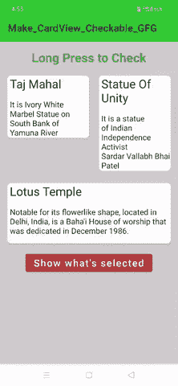

# 如何让 CardView 在安卓系统中可勾选？

> 原文:[https://www . geeksforgeeks . org/how-make-card view-checkable-in-Android/](https://www.geeksforgeeks.org/how-to-make-cardview-checkable-in-android/)

在安卓系统中，我们可以制作一个[卡片视图](https://www.geeksforgeeks.org/cardview-in-android-with-example/)可检查，这确实是一个有用的功能。如果我们想让用户选择一些项目，并想显示用户选择的项目，那么这是我们最重要的功能。下面给出了一个 GIF 示例，来了解一下我们将在本文中做什么。注意，我们将使用 **Kotlin** 语言来实现这个项目。



### **分步实施**

**第一步:创建新项目**

要在安卓工作室创建新项目，请参考[如何在安卓工作室创建/启动新项目](https://www.geeksforgeeks.org/android-how-to-create-start-a-new-project-in-android-studio/)。注意选择**科特林**作为编程语言。

**步骤 2:使用构建。梯度(应用级)文件**

导航至 **Gradle 脚本> build.gradle(模块:app)** 并在依赖项部分添加以下依赖项。

> 实现' com . Google . Android . material:material:1 . 1 . 0 '

在**插件{ }** 标签中添加 kotlin 安卓扩展。

> 插件{
> 
> ——–
> 
> ——–
> 
> id 'kotlin-android-extensions '
> 
> }

**步骤 3:使用 activity_main.xml 文件**

导航到**应用程序> res >布局> activity_main.xml** 并将下面的代码添加到该文件中。下面是 **activity_main.xml** 文件的代码。

## 可扩展标记语言

```kt
<?xml version="1.0" encoding="utf-8"?>
<!--Constraint Layout as the parent layout-->
<androidx.constraintlayout.widget.ConstraintLayout 
    xmlns:android="http://schemas.android.com/apk/res/android"
    xmlns:app="http://schemas.android.com/apk/res-auto"
    xmlns:tools="http://schemas.android.com/tools"
    android:layout_width="match_parent"
    android:layout_height="match_parent"
    android:background="#CFCDCD"
    tools:context=".MainActivity">

    <!--Linear Layout as the child layout-->
    <LinearLayout
        android:layout_width="match_parent"
        android:layout_height="match_parent"
        android:orientation="vertical"
        android:padding="15dp"
        tools:layout_editor_absoluteX="-16dp"
        tools:layout_editor_absoluteY="-287dp">

        <TextView
            android:layout_width="wrap_content"
            android:layout_height="wrap_content"
            android:layout_gravity="center_horizontal"
            android:text="Long Press to Check"
            android:textColor="#4CAF50"
            android:textSize="25sp"
            android:textStyle="bold" />

        <LinearLayout
            android:layout_width="match_parent"
            android:layout_height="wrap_content"
            android:orientation="horizontal"
            android:weightSum="1">

            <!--CardView for Taj Mahal -->
            <com.google.android.material.card.MaterialCardView
                android:id="@+id/cardTajMahal"
                android:layout_width="wrap_content"
                android:layout_height="wrap_content"
                android:layout_marginTop="20dp"
                android:layout_weight=".5"
                android:checkable="true"
                android:clickable="true"
                android:focusable="true"
                android:padding="4dp"
                app:cardBackgroundColor="@android:color/white"
                app:cardCornerRadius="7dp"
                app:cardElevation="3dp">

                <LinearLayout
                    android:layout_width="match_parent"
                    android:layout_height="wrap_content"
                    android:orientation="vertical">

                    <TextView
                        android:layout_width="match_parent"
                        android:layout_height="wrap_content"
                        android:layout_marginStart="5dp"
                        android:text="Taj Mahal"
                        android:textAppearance="@style/TextAppearance.AppCompat.Headline" />

                    <TextView
                        android:layout_width="wrap_content"
                        android:layout_height="wrap_content"
                        android:layout_marginStart="5dp"
                        android:layout_marginTop="15dp"
                        android:text="It is Ivory White Marbel Statue on South Bank of Yamuna River"
                        android:textAppearance="@style/TextAppearance.AppCompat.Subhead" />

                </LinearLayout>

            </com.google.android.material.card.MaterialCardView>

            <!--CardView for Statue of Unity -->
            <com.google.android.material.card.MaterialCardView
                android:id="@+id/cardStatueOfUnity"
                android:layout_width="wrap_content"
                android:layout_height="wrap_content"
                android:layout_marginStart="20dp"
                android:layout_marginTop="20dp"
                android:layout_weight=".5"
                android:checkable="true"
                android:clickable="true"
                android:focusable="true"
                android:padding="4dp"
                app:cardBackgroundColor="@android:color/white"
                app:cardCornerRadius="7dp"
                app:cardElevation="3dp">

                <LinearLayout
                    android:layout_width="match_parent"
                    android:layout_height="wrap_content"
                    android:orientation="vertical">

                    <TextView
                        android:layout_width="wrap_content"
                        android:layout_height="wrap_content"
                        android:layout_marginStart="5dp"
                        android:text="Statue Of Unity"
                        android:textAppearance="@style/TextAppearance.AppCompat.Headline" />

                    <TextView
                        android:layout_width="wrap_content"
                        android:layout_height="wrap_content"
                        android:layout_marginStart="5dp"
                        android:layout_marginTop="15dp"
                        android:text="It is a statue of Indian Independence Activist
                                  Sardar Vallabh Bhai Patel"
                        android:textAppearance="@style/TextAppearance.AppCompat.Subhead" />
                </LinearLayout>

            </com.google.android.material.card.MaterialCardView>

        </LinearLayout>

        <!--Card View for Lotus Temple-->
        <com.google.android.material.card.MaterialCardView
            android:id="@+id/cardLotusTemple"
            android:layout_width="match_parent"
            android:layout_height="wrap_content"
            android:layout_marginTop="25dp"
            android:layout_marginBottom="5dp"
            android:checkable="true"
            android:clickable="true"
            android:focusable="true"
            android:padding="4dp"
            app:cardBackgroundColor="@android:color/white"
            app:cardCornerRadius="7dp"
            app:cardElevation="3dp">

            <LinearLayout
                android:layout_width="match_parent"
                android:layout_height="wrap_content"
                android:orientation="vertical">

                <TextView
                    android:id="@+id/txvLotusTemple"
                    android:layout_width="wrap_content"
                    android:layout_height="wrap_content"
                    android:layout_marginStart="5dp"
                    android:text="Lotus Temple"
                    android:textAppearance="@style/TextAppearance.AppCompat.Headline" />

                <TextView
                    android:layout_width="wrap_content"
                    android:layout_height="wrap_content"
                    android:layout_marginStart="5dp"
                    android:layout_marginTop="15dp"
                    android:layout_marginBottom="15dp"
                    android:text="Notable for its flowerlike shape, located in Delhi, India, is a Baha'i House of worship that was dedicated in December 1986."
                    android:textAppearance="@style/TextAppearance.AppCompat.Subhead" />

            </LinearLayout>
        </com.google.android.material.card.MaterialCardView>

        <Button
            android:id="@+id/btnWhatsSelected"
            android:layout_width="wrap_content"
            android:layout_height="wrap_content"
            android:layout_gravity="center"
            android:layout_margin="10dp"
            android:backgroundTint="#B13C3C"
            android:text="Show what's selected"
            android:textAllCaps="false"
            android:textSize="20sp" />
    </LinearLayout>

</androidx.constraintlayout.widget.ConstraintLayout>
```

**第 4 步:使用**T2【主活动. kt】文件

转到 **MainActivity.kt** 文件，参考以下代码。下面是 **MainActivity.kt** 文件的代码。代码中添加了注释，以更详细地理解代码。

## 我的锅

```kt
import android.os.Bundle
import androidx.appcompat.app.AppCompatActivity
import com.google.android.material.snackbar.Snackbar
import kotlinx.android.synthetic.main.activity_main.*

class MainActivity : AppCompatActivity() {
    override fun onCreate(savedInstanceState: Bundle?) {
        super.onCreate(savedInstanceState)
        setContentView(R.layout.activity_main)

        // implementing the long click listener 
        // for when pressed on card view
        cardTajMahal.setOnLongClickListener {
            // if the card view is checked,make 
            // it unchecked and vice-versa
            cardTajMahal.isChecked = !cardTajMahal.isChecked
            true
        }

        // implementing the long click listener 
        // for when pressed on card view
        cardStatueOfUnity.setOnLongClickListener {
            cardStatueOfUnity.isChecked = !cardStatueOfUnity.isChecked
            true
        }

        // implementing the long click listener
        // for when pressed on card view
        cardLotusTemple.setOnLongClickListener {
            cardLotusTemple.isChecked = !cardLotusTemple.isChecked
            true
        }

        btnWhatsSelected.setOnClickListener {
            // getting the info about which 
            // card view has been selected
            var msg = ""
            if (cardTajMahal.isChecked) {
                msg += "'Taj Mahal' "
            }
            if (cardStatueOfUnity.isChecked) {
                msg += "'Statue Of Unity' "
            }
            if (cardTajMahal.isChecked) {
                msg += "'Lotus Temple' "
            }
            // snack bar is just like a toast msg
            Snackbar.make(it, " $msg Selected", Snackbar.LENGTH_LONG).show()
        }
    }
}
```

### 输出:

<video class="wp-video-shortcode" id="video-549288-1" width="640" height="360" preload="metadata" controls=""><source type="video/mp4" src="https://media.geeksforgeeks.org/wp-content/uploads/20201207165708/make_card_View_checkable.mp4?_=1">[https://media.geeksforgeeks.org/wp-content/uploads/20201207165708/make_card_View_checkable.mp4](https://media.geeksforgeeks.org/wp-content/uploads/20201207165708/make_card_View_checkable.mp4)</video>