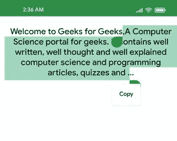

# 如何使用 Jetpack Compose 在安卓中让文本可选？

> 原文:[https://www . geeksforgeeks . org/如何使用 jetpack-compose/](https://www.geeksforgeeks.org/how-to-make-text-selectable-in-android-using-jetpack-compose/) 在安卓中制作可选文本

默认情况下，可组合文本是不可选择的，这意味着用户不能从您的应用程序中复制文本，要启用文本选择，您需要将文本元素包装到选择容器中。在本文中，我们将使用[安卓的 Jetpack Compose](https://www.geeksforgeeks.org/basics-of-jetpack-compose-in-android/) 来创建那些芯片。下面给出了一个示例图像，以说明我们将要构建的内容。请注意，我们将使用 Kotlin 语言实现这个项目。



### **分步实施**

**第一步:创建新项目**

要在安卓工作室金丝雀版本中创建新项目，请参考[如何使用 Jetpack Compose 在安卓工作室金丝雀版本中创建新项目。](https://www.geeksforgeeks.org/how-to-create-a-new-project-in-android-studio-canary-version-with-jetpack-compose/)

**步骤 2:使用 MainActivity.kt 文件**

导航到**应用程序> java >你的应用程序的包名，打开 MainActivity.kt** 文件。在该文件中添加下面的代码。代码中添加了注释，以更详细地理解代码。

## 我的锅

```
import android.os.Bundle
import androidx.activity.ComponentActivity
import androidx.activity.compose.setContent
import androidx.compose.foundation.layout.Column
import androidx.compose.foundation.layout.fillMaxWidth
import androidx.compose.foundation.layout.padding
import androidx.compose.foundation.text.selection.DisableSelection
import androidx.compose.foundation.text.selection.SelectionContainer
import androidx.compose.material.MaterialTheme
import androidx.compose.material.Surface
import androidx.compose.material.Text
import androidx.compose.runtime.Composable
import androidx.compose.ui.Modifier
import androidx.compose.ui.text.style.TextAlign
import androidx.compose.ui.tooling.preview.Preview
import androidx.compose.ui.unit.dp
import com.example.jetpack_playground.ui.theme.Jetpack_playgroundTheme

class MainActivity : ComponentActivity() {
    override fun onCreate(savedInstanceState: Bundle?) {
        super.onCreate(savedInstanceState)
        setContent {
            Jetpack_playgroundTheme {
                // A surface container using the 
                  // 'background' color from the theme
                Surface(color = MaterialTheme.colors.background) {
                    // call the CustomSelectableText() function
                    // it is defined below
                    Column {
                        CustomSelectableText()
                    }
                }
            }
        }
    }
}

// create a composable function
// for the selectable text.
// Wrap the text inside SelectionContainer()
// in order to make it selectable
@Composable
fun CustomSelectableText() {
    SelectionContainer() {
        Column() {
            Text(
                text = "Welcome to Geeks for Geeks,A Computer Science portal for geeks." +
                        "It contains well written, well thought and well explained computer " +
                        "science and programming articles, quizzes and ...",
                textAlign = TextAlign.Center,
                modifier = Modifier
                    .padding(start = 10.dp, top = 20.dp)
                    .fillMaxWidth()
            )
        }
    }
}

@Preview(showBackground = true)
@Composable
fun DefaultPreview() {
    Jetpack_playgroundTheme {
        CustomSelectableText()
    }
}
```

**输出:**

<video class="wp-video-shortcode" id="video-641639-1" width="640" height="360" preload="metadata" controls=""><source type="video/mp4" src="https://media.geeksforgeeks.org/wp-content/uploads/20210707235559/selectable_text_jetpack_compose_1_gfg.mp4?_=1">[https://media.geeksforgeeks.org/wp-content/uploads/20210707235559/selectable_text_jetpack_compose_1_gfg.mp4](https://media.geeksforgeeks.org/wp-content/uploads/20210707235559/selectable_text_jetpack_compose_1_gfg.mp4)</video>