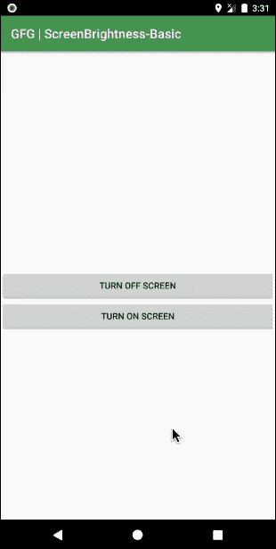

# 如何在安卓系统中编程最大化/最小化屏幕亮度？

> 原文:[https://www . geeksforgeeks . org/如何最大化-最小化-屏幕亮度-在安卓中以编程方式/](https://www.geeksforgeeks.org/how-to-maximize-minimize-screen-brightness-programmatically-in-android/)

屏幕亮度是直接影响用户和设备电池的因素之一。安卓设备是智能系统，内置自动亮度系统。但大多数情况下，用户不会检查或默认设置该功能。无论此功能是存在、开启或关闭，还是在任何设备中缺失，开发人员都必须考虑到这一点，并开发一个优化的应用程序。在应用程序内部声明的任何内容都可能对外部空间产生影响，也就是说，如果屏幕亮度是从应用程序以编程方式更改的，即使退出应用程序后，亮度值也可能保持不变。因此，在用户退出之前，必须尝试追溯原件并设置它们。

### 我们可以在哪里使用这个功能？

1.  **应用流式视频:**可以分析每一帧，并与房间的环境光进行比较，从而在向用户观看时做出改变。
2.  **电池电量低的情况:**如果电池电量低，可以将亮度设置为低值。
3.  **如果屏幕不活动或无响应:**如果屏幕不活动或无响应，在特定超时后亮度可能会降低。

下面给出一个 GIF 示例，来了解一下在本文 中我们要做什么。 注意，我们要用 **Kotlin** 语言来实现这个项目。



### 方法

**第一步:创建新项目**

要在安卓工作室创建新项目，请参考[如何在安卓工作室创建/启动新项目](https://www.geeksforgeeks.org/android-how-to-create-start-a-new-project-in-android-studio/)。注意选择**科特林**作为编程语言。

**步骤 2:使用 AndroidManifest.xml 文件**

控制设备屏幕亮度需要更改根设置，为此在[**androidmanifest . XML**](https://www.geeksforgeeks.org/application-manifest-file-android/)文件中声明 **WRITE_SETTINGS** 的**use-permission**。

> < uses-permission Android:name = " Android . permission . WRITE _ SETTINGS "
> 
> 工具:忽略=“受保护的权限”/>

下面是 **和** 文件的代码。

## 可扩展标记语言

```kt
<?xml version="1.0" encoding="utf-8"?>
<manifest 
    xmlns:android="http://schemas.android.com/apk/res/android"
    xmlns:tools="http://schemas.android.com/tools"
    package="org.geeksforgeeks.playingwithbrightness">

      <!--Add this permission-->
    <uses-permission android:name="android.permission.WRITE_SETTINGS"
        tools:ignore="ProtectedPermissions" />

    <application
        android:allowBackup="true"
        android:icon="@mipmap/ic_launcher"
        android:label="@string/app_name"
        android:roundIcon="@mipmap/ic_launcher_round"
        android:supportsRtl="true"
        android:theme="@style/AppTheme">
        <activity android:name=".MainActivity">
            <intent-filter>
                <action android:name="android.intent.action.MAIN" />

                <category android:name="android.intent.category.LAUNCHER" />
            </intent-filter>
        </activity>
    </application>

</manifest>
```