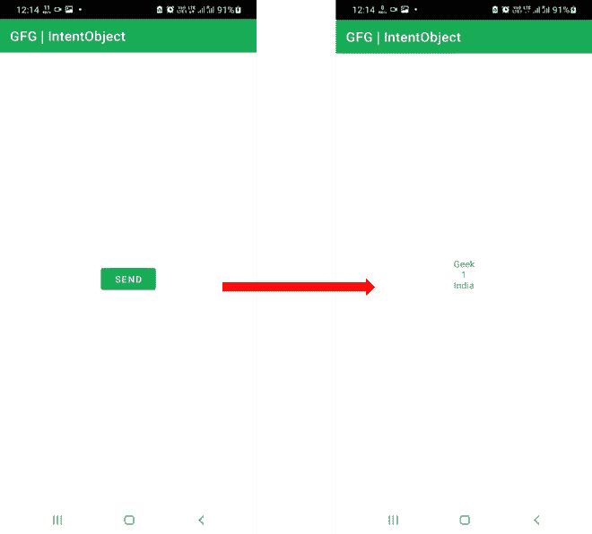

# 如何在 Android 中将可序列化对象从一个活动传递到另一个活动？

> 原文:[https://www . geeksforgeeks . org/如何在 android 中将可序列化的对象从一个活动传递到另一个活动/](https://www.geeksforgeeks.org/how-to-pass-a-serializable-object-from-one-activity-to-another-activity-in-android/)

在 Android 中开发应用程序时，开发人员可以在应用程序中创建多个活动。因此，可以有许多活动，并且可以将数据从一个活动传输到另一个活动。在这种情况下，使用意图。意图让用户从一个活动跳到另一个活动，或者从当前活动跳到下一个活动。当从一个活动转到另一个活动时，我们可以从当前活动中传递字符串、整数等参数，并在下一个活动中获取它们。



在本文中，我们将向您展示如何创建一个可序列化的对象，从一个活动中传递它，并在下一个活动中获取它。

### 逐步实施

**第一步:在安卓工作室新建项目**

要在安卓工作室创建新项目，请参考[如何在安卓工作室创建/启动新项目](https://www.geeksforgeeks.org/android-how-to-create-start-a-new-project-in-android-studio/)。我们在**科特林**中演示了该应用程序，因此在创建新项目时，请确保选择科特林作为主要语言。

**第二步:创建一个可序列化的对象(mycustomobject . kt*****)***

## 我的锅

```kt
import java.io.Serializable

class MyCustomObject: Serializable {

    var name = ""
    var id = 0
    var place = ""

    constructor(mName: String, mId: Int, mPlace: String){
        name = mName
        id = mId
        place = mPlace
    }

    constructor()
}
```

**第三步:在第一个活动(activity_main.xml)的布局中增加一个按钮**

## 可扩展标记语言

```kt
<?xml version="1.0" encoding="utf-8"?>
<RelativeLayout 
    xmlns:android="http://schemas.android.com/apk/res/android"
    xmlns:tools="http://schemas.android.com/tools"
    android:layout_width="match_parent"
    android:layout_height="match_parent"
    tools:context=".MainActivity">

    <Button
        android:id="@+id/btnSend"
        android:layout_width="wrap_content"
        android:layout_height="wrap_content"
        android:layout_centerInParent="true"
        android:text="Send" />

</RelativeLayout>
```

**第 4 步:将对象传递给新活动的程序(MainActivity.kt)**

## 我的锅

```kt
import android.content.Intent
import androidx.appcompat.app.AppCompatActivity
import android.os.Bundle
import android.widget.Button
import android.widget.EditText
import java.io.Serializable

class MainActivity : AppCompatActivity() {
    override fun onCreate(savedInstanceState: Bundle?) {
        super.onCreate(savedInstanceState)
        setContentView(R.layout.activity_main)

        val btn = findViewById<Button>(R.id.btnSend)

        btn.setOnClickListener {
            val intent = Intent(this, SecondActivity::class.java)
            val passingObject = MyCustomObject()
            passingObject.name = "Geek"
            passingObject.id = 1
            passingObject.place = "India"
            intent.putExtra("object", passingObject)
            startActivity(intent)
        }
    }
}
```

**第五步:创建一个新的活动 SecondActivity.kt 来捕捉传递的对象，并在第二个活动 activity_second.xml 的布局中添加一个 TextView**

## 我的锅

```kt
import androidx.appcompat.app.AppCompatActivity
import android.os.Bundle
import android.widget.TextView

class SecondActivity : AppCompatActivity() {
    override fun onCreate(savedInstanceState: Bundle?) {
        super.onCreate(savedInstanceState)
        setContentView(R.layout.activity_second)

        val myIntent = intent
        val derivedObject = myIntent.getSerializableExtra("object") as MyCustomObject

        val myTextView = findViewById<TextView>(R.id.tv1)
        myTextView.append(derivedObject.name + "\n")
        myTextView.append(derivedObject.id.toString() + "\n")
        myTextView.append(derivedObject.place + "\n")
    }
}
```

## 可扩展标记语言

```kt
<?xml version="1.0" encoding="utf-8"?>
<RelativeLayout 
    xmlns:android="http://schemas.android.com/apk/res/android"
    android:layout_width="match_parent"
    android:layout_height="match_parent">

    <TextView
        android:id="@+id/tv1"
        android:layout_width="match_parent"
        android:layout_height="wrap_content"
        android:gravity="center"
        android:layout_centerInParent="true"/>

</RelativeLayout>
```

**输出:**

<video class="wp-video-shortcode" id="video-656490-1" width="640" height="360" preload="metadata" controls=""><source type="video/mp4" src="https://media.geeksforgeeks.org/wp-content/uploads/20210728203219/output117.mp4?_=1">[https://media.geeksforgeeks.org/wp-content/uploads/20210728203219/output117.mp4](https://media.geeksforgeeks.org/wp-content/uploads/20210728203219/output117.mp4)</video>