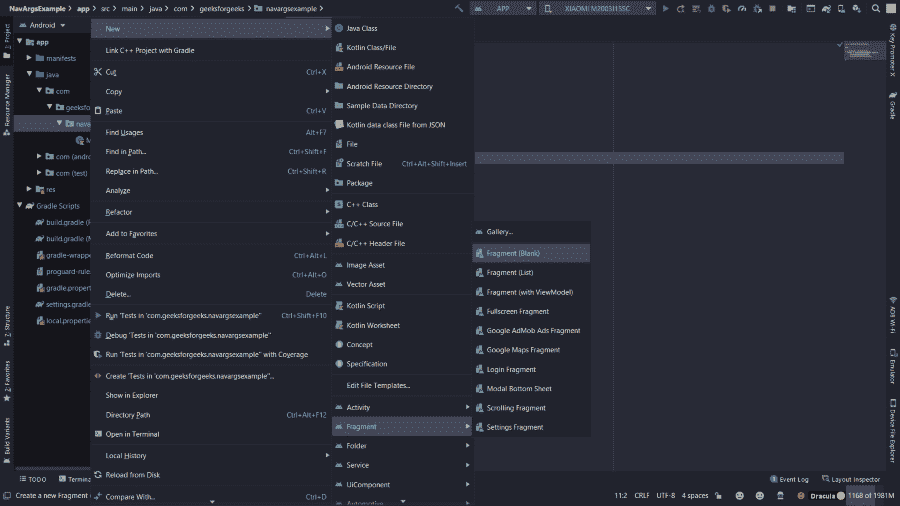
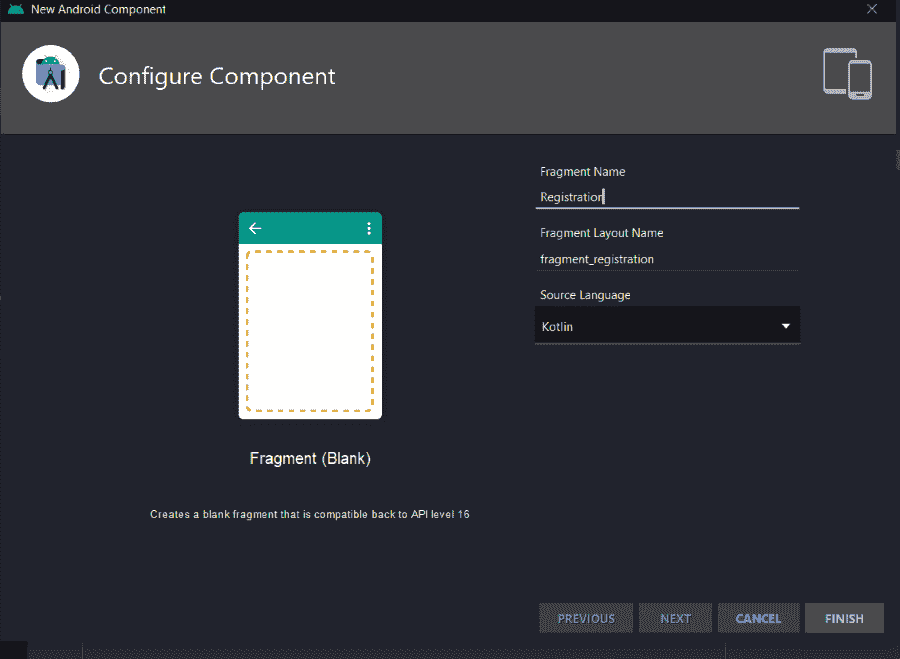
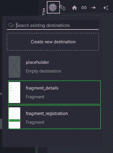

# 如何在安卓系统中使用安全参数将数据传递到目的地？

> 原文:[https://www . geesforgeks . org/如何使用 android 中的安全参数将数据传递到目的地/](https://www.geeksforgeeks.org/how-to-pass-data-to-destination-using-safe-args-in-android/)

**安全参数**是一个渐变插件，允许您将数据传递到目标用户界面组件。它生成简单的对象和生成器类，用于类型安全导航和访问任何关联的参数。[安全参数](https://developer.android.com/guide/navigation/navigation-pass-data)强烈推荐用于导航和传递数据，因为它确保类型安全。下面给出了一个示例视频，以了解我们将在本文中做什么。注意，我们将使用**柯特林**语言来实现这个项目。

<video class="wp-video-shortcode" id="video-552220-1" width="640" height="360" preload="metadata" controls=""><source type="video/mp4" src="https://media.geeksforgeeks.org/wp-content/uploads/20210126220409/safeArgs_gfg.mp4?_=1">[https://media.geeksforgeeks.org/wp-content/uploads/20210126220409/safeArgs_gfg.mp4](https://media.geeksforgeeks.org/wp-content/uploads/20210126220409/safeArgs_gfg.mp4)</video>

### 逐步实施

**第一步:创建新项目**

要在安卓工作室创建新项目，请参考[如何在安卓工作室创建/启动新项目](https://www.geeksforgeeks.org/android-how-to-create-start-a-new-project-in-android-studio/)。注意选择**科特林**作为编程语言。

**第二步:添加依赖关系**

在 **build.gradle(项目)**中，在 dependencies 下添加以下代码。

> 依赖项{
> 
> 类路径" andidx . navigation:navigation safe args gradle 插件:2.3.2 "
> 
> }

在 **build.gradle (app)** 中添加以下代码，点击**立即同步**

> 插件{
> 
> id 'com.android.application '
> 
> kot Lin Android id
> 
> id 'kotlin-android-extensions '
> 
> id " andidx . navigation . safeargs . kot Lin "
> 
> }

**第三步:创建两个新片段**

在本文中，我们将从一个[片段](https://www.geeksforgeeks.org/introduction-fragments-android/)发送数据，并在另一个片段中接收数据。首先，创建两个片段。要创建新片段:

> 项目名称(右键)->新建->片段->片段(空白)



将会打开一个对话框。在片段名称中写**注册**，在片段布局名称中写**片段 _ 注册**。以类似的方式创建另一个片段，片段名为**细节**，片段布局名为**片段 _ 细节**。



**第 4 步:创建两个片段的 XML 布局**

转到**Fragment _ registration . XML**文件，参考以下代码。下面是**文件的代码。这是应用程序中使用的基本布局。**

## 可扩展标记语言

```kt
<?xml version="1.0" encoding="utf-8"?>
<androidx.constraintlayout.widget.ConstraintLayout 
    xmlns:android="http://schemas.android.com/apk/res/android"
    xmlns:app="http://schemas.android.com/apk/res-auto"
    xmlns:tools="http://schemas.android.com/tools"
    android:layout_width="match_parent"
    android:layout_height="match_parent"
    tools:context=".Registration">

    <EditText
        android:id="@+id/et_name"
        android:layout_width="match_parent"
        android:layout_height="wrap_content"
        android:layout_alignParentStart="true"
        android:layout_alignParentEnd="true"
        android:layout_margin="20dp"
        android:ems="10"
        android:hint="Name"
        android:inputType="textPersonName"
        app:layout_constraintEnd_toEndOf="parent"
        app:layout_constraintStart_toStartOf="parent"
        app:layout_constraintTop_toTopOf="parent" />

    <EditText
        android:id="@+id/et_email"
        android:layout_width="match_parent"
        android:layout_height="wrap_content"
        android:ems="10"
        android:hint="Email"
        android:layout_margin="20dp"
        android:inputType="textPersonName"
        app:layout_constraintEnd_toEndOf="parent"
        app:layout_constraintStart_toStartOf="parent"
        app:layout_constraintTop_toBottomOf="@+id/et_name" />

    <EditText
        android:id="@+id/et_password"
        android:layout_width="match_parent"
        android:layout_height="wrap_content"
        android:ems="10"
        android:hint="Password"
        android:layout_margin="20dp"
        android:inputType="textPersonName"
        app:layout_constraintEnd_toEndOf="parent"
        app:layout_constraintStart_toStartOf="parent"
        app:layout_constraintTop_toBottomOf="@+id/et_email" />

    <Button
        android:id="@+id/button_send"
        android:layout_width="276dp"
        android:layout_height="50dp"
        android:text="Send"
        android:layout_margin="20dp"
        app:layout_constraintEnd_toEndOf="parent"
        app:layout_constraintStart_toStartOf="parent"
        app:layout_constraintTop_toBottomOf="@+id/et_password" />

</androidx.constraintlayout.widget.ConstraintLayout>
```

转到 **Fragment_detail.xml** 文件，参考以下代码。下面是**文件的代码。**

## 可扩展标记语言

```kt
<?xml version="1.0" encoding="utf-8"?>
<androidx.constraintlayout.widget.ConstraintLayout 
    xmlns:android="http://schemas.android.com/apk/res/android"
    xmlns:tools="http://schemas.android.com/tools"
    android:layout_width="match_parent"
    android:layout_height="match_parent"
    xmlns:app="http://schemas.android.com/apk/res-auto"
    tools:context=".Details">

 <TextView
     android:layout_width="wrap_content"
     android:layout_height="wrap_content"
     android:text="Name :"
     android:id="@+id/tv1"
     android:textSize="20sp"
     app:layout_constraintLeft_toLeftOf="parent"
     app:layout_constraintTop_toTopOf="parent"
     android:layout_marginTop="50dp"
     android:layout_marginStart="30dp"
     />

    <TextView
        android:layout_width="wrap_content"
        android:layout_height="wrap_content"
        android:textSize="20sp"
        android:textColor="@color/black"
        android:id="@+id/tv_name"
        app:layout_constraintLeft_toRightOf="@id/tv1"
        app:layout_constraintTop_toTopOf="@id/tv1"
        android:layout_marginStart="20dp"
        />
    <TextView
        android:layout_width="wrap_content"
        android:layout_height="wrap_content"
        android:text="Email :"
        android:id="@+id/tv2"
        android:textSize="20sp"
        app:layout_constraintTop_toBottomOf="@id/tv1"
        app:layout_constraintLeft_toLeftOf="parent"
        android:layout_marginTop="20dp"
        android:layout_marginStart="30dp"
        />

    <TextView
        android:layout_width="wrap_content"
        android:layout_height="wrap_content"
        android:textSize="20sp"
        android:textColor="@color/black"
        android:id="@+id/tv_email"
        app:layout_constraintLeft_toRightOf="@id/tv2"
        app:layout_constraintTop_toTopOf="@id/tv2"
        android:layout_marginStart="20dp"
        />

    <TextView
        android:layout_width="wrap_content"
        android:layout_height="wrap_content"
        android:text="Password :"
        android:id="@+id/tv3"
        android:textSize="20sp"
        app:layout_constraintTop_toBottomOf="@id/tv2"
        app:layout_constraintLeft_toLeftOf="parent"
        android:layout_marginTop="20dp"
        android:layout_marginStart="30dp"
        />

    <TextView
        android:layout_width="wrap_content"
        android:layout_height="wrap_content"
        android:textSize="20sp"
        android:textColor="@color/black"
        android:id="@+id/tv_password"
        app:layout_constraintLeft_toRightOf="@id/tv3"
        app:layout_constraintTop_toTopOf="@id/tv3"
        android:layout_marginStart="20dp"
        />

</androidx.constraintlayout.widget.ConstraintLayout>
```

**第五步:新建一个 Kotlin 类**

创建一个新的类 **User.kt** 我们将使用具有名称、电子邮件、密码的自定义通用“**用户**”的数据传递给另一个片段。

## 我的锅

```kt
import android.os.Parcelable
import kotlinx.android.parcel.Parcelize

@Parcelize
data class User(
    val name : String ="",
    val email : String= "",
    val password : String =""

) : Parcelable
```

**步骤 6:创建新的导航图**

> res(右键)->新建->安卓资源文件

在对话框中，将文件名写为 **nav_graph** ，选择资源类型为“**导航**”。然后单击确定。现在打开刚刚创建的 **nav_graph.xml** 文件，点击新的目标图标，选择两个片段。将 Fragment_registration 设为主页。创建从片段注册到片段细节的动作，并在片段细节的参数中传递**用户**参数。它的 XML 代码如下所示。



## 可扩展标记语言

```kt
<?xml version="1.0" encoding="utf-8"?>
<navigation 
    xmlns:android="http://schemas.android.com/apk/res/android"
    xmlns:app="http://schemas.android.com/apk/res-auto"
    xmlns:tools="http://schemas.android.com/tools"
    android:id="@+id/nav_graph"
    app:startDestination="@id/registration">

    <fragment
        android:id="@+id/registration"
        android:name="com.geeksforgeeks.navargsexample.Registration"
        android:label="fragment_registration"
        tools:layout="@layout/fragment_registration" >
        <action
            android:id="@+id/action_registration_to_details"
            app:destination="@id/details" />
    </fragment>

    <fragment
        android:id="@+id/details"
        android:name="com.geeksforgeeks.navargsexample.Details"
        android:label="fragment_details"
        tools:layout="@layout/fragment_details" >
        <argument
            android:name="user"
            app:argType="com.geeksforgeeks.navargsexample.User" />
    </fragment>

</navigation>
```

**第 7 步:使用 activity_main.xml 文件**

转到 **activity_main.xml** 文件，参考以下代码。下面是 activity_main.xml 文件的代码。这个布局包含一个框架布局和一个片段，它将作为我们之前创建的片段的宿主。注意片段标签中的**导航图**标签。

## 可扩展标记语言

```kt
<?xml version="1.0" encoding="utf-8"?>
<androidx.constraintlayout.widget.ConstraintLayout 
    xmlns:android="http://schemas.android.com/apk/res/android"
    xmlns:app="http://schemas.android.com/apk/res-auto"
    xmlns:tools="http://schemas.android.com/tools"
    android:layout_width="match_parent"
    android:layout_height="match_parent"
    tools:context=".MainActivity">

    <FrameLayout
        android:id="@+id/frameLayout"
        android:layout_width="match_parent"
        android:layout_height="0dp"
        app:layout_constraintEnd_toEndOf="parent"
        app:layout_constraintHorizontal_bias="0.5"
        app:layout_constraintStart_toStartOf="parent"
        app:layout_constraintTop_toTopOf="parent">

        <!--this fragmnet will act as the host for 
            both fragments in the main activity-->
        <fragment
            android:id="@+id/nav_Host_Fragment"
            android:name="androidx.navigation.fragment.NavHostFragment"
            android:layout_width="match_parent"
            android:layout_height="match_parent"
            app:defaultNavHost="true"
            app:navGraph="@navigation/nav_graph" 
            />

    </FrameLayout>

</androidx.constraintlayout.widget.ConstraintLayout>
```

**第八步:使用 Registration.kt 文件**

转到 **Registration.kt** 文件，参考以下代码。以下是**注册号**文件的代码。代码中添加了注释，以更详细地理解代码。

## 我的锅

```kt
import android.os.Bundle
import androidx.fragment.app.Fragment
import android.view.LayoutInflater
import android.view.View
import android.view.ViewGroup
import androidx.navigation.fragment.findNavController
import com.geeksforgeeks.navargsexample.databinding.FragmentRegistrationBinding

class Registration : Fragment() {

    private var _binding: FragmentRegistrationBinding? = null
    private val binding get() = _binding!!

    override fun onCreateView(
        inflater: LayoutInflater, container: ViewGroup?,
        savedInstanceState: Bundle?
    ): View {
        _binding = FragmentRegistrationBinding.inflate(inflater, container, false)
        val view = binding.root

        // call onClick on the SendButton
        binding.buttonSend.setOnClickListener {
            val name = binding.etName.text.toString()
            val email = binding.etEmail.text.toString()
            val password = binding.etPassword.text.toString()

            // create user object and pass the 
              // required arguments
            // that is name, email,and password
            val user = User(name,email, password)

            // create an action and pass the the required user object to it
            // If you can not find the RegistrationDirection try to "Build project"
            val action = RegistrationDirections.actionRegistrationToDetails(user)

            // this will navigate the current fragment i.e 
              // Registration to the Detail fragment
            findNavController().navigate(
                action
            )
        }
        return view
    }

    override fun onDestroyView() {
        super.onDestroyView()
        _binding = null
    }
}
```

**步骤 9:使用 Details.kt 文件**

转到 **Details.kt** 文件，参考以下代码。以下是**详细信息文件的代码。代码中添加了注释，以更详细地理解代码。**

## 我的锅

```kt
import android.os.Bundle
import androidx.fragment.app.Fragment
import android.view.LayoutInflater
import android.view.View
import android.view.ViewGroup
import androidx.navigation.fragment.navArgs
import com.geeksforgeeks.navargsexample.databinding.FragmentDetailsBinding

class Details : Fragment() {

    private var _binding: FragmentDetailsBinding? = null
    private val binding get() = _binding!!

    // get the arguments from the Registration fragment
    private val args : DetailsArgs by navArgs()

    override fun onCreateView(
        inflater: LayoutInflater, container: ViewGroup?,
        savedInstanceState: Bundle?
    ): View {
        _binding = FragmentDetailsBinding.inflate(inflater, container, false)
        val view = binding.root

        // Receive the arguments in a variable
        val userDetails = args.user

        // set the values to respective textViews
        binding.tvName.text = userDetails.name
        binding.tvEmail.text = userDetails.email
        binding.tvPassword.text = userDetails.password

        return view
    }

    override fun onDestroyView() {
        super.onDestroyView()
        _binding = null
    }
}
```

> **注意:**在这个例子中，我们不需要在 ActivityMain.kt 里面写任何代码

### 输出:

<video class="wp-video-shortcode" id="video-552220-2" width="640" height="360" preload="metadata" controls=""><source type="video/mp4" src="https://media.geeksforgeeks.org/wp-content/uploads/20210126220409/safeArgs_gfg.mp4?_=2">[https://media.geeksforgeeks.org/wp-content/uploads/20210126220409/safeArgs_gfg.mp4](https://media.geeksforgeeks.org/wp-content/uploads/20210126220409/safeArgs_gfg.mp4)</video>

github rest 在这里。