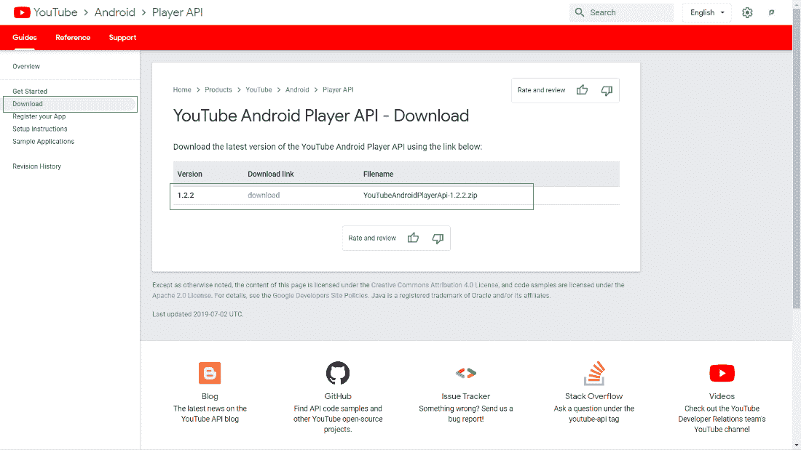
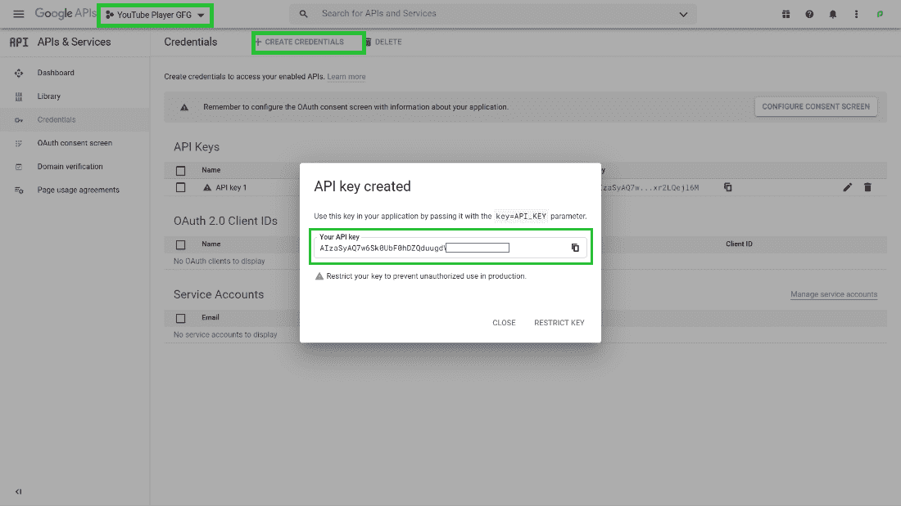

# 如何使用 YouTube API 在安卓系统中播放 YouTube 视频？

> 原文:[https://www . geesforgeks . org/how-play-YouTube-Android 中的视频-使用-youtube-api/](https://www.geeksforgeeks.org/how-to-play-youtube-video-in-android-using-youtube-api/)

**YouTube 安卓播放器应用编程接口**允许您在不离开应用的情况下播放应用内的任何 YouTube 视频或播放列表。下面给出了一个示例视频，以了解我们将在本文中做什么。注意，我们将使用 **Java** 和**柯特林**语言来实现这个项目。

<video class="wp-video-shortcode" id="video-557215-1" width="640" height="360" preload="metadata" controls=""><source type="video/mp4" src="https://media.geeksforgeeks.org/wp-content/uploads/20210209225758/youtube_payer_android_gfg.mp4?_=1">[https://media.geeksforgeeks.org/wp-content/uploads/20210209225758/youtube_payer_android_gfg.mp4](https://media.geeksforgeeks.org/wp-content/uploads/20210209225758/youtube_payer_android_gfg.mp4)</video>

### **分步实施**

**第一步:创建新项目**

要在安卓工作室创建新项目，请参考[如何在安卓工作室创建/启动新项目](https://www.geeksforgeeks.org/android-how-to-create-start-a-new-project-in-android-studio/)。注意，选择**柯特林/Java** 作为编程语言

**第二步:添加 YouTube Player 安卓 API**

从 [**这里**](https://developers.google.com/youtube/android/player/downloads) **下载添加 YouTube 安卓播放器 API。**下载后解压文件，复制到安卓项目的 **libs** 文件夹。

> **项目- > app - > libs**



**第三步:添加渐变依赖**

添加以下代码构建. gradle(app)，然后点击**立即同步**

> 实现文件(' libs \ \ YoutubeAnDroidplayerapi . jar ')

**第四步。添加 API 键播放 YouTube 视频**

通过访问此[链接添加 API 密钥。](https://console.developers.google.com/projectcreate?previousPage=%2Fapis%2Fcredentials%3Fproject%3Diintroidxprojects&folder=&organizationId=0)创建一个新项目，或者选择现有项目，创建一个应用编程接口密钥并保存在某个地方。我们稍后将在代码中使用它。



**第五步:添加互联网权限**

前往 **AndroidManifest.xml** 添加**互联网**权限。我们将需要它，以便在我们的应用程序中播放视频。

**第 6 步:使用 activity_main.xml 文件**

转到 **activity_main.xml** 文件，参考以下代码。下面是 **activity_main.xml** 文件的代码。

## 可扩展标记语言

```kt
<?xml version="1.0" encoding="utf-8"?>
<androidx.constraintlayout.widget.ConstraintLayout
    xmlns:android="http://schemas.android.com/apk/res/android"
    xmlns:app="http://schemas.android.com/apk/res-auto"
    xmlns:tools="http://schemas.android.com/tools"
    android:layout_width="match_parent"
    android:layout_height="match_parent"
    tools:context=".MainActivity">

    <com.google.android.youtube.player.YouTubePlayerView
        android:layout_width="match_parent"
        android:layout_height="wrap_content"
        android:id="@+id/ytPlayer"
        app:layout_constraintTop_toTopOf="parent"/>

</androidx.constraintlayout.widget.ConstraintLayout>
```

**步骤 7:使用主活动文件**

转到**主活动**文件，参考以下代码。以下是**主活动**文件的代码。代码中添加了注释，以更详细地理解代码。

## Java 语言(一种计算机语言，尤用于创建网站)

```kt
import android.os.Bundle;
import android.widget.Toast;
import androidx.annotation.Nullable;
import androidx.appcompat.app.AppCompatActivity;
import com.google.android.youtube.player.YouTubeInitializationResult;
import com.google.android.youtube.player.YouTubePlayer;
import com.google.android.youtube.player.YouTubePlayerView;

public class MainActivity extends AppCompatActivity {

    String api_key = "Enter your API key here";

    @Override
    protected void
    onCreate(@Nullable Bundle savedInstanceState)
    {
        super.onCreate(savedInstanceState);
        setContentView(R.layout.activity_main);

        // Get reference to the view of Video player
        YouTubePlayerView ytPlayer = (YouTubePlayerView)findViewById(R.id.ytPlayer);

        ytPlayer.initialize(
            api_key,
            new YouTubePlayer.OnInitializedListener() {
                // Implement two methods by clicking on red
                // error bulb inside onInitializationSuccess
                // method add the video link or the playlist
                // link that you want to play In here we
                // also handle the play and pause
                // functionality
                @Override
                public void onInitializationSuccess(
                    YouTubePlayer.Provider provider,
                    YouTubePlayer youTubePlayer, boolean b)
                {
                    youTubePlayer.loadVideo("HzeK7g8cD0Y");
                    youTubePlayer.play();
                }

                // Inside onInitializationFailure
                // implement the failure functionality
                // Here we will show toast
                @Override
                public void onInitializationFailure(YouTubePlayer.Provider provider,
                                                    YouTubeInitializationResult
                                                    youTubeInitializationResult)
                {
                    Toast.makeText(getApplicationContext(), "Video player Failed", Toast.LENGTH_SHORT).show();
                }
            });
    }
}
```

## 我的锅

```kt
import android.os.Bundle
import android.widget.Toast
import com.google.android.youtube.player.YouTubeBaseActivity
import com.google.android.youtube.player.YouTubeInitializationResult
import com.google.android.youtube.player.YouTubePlayer
import com.google.android.youtube.player.YouTubePlayerView

class MainActivity : YouTubeBaseActivity() {

    // Change the AppCompactActivity to YouTubeBaseActivity()

    // Add the api key that you had
    // copied from google API
    // This is a dummy api key
    val api_key =  "Enter your API key here"

    override fun onCreate(savedInstanceState: Bundle?) {
        super.onCreate(savedInstanceState)
        setContentView(R.layout.activity_main)

        // Get reference to the view of Video player
        val ytPlayer = findViewById<YouTubePlayerView>(R.id.ytPlayer)

        ytPlayer.initialize(api_key, object : YouTubePlayer.OnInitializedListener{
            // Implement two methods by clicking on red error bulb
            // inside onInitializationSuccess method
            // add the video link or the
            // playlist link that you want to play
            // In here we also handle the play and pause functionality
            override fun onInitializationSuccess(
                    provider: YouTubePlayer.Provider?,
                    player: YouTubePlayer?,
                    p2: Boolean
            ) {
                player?.loadVideo("HzeK7g8cD0Y")
                player?.play()
            }

            // Inside onInitializationFailure
            // implement the failure functionality
            // Here we will show toast
            override fun onInitializationFailure(
                    p0: YouTubePlayer.Provider?,
                    p1: YouTubeInitializationResult?
            ) {
               Toast.makeText(this@MainActivity , "Video player Failed" , Toast.LENGTH_SHORT).show()
            }
        })
    }
}
```

**输出:**

<video class="wp-video-shortcode" id="video-557215-2" width="640" height="360" preload="metadata" controls=""><source type="video/mp4" src="https://media.geeksforgeeks.org/wp-content/uploads/20210209225758/youtube_payer_android_gfg.mp4?_=2">[https://media.geeksforgeeks.org/wp-content/uploads/20210209225758/youtube_payer_android_gfg.mp4](https://media.geeksforgeeks.org/wp-content/uploads/20210209225758/youtube_payer_android_gfg.mp4)</video>