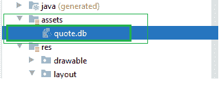

# 如何在安卓系统中预填充房间数据库？

> 原文:[https://www . geeksforgeeks . org/如何在 android 中预填充房间数据库/](https://www.geeksforgeeks.org/how-to-prepopulate-room-database-in-android/)

Room 是安卓中的 Jetpack 架构组件之一。这在 SQLite 数据库上提供了一个抽象层，用于在本地保存持久数据并对其执行操作。这是谷歌推荐的，而不是 SQLite 数据库，尽管 SQLite APIs 更强大，但它们相当低级，使用起来需要大量的时间和精力。但是，Room 使创建数据库并对其执行操作变得简单明了。但是预填充数据库意味着什么呢？**预填充数据库意味着在第一次运行时在数据库中有一些预加载的数据。**因此，我们将看到预填充房间数据库的实现。我们将从**应用资产**预填充数据库。

### 履行

我们需要一个预打包的数据库，它将存储在 android studio 的资产文件夹中。



**第一步:**

要从存储在资产中的预打包数据库中预填充房间数据库，我们需要从 **Room.databaseBuilder** 对象调用 createFromAsset()方法。现在我们将创建**数据实体**。它将是一个数据类，让我们给它命名为“Quote.kt”。参考以下代码。

## 我的锅

```kt
import androidx.room.Entity
import androidx.room.PrimaryKey

@Entity(tableName = "quote")
data class Quote(
    @PrimaryKey(autoGenerate = true)
    val id: Int,
    val text: String,
    val author: String
)
```

(autoGenerate = true)用于每当添加新数据时自动递增到 id。

**第二步:**

**那我们需要创造刀。**道是一个接口，所以不需要在里面定义方法。房间需要注意这些方法的实施。Dao 用于访问数据库中的数据对象。参考以下代码。

## 我的锅

```kt
import androidx.lifecycle.LiveData
import androidx.room.Dao
import androidx.room.Insert
import androidx.room.Query

@Dao
interface QuoteDao {
    @Insert
    suspend fun insert(quote: Quote)

    @Query("Select * From quote")
    fun getQuote(): LiveData<List<Quote>>
}
```

**第三步:**

**现在我们将创建数据库类**，它是应用程序持久化数据的主要访问点。这是一个抽象类，它扩展到了 RoomDatabase。在这里，我们在调用 build()之前，先从 Room.databaseBuilder 对象中调用 createFromAsset(“路径”)方法。参考以下代码。

## 我的锅

```kt
import android.content.Context
import androidx.room.Database
import androidx.room.Room
import androidx.room.RoomDatabase

@Database(entities = [Quote::class], version = 1)
abstract class QuoteDatabase : RoomDatabase() {
    abstract fun quoteDao(): QuoteDao

    companion object {
        private var INSTANCE: QuoteDatabase? = null
        fun getDatabase(context: Context): QuoteDatabase {
            if (INSTANCE == null) {
                synchronized(this) {
                    INSTANCE =
                        Room.databaseBuilder(context, QuoteDatabase::class.java, "quote_database")
                            .createFromAsset("quote.db")
                            .build()
                }
            }
            return INSTANCE!!
        }
    }
}
```

这就是我们如何实现预填充的房间持久性数据库。