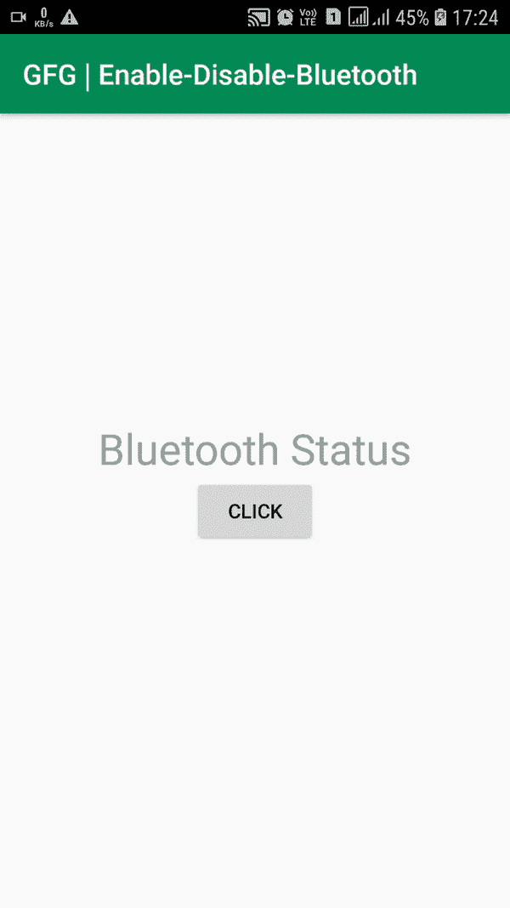

# 如何在安卓系统中编程启用/禁用蓝牙？

> 原文:[https://www . geesforgeks . org/如何以编程方式启用-禁用-安卓系统中的蓝牙/](https://www.geeksforgeeks.org/how-to-programmatically-enable-disable-bluetooth-in-android/)

在安卓手机中，使用蓝牙图标启用/禁用蓝牙非常容易，但是你有没有想过如何在安卓中以编程方式完成这个任务。 下面给出一个 GIF 示例，来了解一下我们在本文 中要做什么。 注意，我们要用 **Kotlin** 语言实现这个项目。



### **以编程方式启用/禁用蓝牙的步骤**

**第一步:创建新项目**

要在安卓工作室创建新项目，请参考[如何在安卓工作室创建/启动新项目](https://www.geeksforgeeks.org/android-how-to-create-start-a-new-project-in-android-studio/)。注意选择**科特林**作为编程语言。

**步骤 2:使用 AndroidManifest.xml 文件**

转到 **AndroidManifest.xml** 文件，添加两个用户权限:**蓝牙**和**蓝牙 _ADMIN** 。

下面是 **AndroidManifest.xml** 文件的代码。

## 可扩展标记语言

```
<?xml version="1.0" encoding="utf-8"?>
<manifest
    xmlns:android="http://schemas.android.com/apk/res/android"
    package="com.example.wifi">

    <!--Put the permissions between the manifest and application opening tags-->
    <uses-permission android:name="android.permission.BLUETOOTH"/>
    <uses-permission android:name="android.permission.BLUETOOTH_ADMIN"/>

    <application
        android:allowBackup="true"
        android:icon="@mipmap/ic_launcher"
        android:label="@string/app_name"
        android:roundIcon="@mipmap/ic_launcher_round"
        android:supportsRtl="true"
        android:theme="@style/AppTheme">
        <activity android:name=".MainActivity">
            <intent-filter>
                <action android:name="android.intent.action.MAIN" />

                <category android:name="android.intent.category.LAUNCHER" />
            </intent-filter>
        </activity>
    </application>

</manifest>
```

**步骤 3:使用 activity_main.xml 文件**

设置完成后，转到 **activity_main.xml** 文件，该文件代表项目的 UI。创建一个点击时改变蓝牙状态的[按钮](https://www.geeksforgeeks.org/button-in-kotlin/)和一个显示蓝牙状态的[文本视图](https://www.geeksforgeeks.org/textview-in-kotlin/)。下面是**activity _ main . XML**文件的代码。代码中添加了注释，以更详细地理解代码。

## 可扩展标记语言

```
<?xml version="1.0" encoding="utf-8"?>
<RelativeLayout 
    xmlns:android="http://schemas.android.com/apk/res/android"
    xmlns:tools="http://schemas.android.com/tools"
    android:layout_width="match_parent"
    android:layout_height="match_parent"
    tools:context=".MainActivity">

    <!--Changes the state of Bluetooth on button click-->
    <Button
        android:id="@+id/BtBtn"
        android:layout_width="wrap_content"
        android:layout_height="wrap_content"
        android:layout_centerInParent="true"
        android:text="Click" />

    <!--Displays the state of Bluetooth on button click-->
    <TextView
        android:id="@+id/BtTv"
        android:layout_width="wrap_content"
        android:layout_height="wrap_content"
        android:layout_above="@id/BtBtn"
        android:layout_centerHorizontal="true"
        android:hint="Bluetooth Status"
        android:textSize="30sp" />

</RelativeLayout>
```

**第 4 步:使用 MainActivity.kt 文件**

在 **MainActivity.kt** 文件中，声明按钮、文本视图和蓝牙适配器(参见代码)。将点击监听器设置为按钮时，使用蓝牙适配器启用或禁用蓝牙。下面是 **MainActivity.kt** 文件的代码。代码中添加了注释，以更详细地理解代码。

## 我的锅

```
import android.bluetooth.BluetoothAdapter
import android.os.Bundle
import android.widget.Button
import android.widget.TextView
import androidx.appcompat.app.AppCompatActivity

class MainActivity : AppCompatActivity() {
    override fun onCreate(savedInstanceState: Bundle?) {
        super.onCreate(savedInstanceState)
        setContentView(R.layout.activity_main)

        // Declaring Button and TextView
        // 1\. Changes the state of Bluetooth on button click
        // 2\. Shows the state of the Bluetooth
        val btnBt = findViewById<Button>(R.id.BtBtn)
        val tvBt = findViewById<TextView>(R.id.BtTv)

        // Declaring Bluetooth adapter
        val mBluetoothAdapter = BluetoothAdapter.getDefaultAdapter()

        // On button Click
        btnBt.setOnClickListener {

            // Enable or disable the Bluetooth and display
              // the state in Text View
            if (mBluetoothAdapter.isEnabled) {
                mBluetoothAdapter.disable()
                tvBt.text = "Bluetooth is OFF"
            } else {
                mBluetoothAdapter.enable()
                tvBt.text = "Bluetooth is ON"
            }
        }
    }
}
```

### 输出:在物理设备上运行

<video class="wp-video-shortcode" id="video-494557-1" width="640" height="360" preload="metadata" controls=""><source type="video/mp4" src="https://media.geeksforgeeks.org/wp-content/uploads/20200919172559/2020_09_19_17_25_04_trim.mp4?_=1">[https://media.geeksforgeeks.org/wp-content/uploads/20200919172559/2020_09_19_17_25_04_trim.mp4](https://media.geeksforgeeks.org/wp-content/uploads/20200919172559/2020_09_19_17_25_04_trim.mp4)</video>