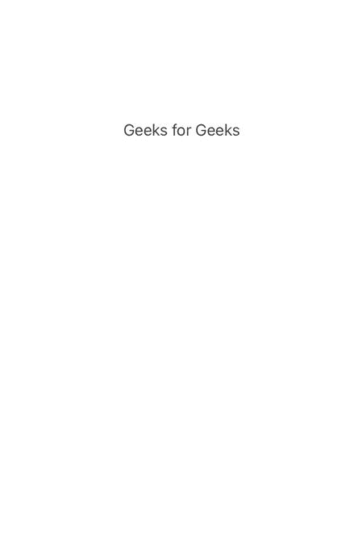

# 如何在安卓上编程截图？

> 原文:[https://www . geeksforgeeks . org/如何在安卓上以编程方式拍摄截图/](https://www.geeksforgeeks.org/how-to-programmatically-take-a-screenshot-on-android/)

有没有想过为某个特定的视图拍摄一些完美的截图，或者某个 UI 元素毁了你最喜欢的截图？不要太担心，这篇极客为极客写的文章将通过从头开始制作一个应用程序来帮助你实现它。由于下面是本文标题名称的代码，我们将讨论如何在安卓上以编程方式拍摄截图。

### **分步实施**

**第一步:创建新项目**

要在安卓工作室创建新项目，请参考[如何在安卓工作室创建/启动新项目](https://www.geeksforgeeks.org/android-how-to-create-start-a-new-project-in-android-studio/)。注意选择**科特林**作为编程语言。

**第二步:设计布局文件**

我们将从设计你想要捕捉的布局开始，这里我们将只添加一个基本的文本视图，然后截图。导航到**应用程序> res >布局> activity_main.xml** 并将下面的代码添加到该文件中。下面是 **activity_main.xml** 文件的代码。

## 可扩展标记语言

```kt
<?xml version="1.0" encoding="utf-8"?>
<android.support.constraint.ConstraintLayout
        xmlns:android="http://schemas.android.com/apk/res/android"
        xmlns:tools="http://schemas.android.com/tools"
        xmlns:app="http://schemas.android.com/apk/res-auto"
        android:layout_width="match_parent"
        android:layout_height="match_parent"
        android:id="@+id/container"
        tools:context=".GeeksforGeeksActivity">

    <TextView
            android:layout_width="wrap_content"
            android:layout_height="wrap_content"
            android:text="I am screenshot"
            android:id="@+id/textView"
            app:layout_constraintBottom_toBottomOf="parent"
            app:layout_constraintLeft_toLeftOf="parent"
            app:layout_constraintRight_toRightOf="parent"
            app:layout_constraintTop_toTopOf="parent"/>

</android.support.constraint.ConstraintLayout>
```

**第三步:让代码工作**

我们现在将添加代码，这是主题的主要症结，这将使实际拍摄截图，然后将其存储在您的设备上。

## 我的锅

```kt
private fun takeScreenShot(view: View): Bitmap {
    val thescreenshot = Bitmap.createBitmap(view.width, view.height, Bitmap.Config.ARGB_8888)
    val draw = Canvas(thescreenshot)
    val drawGeeks = view.background
    if (drawGeeks != null) drawGeeks.draw(draw)
    else draw.drawColor(Color.BLACK)
    view.draw(draw)
    return thescreenshot
}
```

视图是指我们希望捕获快照的布局视图。我们的代码中有一个 id 为容器的视图。

**第四步:做更好的事情**

我们还可以将下面的方法添加到文件中，这样我们就可以实现一些额外的功能，然后再次截图，这样效果会更好。在这种情况下，视图将是 ConstraintLayout(即容器)的 id。在这个方法中，我们将首先构造一个空位图，它必须作为函数的值返回。然后我们构建一个画布，并使用位图在上面进行绘制。它以可绘制的背景为背景。现在，我们将使用 view.draw 在画布(canvas)上绘制视图。最后，我们返回我们创建的位图，这是视图的位图。现在，在活动文件中，调用前面提到的方法，如下所示:

## 我的锅

```kt
class GeeksforGeeksActivity : AppCompatActivity() {
    override fun onCreate(savedInstanceState: Bundle?) {
        super.onCreate(savedInstanceState)
        setContentView(R.layout.activity_main)
        val geeksforgeekslLayout: ConstraintLayout = findViewById(R.id.gfgContainer)
        takeScreenShot(geeksforgeekslLayout)
    }

    private fun takeScreenShot(view: View): Bitmap {
        val screenshot= Bitmap.createBitmap(view.width, view.height, Bitmap.Config.ARGB_8888)
        val drawBoard = Canvas(returnedBitmap)
        val actualScreen = view.background
        if (actualScreen != null) actualScreen.draw(drawBoard)
        else drawBoard.drawColor(Color.WHITE)
        view.draw(drawBoard)
        return returnedBitmap
    }
}
```

**输出:**



图像#1。输出。

现在，这是我们在步骤 1 中创建的视图，这非常适合于我们需要从大量信息中总结或分离出一些特殊信息并隐藏这些信息的情况。

### 结论

这种方法可以用来为您想要的任何视图生成位图，以及任何小部件的屏幕截图，如图像视图或文本视图。