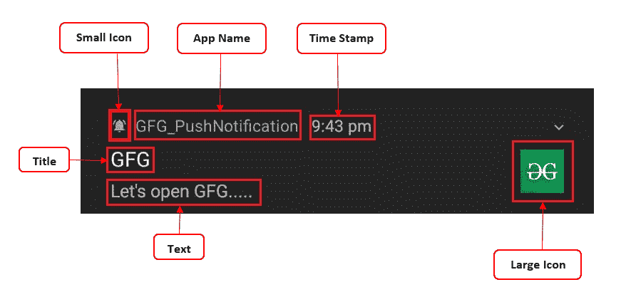

# 如何在安卓系统中推送通知？

> 原文:[https://www . geesforgeks . org/如何在安卓中推送通知/](https://www.geeksforgeeks.org/how-to-push-notification-in-android/)

通知是出现在我们的应用程序的正常用户界面之外的消息。通知可以以不同的格式和位置出现，例如状态栏中的图标、通知抽屉中更详细的条目等。通过通知，我们可以通知用户我们应用程序的任何重要更新和事件。通过点击通知，用户可以打开我们的应用程序的任何活动，或者可以做一些动作，如打开任何网页等。

### **通知看起来怎么样**？****

让我们看看导航抽屉中出现的通知模板的基本设计。



<figure class="table">

| 

通知的一部分

 | 

定义内容的方法

 | 

参数的类型需要传递到方法中

 |
| --- | --- | --- |
| 小图标 | **set mallicon()** | 需要传递一个可绘制的文件作为一个 ID，它是一个 **Int** 类型。 |
| 应用名称 | 默认情况下，应用程序名称由系统提供，我们不能覆盖它。 |
| 时间戳 | 默认情况下，时间戳是由系统提供的，但是我们可以通过 **setWhen()** 方法覆盖它。 | 应该传递一个长的数据类型。 |
| 标题 | set content title() | 应该传递一个**字符串**类型的数据。 |
| 文本 | set content text() | 应该传递一个**字符串**类型的数据。 |
| 大图标 | **【setlargecon()** | 一张**位图！**类型图像文件数据应通过。 |

</figure>

## 理解推送通知的一些重要概念

我们将逐步讨论下面提到的所有概念，

1.  **创建基本通知**
2.  **创建通知渠道**
3.  **添加大图标**
4.  **使通知可扩展**
5.  **使通知可点击**
6.  **在我们的通知中添加一个操作按钮**

### **1。创建基本通知**

要创建基本通知首先我们需要构建一个通知。现在要建立通知，我们必须使用**通知兼容性。Builder()** 类，我们需要在创建该类的实例时传递活动的上下文和通道 id 作为参数。请注意这里我们没有使用**通知。Builder()。** NotificationCompat 为较高版本(安卓 8.0 及以上)和较低版本(安卓 8.0 以下)提供兼容性。

## 我的锅

```
val nBuilder = NotificationCompat.Builder(this,CHANNEL_ID)
                    .setContentTitle(et1.text.toString())
                    .setContentText(et2.text.toString())
                    .setSmallIcon(R.drawable.spp_notification_foreground)
                    .setPriority(NotificationCompat.PRIORITY_DEFAULT)
                    .build()
```

> 请注意，这里我们需要通过 **setPriority()** 方法相应设置通知的优先级。

现在，为了传递通知，我们需要一个 NotificationManagerCompat 类的对象，然后我们通知它。

## 我的锅

```
val nManager = NotificationManagerCompat.from(this)
// Here we need to set an unique id for each
// notification and the notification Builder
            nManager.notify(1, nBuilder)
```