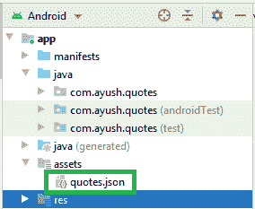
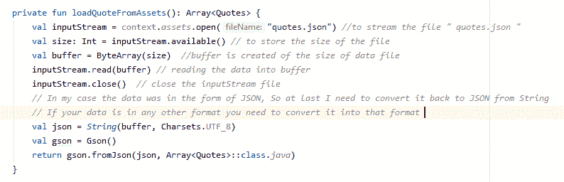

# 如何在安卓系统中读取文件？

> 原文:[https://www . geesforgeks . org/如何在安卓系统中读取文件/](https://www.geeksforgeeks.org/how-to-read-a-file-in-android/)

在 android 开发中，数据以文件、共享首选项和数据库的形式呈现。我们有不同格式的数据，根据我们的应用程序需要做的任务。在视频播放器或音乐播放器应用程序的情况下，我们在文件中有数据存储，**如何在本文学习的安卓**中读取这些文件。这里，首先我将在[资产文件夹中存储一个文件(在我的例子中是 JSON 文件)。](https://www.geeksforgeeks.org/assets-folder-in-android/)

quotes.json 是一个 json 文件，你也可以选择其他格式的文件

在计算机上的任何文件中，数据都以二进制形式存储，即 0 和 1。由于我们不能自己读取这些文件，要以人类可读的形式读取，我们需要解析文件。

**所以要读取文件并为我们解析它，我们将遵循以下步骤:**

*   **步骤 1:** 我们将使用 InputStream 打开文件，并将数据流式传输到其中。
*   **步骤 2:** 创建一个变量来存储文件的大小。
*   **步骤 3:** 创建一个文件大小的缓冲区。
*   **第 4 步:**我们将把 inputStream 文件读入缓冲区。
*   **第五步**:关闭 inputStream 文件。
*   **第 6 步:**将缓冲文件转换为您需要的数据格式。

### **解释**

*   **InputStream** 是 JAVA 中的一个类，用于以有序的字节序列进行读取。使用它，我们可以在安卓系统上读取文件。
*   那么我们为什么要使用缓冲区呢？嗯，我们也可以不用它来做这项工作，但是缓冲区有助于非常有效地读取文件。
*   InputStream 一次读取单个字节，因此最好一次读取字节数组以获得更好的性能。
*   因此，缓冲区帮助我们将字节转换成一个字节数组，一次可以轻松读取一次。

最后 3 行是将缓冲区中的数据更改为 JSON 数据，因为最初我以 JSON 格式存储文件，然后我使用 GSON 将 JSON 数据转换为 JAVA 对象(如果您的文件格式不同，您可以忽略最后 3 行)。