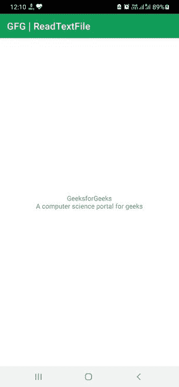

# 如何在安卓系统中读取文本文件？

> 原文:[https://www . geesforgeks . org/如何阅读安卓文本文件/](https://www.geeksforgeeks.org/how-to-read-a-text-file-in-android/)

文本文件是一种可以存储一系列字符或文本的文件。这些字符可以是任何人类可读的。这类文件没有任何文本格式，如粗体、斜体、下划线、字体、字号等。安卓系统中的文本文件可以用来访问或读取其中的信息或文本。也就是说，信息可以存储在文本文件中，并且可以在运行时随时访问。因此，通过这篇文章，我们将向您展示如何在安卓系统中从文本文件中读取或获取文本。

### 逐步实施

**第一步:在安卓工作室新建项目**

要在安卓工作室创建新项目，请参考[如何在安卓工作室创建/启动新项目](https://www.geeksforgeeks.org/android-how-to-create-start-a-new-project-in-android-studio/)。我们在 **Kotlin** 中演示了该应用程序，因此在创建新项目时，请确保选择 Kotlin 作为主要语言。

**第二步:创建资产文件夹**

请参考安卓工作室中的[资产文件夹，在安卓工作室中创建一个资产文件夹。我们将在资产文件夹中创建一个文本文件。](https://www.geeksforgeeks.org/assets-folder-in-android/)

**第三步:在资产文件夹**中创建文本文件

我们可以创建一个文本文件，只需右键单击资产文件夹，将鼠标拖动到 new 上，然后单击 file。现在输入一些想要的名字，添加”。txt "分机，并按回车键。另一种方法是在桌面上创建一个文本文件，并简单地将其复制到资产文件夹中。我们的文本文件是这样的:

**我的文本.txt：**

```kt
GeeksforGeeks
A computer science portal for geeks
```

**第四步:在布局文件(activity_main.xml)中添加一个 TextView**

我们将在布局中添加一个[文本视图](https://www.geeksforgeeks.org/textview-widget-in-android-using-java-with-examples/)，以显示文本文件中的文本。

## 可扩展标记语言

```kt
<?xml version="1.0" encoding="utf-8"?>
<RelativeLayout 
    xmlns:android="http://schemas.android.com/apk/res/android"
    xmlns:tools="http://schemas.android.com/tools"
    android:layout_width="match_parent"
    android:layout_height="match_parent"
    tools:context=".MainActivity">

    <!-- A TextView to show the data from the text file-->
    <TextView
        android:id="@+id/textView"
        android:layout_width="wrap_content"
        android:layout_height="wrap_content"
        android:layout_centerInParent="true"
        android:gravity="center"/>

</RelativeLayout>
```

**第五步:用主代码(MainActivity.kt)** 编写下面的程序

在主代码中，我们将读取文本文件，并在文本视图中显示该文件中的文本。为了更好的理解，请参考几乎每一行代码的注释。

## 我的锅

```kt
import androidx.appcompat.app.AppCompatActivity
import android.os.Bundle
import android.widget.TextView
import java.io.*

class MainActivity : AppCompatActivity() {

    override fun onCreate(savedInstanceState: Bundle?) {
        super.onCreate(savedInstanceState)
        setContentView(R.layout.activity_main)

        // Declaring and initializing the TextView from the layout
        val myTextView = findViewById<TextView>(R.id.textView)

        // A string variable to store the text from the text file
        val myOutput: String

        // Declaring an input stream to read data
        val myInputStream: InputStream

        // Try to open the text file, reads 
        // the data and stores it in the string
        try {
            myInputStream = assets.open("MyText.txt")
            val size: Int = myInputStream.available()
            val buffer = ByteArray(size)
            myInputStream.read(buffer)
            myOutput = String(buffer)

            // Sets the TextView with the string
            myTextView.text = myOutput

        } catch (e: IOException) {
            // Exception
            e.printStackTrace()
        }
    }
}
```

**输出:**

一旦应用程序启动，我们可以看到文本文件中的文本显示在文本视图中。

