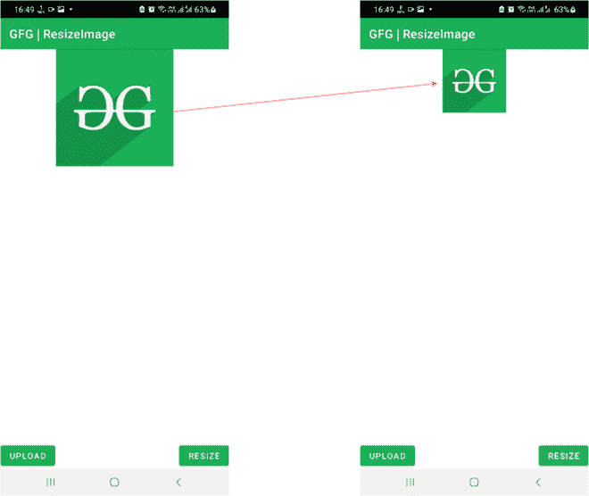

# 如何在安卓中编程调整图像大小？

> 原文:[https://www . geeksforgeeks . org/如何在安卓中以编程方式调整图像大小/](https://www.geeksforgeeks.org/how-to-resize-images-programmatically-in-android/)

网上有许多应用程序可用于执行图像操作，如裁剪、减小图像文件大小或将图像调整到特定尺寸。这些应用程序大多基于应用编程接口，其中图像被上传到匿名服务器，执行各种功能，然后显示为可供下载的结果。随着互联网的介入，这个过程变得复杂起来。然而，很少有应用程序可以在本地执行类似的操作。



通过这篇文章，我们将向您展示如何在安卓系统中以编程方式将图像调整到自定义尺寸。

### 逐步实施

**第一步:在安卓工作室新建项目**

要在安卓工作室创建新项目，请参考[如何在安卓工作室创建/启动新项目](https://www.geeksforgeeks.org/android-how-to-create-start-a-new-project-in-android-studio/)。我们在**科特林**中演示了该应用程序，因此在创建新项目时，请确保选择科特林作为主要语言。

**步骤 2:使用 activity_main.xml 文件**

导航到**应用程序> res >布局> activity_main.xml** ，并将下面的代码添加到该文件中。下面是 **activity_main.xml** 文件的代码。添加两个**按钮**以上传和调整大小，添加一个[图像视图](https://www.geeksforgeeks.org/imageview-in-android-with-example/)以在布局中显示上传和调整大小后的图像。

## 可扩展标记语言

```kt
<?xml version="1.0" encoding="utf-8"?>
<RelativeLayout
    xmlns:android="http://schemas.android.com/apk/res/android"
    xmlns:app="http://schemas.android.com/apk/res-auto"
    xmlns:tools="http://schemas.android.com/tools"
    android:layout_width="match_parent"
    android:layout_height="match_parent"
    tools:context=".MainActivity">

    <!-- Button to upload Image from the device -->
    <Button
        android:id="@+id/upload_button"
        android:layout_width="wrap_content"
        android:layout_height="wrap_content"
        android:layout_alignParentBottom="true"
        android:text="Upload"/>

    <!-- Button to perform resize operation -->
    <Button
        android:id="@+id/resize_button"
        android:layout_width="wrap_content"
        android:layout_height="wrap_content"
        android:layout_alignParentBottom="true"
        android:text="Resize"
        android:layout_alignParentRight="true"
        android:layout_alignParentEnd="true" />

    <!-- ImageView to display images after
          uploading and resizing -->
    <ImageView
        android:id="@+id/imageView"
        android:layout_width="match_parent"
        android:layout_height="wrap_content"
        android:layout_centerHorizontal="true"/>

</RelativeLayout>
```

**第三步:使用**T2【主活动. kt】文件

转到 **MainActivity.kt** 文件，参考以下代码。下面是 **MainActivity.kt** 文件的代码。代码中添加了注释，以更详细地理解代码。在主代码中执行调整大小操作。

## 我的锅

```kt
import android.app.Activity
import android.content.Intent
import android.graphics.Bitmap
import android.graphics.ImageDecoder
import android.net.Uri
import android.os.Build
import androidx.appcompat.app.AppCompatActivity
import android.os.Bundle
import android.provider.MediaStore
import android.widget.Button
import android.widget.ImageView
import android.widget.Toast
import androidx.annotation.RequiresApi
import java.io.IOException

class MainActivity : AppCompatActivity() {

    // Declaring ImageView, number of images to pick
    // from the device and a Bitmap to store the image
    private lateinit var mImageView: ImageView
    private val mPickImage = 1
    private lateinit var mYourBitmap: Bitmap

    override fun onCreate(savedInstanceState: Bundle?) {
        super.onCreate(savedInstanceState)
        setContentView(R.layout.activity_main)

        // Declaring and initializing the buttons
        val mUploadButton = findViewById<Button>(R.id.upload_button)
        val mResizeButton = findViewById<Button>(R.id.resize_button)

        // Initializing the image view
        mImageView = findViewById(R.id.imageView)

        // When upload button is clicked, the intent navigates
        // to the local content in the device,
        // where one can select the desired image
        mUploadButton.setOnClickListener {
            val intent = Intent(Intent.ACTION_GET_CONTENT)
            intent.type = "image/*"
            startActivityForResult(intent, mPickImage)
        }

        // When resize button is clicked
        mResizeButton.setOnClickListener {
            // Generate a new Bitmap of custom dimensions and set it in the image view
            val resized = Bitmap.createScaledBitmap(mYourBitmap, 300, 300, true)
            mImageView.setImageBitmap(resized)
        }
    }

    @RequiresApi(Build.VERSION_CODES.P)
    override fun onActivityResult(requestCode: Int, resultCode: Int, data: Intent?) {
        super.onActivityResult(requestCode, resultCode, data)
        if (requestCode == mPickImage && resultCode == Activity.RESULT_OK) {
            // If the image file does not exist
            if (data == null) {
                Toast.makeText(applicationContext,"Error",Toast.LENGTH_SHORT).show()
                return
            }

            // Otherwise
            try {
                // Load the image address and set it in the image view
                val imageUri: Uri = data.data!!
                val source = ImageDecoder.createSource(this.contentResolver, imageUri)
                mYourBitmap = ImageDecoder.decodeBitmap(source)
                mImageView.setImageBitmap(mYourBitmap)
            } catch (e: IOException) {
                e.printStackTrace()
            }
        }
    }
}
```

**输出:**

您可以看到，当单击调整大小按钮时，图像大小会减小。

<video class="wp-video-shortcode" id="video-659847-1" width="640" height="360" preload="metadata" controls=""><source type="video/mp4" src="https://media.geeksforgeeks.org/wp-content/uploads/20210804112618/284.mp4?_=1">[https://media.geeksforgeeks.org/wp-content/uploads/20210804112618/284.mp4](https://media.geeksforgeeks.org/wp-content/uploads/20210804112618/284.mp4)</video>