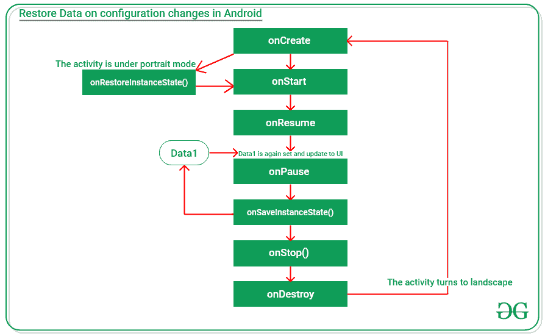
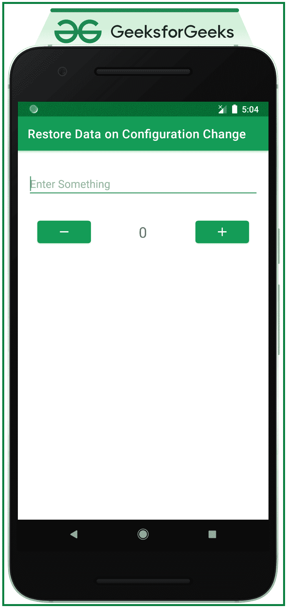

# 如何使用捆绑包恢复安卓系统中更改配置的数据？

> 原文:[https://www . geeksforgeeks . org/如何使用捆绑包恢复安卓系统中更改配置的数据/](https://www.geeksforgeeks.org/how-to-restore-data-on-configuration-changed-in-android-using-bundles/)

在安卓系统中，如果应用程序的配置发生变化，例如安卓屏幕旋转时，一些数据会丢失并重置。尤其是来自变量的数据。所以这个问题可以通过覆盖函数**onsavesentacestate()**和**onrestorenstatestate()来解决。**所以在本文中，我们已经讨论了如何使用流程图来详细解决这个问题，以便理解何时调用上述函数。请注意，我们将使用 **Kotlin** 语言来实现该项目。

**下面是一个流程图，表示如何在 UI 中调用方法和恢复及更新数据:**



### **分步实施**

**第一步:创建一个空的活动项目**

*   使用安卓工作室创建一个新的空活动安卓工作室项目。参考[安卓|如何在安卓工作室创建/启动新项目？](https://www.geeksforgeeks.org/android-how-to-create-start-a-new-project-in-android-studio/)，要知道如何创建一个空的活动 Android Studio 项目。

**步骤 2:使用 activity_main.xml 文件**

*   应用程序的主布局包含[编辑文本](https://www.geeksforgeeks.org/android-edittext-in-kotlin/)，一个[文本视图](https://www.geeksforgeeks.org/textview-in-kotlin/)，两个[按钮](https://www.geeksforgeeks.org/button-in-kotlin/)，增加和减少文本视图的值。
*   要实现用户界面，在 **activity_main.xml** 文件中调用以下代码。

## 可扩展标记语言

```kt
<?xml version="1.0" encoding="utf-8"?>
<androidx.constraintlayout.widget.ConstraintLayout 
    xmlns:android="http://schemas.android.com/apk/res/android"
    xmlns:app="http://schemas.android.com/apk/res-auto"
    xmlns:tools="http://schemas.android.com/tools"
    android:layout_width="match_parent"
    android:layout_height="match_parent"
    tools:context=".MainActivity"
    tools:ignore="HardcodedText">

    <EditText
        android:id="@+id/editText"
        android:layout_width="match_parent"
        android:layout_height="wrap_content"
        android:layout_marginStart="16dp"
        android:layout_marginTop="32dp"
        android:layout_marginEnd="16dp"
        android:hint="Enter Something"
        app:layout_constraintEnd_toEndOf="parent"
        app:layout_constraintStart_toStartOf="parent"
        app:layout_constraintTop_toTopOf="parent" />

    <Button
        android:id="@+id/decrementB"
        android:layout_width="wrap_content"
        android:layout_height="wrap_content"
        android:layout_marginStart="32dp"
        android:layout_marginTop="32dp"
        app:icon="@drawable/ic_remove"
        app:iconGravity="textStart"
        app:iconPadding="0dp"
        app:layout_constraintStart_toStartOf="parent"
        app:layout_constraintTop_toBottomOf="@+id/editText" />

    <TextView
        android:id="@+id/counterText"
        android:layout_width="wrap_content"
        android:layout_height="wrap_content"
        android:text="0"
        android:textSize="24sp"
        app:layout_constraintBottom_toBottomOf="@+id/incrementB"
        app:layout_constraintEnd_toStartOf="@+id/incrementB"
        app:layout_constraintHorizontal_bias="0.497"
        app:layout_constraintStart_toEndOf="@+id/decrementB"
        app:layout_constraintTop_toTopOf="@+id/incrementB" />

    <Button
        android:id="@+id/incrementB"
        android:layout_width="wrap_content"
        android:layout_height="wrap_content"
        android:layout_marginTop="32dp"
        android:layout_marginEnd="32dp"
        app:icon="@drawable/ic_add"
        app:iconGravity="textStart"
        app:iconPadding="0dp"
        app:layout_constraintEnd_toEndOf="parent"
        app:layout_constraintTop_toBottomOf="@+id/editText" />

</androidx.constraintlayout.widget.ConstraintLayout>
```

**输出:**



**第三步:使用 MainActivity.kt 文件**

*   在 MainActivity 中，kt 文件中的两个函数**onsavesentate(outState:Bundle)**和**onRestoreInstanceState(savedInstanceState:Bundle)**必须被覆盖，onsavesentate 函数将数据放入名为 outState 的 Bundle 中，onrestore instancestate 函数使用名为 savedInstanceState 的 Bundle 接收数据。参考上面提供的流程图，获得清晰的流程。
*   为了实现相同的功能，在 **MainActivity.kt** 文件中调用以下代码。
*   代码中添加了注释，以更详细地理解代码。

## 我的锅

```kt
import androidx.appcompat.app.AppCompatActivity
import android.os.Bundle
import android.widget.Button
import android.widget.EditText
import android.widget.TextView

class MainActivity : AppCompatActivity() {

    // instances of all the UI elements
    lateinit var editText: EditText
    lateinit var counterText: TextView
    lateinit var incrementB: Button
    lateinit var decrementB: Button

    // counter to increment or 
      // decrement the counter text
    var countInt: Int = 0

    override fun onCreate(savedInstanceState: Bundle?) {
        super.onCreate(savedInstanceState)
        setContentView(R.layout.activity_main)

        // register all the UI elements with 
          // their appropriate IDs
        editText = findViewById(R.id.editText)
        incrementB = findViewById(R.id.incrementB)
        decrementB = findViewById(R.id.decrementB)
        counterText = findViewById(R.id.counterText)

        // handle the increment button
        incrementB.setOnClickListener {
            if (countInt >= 0) {
                countInt++
                counterText.text = countInt.toString()
            }
        }

        // handle the decrement button
        decrementB.setOnClickListener {
            if (countInt > 0) {
                countInt--
                counterText.text = countInt.toString()
            }
        }
    }

    override fun onSaveInstanceState(outState: Bundle) {
        super.onSaveInstanceState(outState)

        // put the unique key value with the data
          // to be restored after configuration changes
        outState.putInt("counterData", countInt)
    }

    override fun onRestoreInstanceState(savedInstanceState: Bundle) {
        super.onRestoreInstanceState(savedInstanceState)

        // get the stored data from the bundle using the unique key
        countInt = savedInstanceState.getInt("counterData")

        // update the UI
        counterText.text = countInt.toString()
    }
}
```

### **输出:**

<video class="wp-video-shortcode" id="video-547005-1" width="640" height="360" preload="metadata" controls=""><source type="video/mp4" src="https://media.geeksforgeeks.org/wp-content/uploads/20210123181531/Untitled.mp4?_=1">[https://media.geeksforgeeks.org/wp-content/uploads/20210123181531/Untitled.mp4](https://media.geeksforgeeks.org/wp-content/uploads/20210123181531/Untitled.mp4)</video>