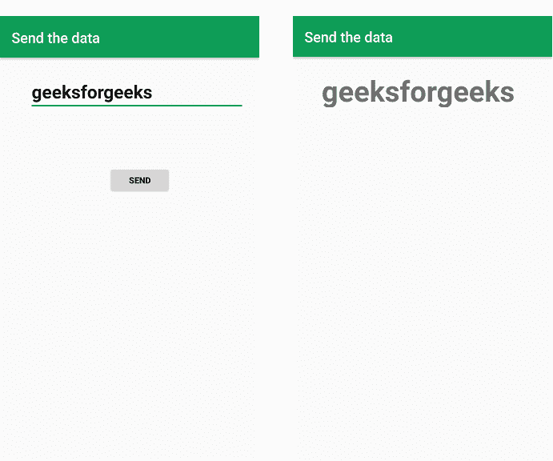

# 如何使用 Kotlin 将数据发送回安卓系统中的 MainActivity？

> 原文:[https://www . geeksforgeeks . org/如何使用 kotlin 将数据发送回 android 中的 main activity/](https://www.geeksforgeeks.org/how-to-send-data-back-to-mainactivity-in-android-using-kotlin/)

由于发送数据的方法很多，但在本文中，我们将使用 **startActivityForResult()** 方法。这里我们需要使用 **startActivityForResult()** 方法启动一个子活动。然后，从子活动中，我们可以轻松地将数据发送回主活动。

**例**:



> **注**:用 java 实现参考本文:[如何使用 Java](https://www.geeksforgeeks.org/android-how-to-send-data-from-one-activity-to-second-activity/) 将数据从一个活动发送到第二个活动

### 逐步实施

**第一步** : [使用 kotlin](https://www.geeksforgeeks.org/how-to-create-project-in-android-studio-using-kotlin/) 在安卓中创建新项目

**第 2 步**:为主要活动创建 XML 布局

## 可扩展标记语言

```kt
<?xml version="1.0" encoding="utf-8"?>
<androidx.constraintlayout.widget.ConstraintLayout 
    xmlns:android="http://schemas.android.com/apk/res/android"
    xmlns:app="http://schemas.android.com/apk/res-auto"
    xmlns:tools="http://schemas.android.com/tools"
    android:layout_width="match_parent"
    android:layout_height="match_parent"
    tools:context=".MainActivity">

    <ImageView
        android:layout_width="80dp"
        android:layout_height="80dp"
        android:src="@drawable/ic_geeksforgeeks"
        app:layout_constraintBottom_toTopOf="@+id/textView"
        app:layout_constraintEnd_toEndOf="parent"
        app:layout_constraintStart_toStartOf="parent"
        app:layout_constraintTop_toTopOf="parent" />

    <TextView
        android:id="@+id/textView"
        android:layout_width="wrap_content"
        android:layout_height="wrap_content"
        android:text="Text View"
        android:textColor="#7CB342"
        android:textSize="20dp"
        android:textStyle="bold"
        app:layout_constraintBottom_toBottomOf="parent"
        app:layout_constraintLeft_toLeftOf="parent"
        app:layout_constraintRight_toRightOf="parent"
        app:layout_constraintTop_toTopOf="parent"
        app:layout_constraintVertical_bias="0.303" />

</androidx.constraintlayout.widget.ConstraintLayout>
```

**第三步:**下面是 MainActivity.kt 文件的代码

## 我的锅

```kt
package com.ayush.gfg_exit

import android.content.Intent
import androidx.appcompat.app.AppCompatActivity
import android.os.Bundle
import android.widget.Button
import android.widget.TextView
import android.widget.Toast
import kotlin.properties.Delegates

class MainActivity : AppCompatActivity() {

    override fun onCreate(savedInstanceState: Bundle?) {
        super.onCreate(savedInstanceState)
        setContentView(R.layout.activity_main)

        findViewById<Button>(R.id.btnMain).setOnClickListener {
            val intent = Intent(this, ChildActivity::class.java)
             // 0 is request code
            startActivityForResult(intent, 0) 
        }
    }

      // this called after child activity finishes.
    override fun onActivityResult(requestCode: Int, resultCode: Int, data: Intent?) {
        super.onActivityResult(requestCode, resultCode, data)

        if (requestCode == 0) {
            if (resultCode == RESULT_OK) {
                // Get the result from intent
                val result = intent.getStringExtra("result")
                // set the result to the text view
                findViewById<TextView>(R.id.textView).text = result
            }
        }
    }
}
```

**第 4 步**:子活动的 XML

## 可扩展标记语言

```kt
<?xml version="1.0" encoding="utf-8"?>
<androidx.constraintlayout.widget.ConstraintLayout
    xmlns:android="http://schemas.android.com/apk/res/android"
    xmlns:app="http://schemas.android.com/apk/res-auto"
    xmlns:tools="http://schemas.android.com/tools"
    android:layout_width="match_parent"
    android:layout_height="match_parent"
    tools:context=".ChildActivity">

    <EditText
        android:id="@+id/etChild"
        android:layout_width="match_parent"
        android:layout_height="wrap_content"
        android:layout_margin="15dp"
        app:layout_constraintBottom_toBottomOf="parent"
        app:layout_constraintEnd_toEndOf="parent"
        app:layout_constraintHorizontal_bias="0.444"
        app:layout_constraintStart_toStartOf="parent"
        app:layout_constraintTop_toTopOf="parent"
        app:layout_constraintVertical_bias="0.263" />

    <Button
        android:id="@+id/btnChild"
        android:layout_width="wrap_content"
        android:layout_height="wrap_content"
        android:text="Send data to MainActivity"
        app:layout_constraintBottom_toBottomOf="parent"
        app:layout_constraintEnd_toEndOf="parent"
        app:layout_constraintHorizontal_bias="0.496"
        app:layout_constraintStart_toStartOf="parent"
        app:layout_constraintTop_toBottomOf="@+id/etChild"
        app:layout_constraintVertical_bias="0.241" />

</androidx.constraintlayout.widget.ConstraintLayout>
```

**步骤 5:** 以下是儿童活动文件的代码

## 我的锅

```kt
package com.ayush.gfg_exit

import android.app.Activity
import android.content.Intent
import androidx.appcompat.app.AppCompatActivity
import android.os.Bundle
import android.widget.Button
import android.widget.EditText

class ChildActivity : AppCompatActivity() {
    lateinit var etChild: EditText
    override fun onCreate(savedInstanceState: Bundle?) {
        super.onCreate(savedInstanceState)
        setContentView(R.layout.activity_child)

        etChild = findViewById(R.id.etChild)
        findViewById<Button>(R.id.btnChild).setOnClickListener {
            val result = etChild.text.toString()
            val intent = Intent()
            intent.putExtra("result", result)
            setResult(Activity.RESULT_OK, intent)
            finish()
        }
    }
}
```

所以我们的应用已经准备好了。

**输出:**

<video class="wp-video-shortcode" id="video-727183-1" width="640" height="360" preload="metadata" controls=""><source type="video/mp4" src="https://media.geeksforgeeks.org/wp-content/uploads/20211202015350/video_2021-12-02_01-53-30.mp4?_=1">[https://media.geeksforgeeks.org/wp-content/uploads/20211202015350/video_2021-12-02_01-53-30.mp4](https://media.geeksforgeeks.org/wp-content/uploads/20211202015350/video_2021-12-02_01-53-30.mp4)</video>