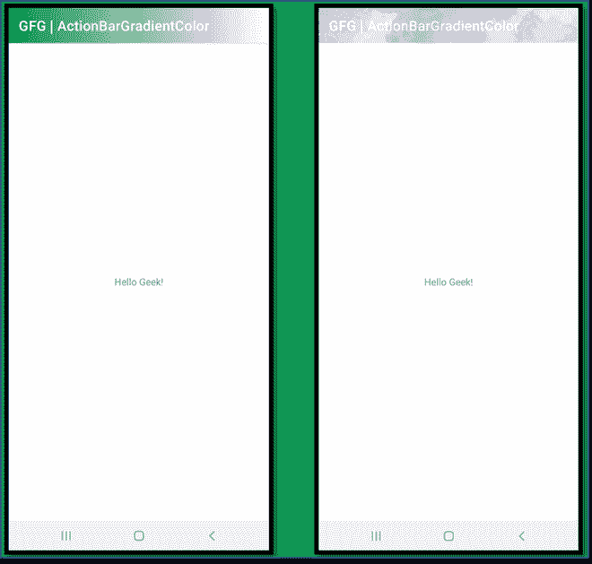
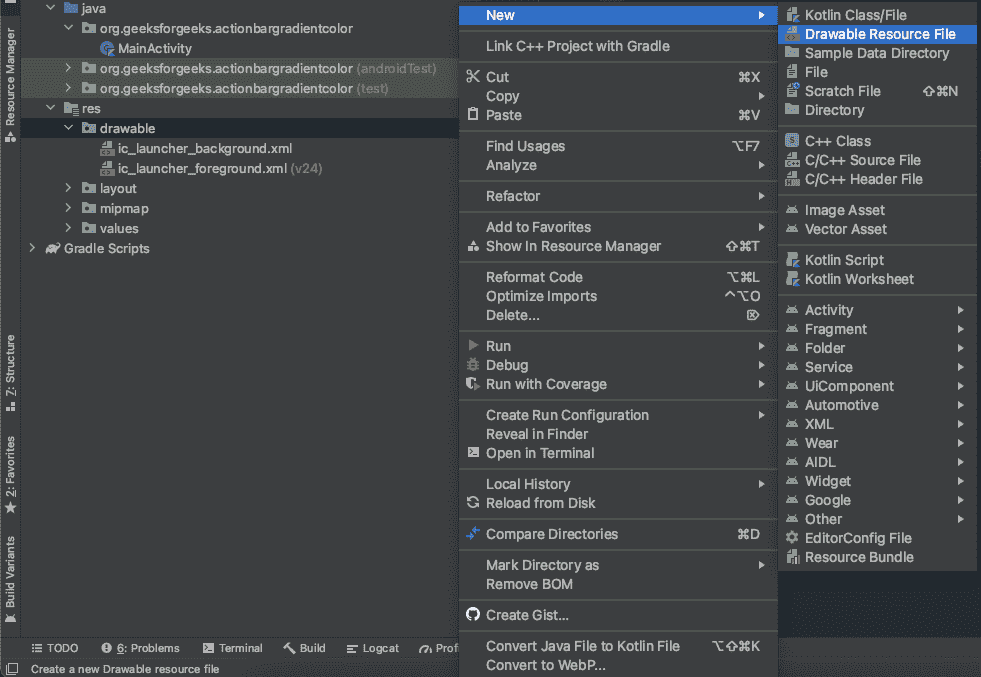
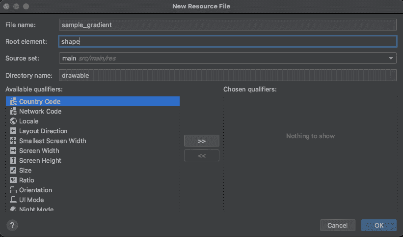
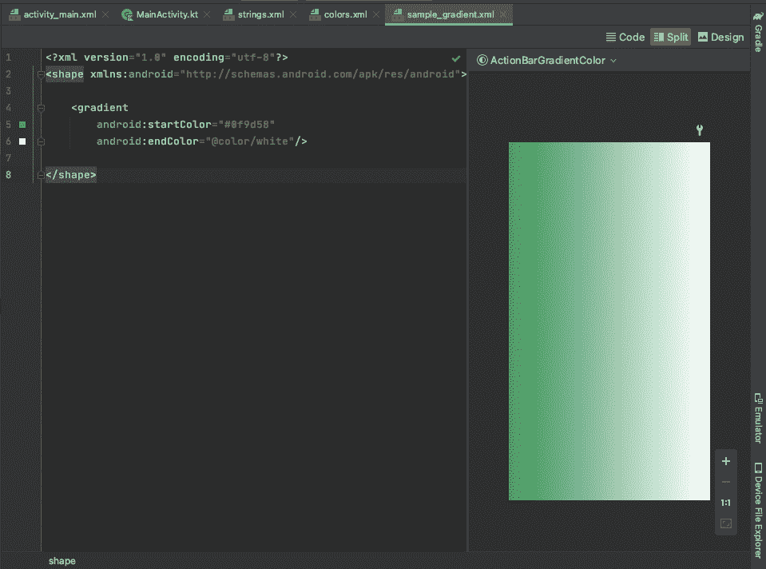
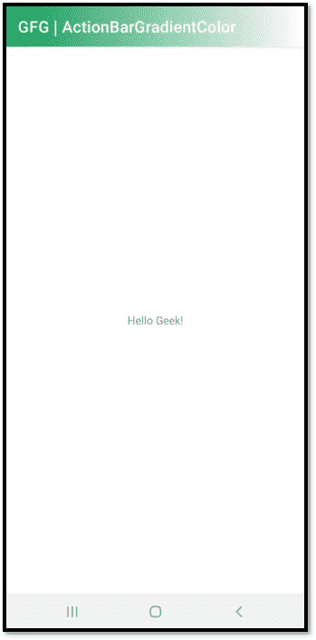
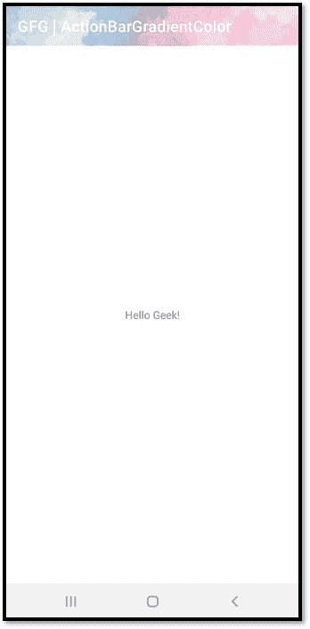

# 如何在安卓中设置 ActionBar 的渐变和图像背景？

> 原文:[https://www . geeksforgeeks . org/如何在安卓中设置渐变和图像背景操作栏/](https://www.geeksforgeeks.org/how-to-set-gradient-and-image-backgrounds-for-actionbar-in-android/)

用户界面在保持用户在应用程序中的参与方面发挥着非常重要的作用。最基本的从开发应用程序的主题开始。主题可能适用于应用程序中的所有用户界面元素，但是，用户可能首先注意到的是操作栏。默认情况下，动作栏有一个主题。我们只能从可用资产中更改其颜色。通过这篇文章，我们想向你展示如何改变[动作栏](https://www.geeksforgeeks.org/actionbar-in-android-with-example/)的背景，让它看起来更有吸引力。本文分为两个部分。首先，我们演示了如何创建渐变，并将其作为背景应用到动作栏，接下来，我们将集成类似的想法和方法，将图像背景应用到动作栏。



(左)渐变背景动作栏，(右)图像背景动作栏

### 设置动作栏渐变背景的步骤

**第一步:创建新项目**

要在安卓工作室创建新项目，请参考[如何在安卓工作室创建/启动新项目](https://www.geeksforgeeks.org/android-how-to-create-start-a-new-project-in-android-studio/)。选择**科特林**作为编程语言。

**第二步:创建可绘制的资源文件**

右键单击资源中的可绘制文件夹，创建可绘制资源文件。现在将光标移动到新建，并选择可绘制资源文件，如下所示。



一旦选中，就会弹出一个窗口来填充文件名、根元素等。我们将文件命名为“ **sample_gradient** ”。我们将选择根元素的形状选项。完成后，单击确定。



**第三步:编辑可绘制资源文件**

我们需要为形状标签之间的渐变片段编写代码。这个片段将帮助我们创建一个梯度。按照下面的代码创建一个。默认情况下，可绘制资源文件是用 XML 编写的。

## 可扩展标记语言

```
<?xml version="1.0" encoding="utf-8"?>
<shape xmlns:android="http://schemas.android.com/apk/res/android">

    <gradient
        android:startColor="#0f9d58"
        android:endColor="@color/white"/>

</shape>
```

下面是渐变的预览。



**第四步:编辑主活动**

## 我的锅

```
package org.geeksforgeeks.actionbargradientcolor

import androidx.appcompat.app.AppCompatActivity
import android.os.Bundle

class MainActivity : AppCompatActivity() {
    override fun onCreate(savedInstanceState: Bundle?) {
        super.onCreate(savedInstanceState)

          // Requesting ActionBar to set specific 
          // background from the drawable folder.
        supportActionBar?.setBackgroundDrawable(resources.getDrawable(R.drawable.sample_gradient))

          // It is necessary to call ActionBar
          // before setContentView().
          setContentView(R.layout.activity_main)
    }
}
```

**输出:**



### 为动作栏设置图像背景的步骤

**第一步:创建新项目**

要在安卓工作室创建新项目，请参考[如何在安卓工作室创建/启动新项目](https://www.geeksforgeeks.org/android-how-to-create-start-a-new-project-in-android-studio/)。选择**科特林**作为编程语言。

**第二步:在可绘制文件夹**中添加设计图片

只需在可绘制文件夹中复制并粘贴设计图像。


design_image.png

**第三步:编辑主活动**

## 我的锅

```
package org.geeksforgeeks.actionbargradientcolor

import androidx.appcompat.app.AppCompatActivity
import android.os.Bundle

class MainActivity : AppCompatActivity() {
    override fun onCreate(savedInstanceState: Bundle?) {
        super.onCreate(savedInstanceState)

          // Requesting ActionBar to set specific 
          // background from the drawable folder.
        supportActionBar?.setBackgroundDrawable(resources.getDrawable(R.drawable.design_image))

          // It is necessary to call ActionBar
          // before setContentView().
          setContentView(R.layout.activity_main)
    }
}
```

**输出:**

