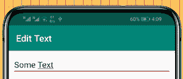

# 如何在安卓 EditText 中设置最小和最大输入值？

> 原文:[https://www . geesforgeks . org/如何设置最小和最大输入值 in-edittext-in-android/](https://www.geeksforgeeks.org/how-to-set-minimum-and-maximum-input-value-in-edittext-in-android/)

在安卓中，[编辑文本](https://www.geeksforgeeks.org/android-edittext-in-kotlin/)是[文本视图](https://www.geeksforgeeks.org/textview-in-kotlin/)的子类，配置为可编辑。编辑文本用于提供文本输入，如字符、字符串、数字等。它对输入的类型没有限制，除非有明确的属性。这意味着我们可以将 EditText 属性设置为只接受字符串或数字。除此之外，我们可以创建只接受特定类型的值的方法来促进期望的任务。



在本文中，我们将向您展示如何在编辑文本中设置最小和最大输入值。

### 逐步实施

**第一步:在安卓工作室新建项目**

要在安卓工作室创建新项目，请参考[如何在安卓工作室创建/启动新项目](https://www.geeksforgeeks.org/android-how-to-create-start-a-new-project-in-android-studio/)。我们在 **Kotlin** 中演示了该应用程序，因此在创建新项目时，请确保选择 Kotlin 作为主要语言。

**步骤 2:使用 activity_main.xml 文件**

导航到**应用程序> res >布局> activity_main.xml** 并将下面的代码添加到该文件中。下面是 **activity_main.xml** 文件的代码。在布局中添加输入类型为数字的编辑文本。

## 可扩展标记语言

```kt
<?xml version="1.0" encoding="utf-8"?>
<RelativeLayout 
    xmlns:android="http://schemas.android.com/apk/res/android"
    xmlns:tools="http://schemas.android.com/tools"
    android:layout_width="match_parent"
    android:layout_height="match_parent"
    tools:context=".MainActivity">

    <!-- We will enter a number and see if it gets accepted -->
    <EditText
        android:id="@+id/editText"
        android:layout_width="match_parent"
        android:layout_height="50sp"
        android:layout_centerHorizontal="true"
        android:hint="Enter number between 1-100"
        android:gravity="center"
        android:importantForAutofill="no"
        android:inputType="number" />

</RelativeLayout>
```

**第三步:使用**T2【主活动. kt】文件

转到 **MainActivity.kt** 文件，参考以下代码。下面是 **MainActivity.kt** 文件的代码。代码中添加了注释，以更详细地理解代码。创建一个内部类来设置编辑文本的最小和最大输入值。

## 我的锅

```kt
import androidx.appcompat.app.AppCompatActivity
import android.os.Bundle
import android.text.InputFilter
import android.text.Spanned
import android.widget.EditText

class MainActivity : AppCompatActivity() {
    override fun onCreate(savedInstanceState: Bundle?) {
        super.onCreate(savedInstanceState)
        setContentView(R.layout.activity_main)

        // Declaring and Initializing  edit text from the layout
        val editText = findViewById<EditText>(R.id.editText)

        // Assigning filters
        editText.filters = arrayOf<InputFilter>(MinMaxFilter(1, 100))
    }

    // Custom class to define min and max for the edit text
    inner class MinMaxFilter() : InputFilter {
        private var intMin: Int = 0
        private var intMax: Int = 0

        // Initialized
        constructor(minValue: Int, maxValue: Int) : this() {
            this.intMin = minValue
            this.intMax = maxValue
        }

        override fun filter(source: CharSequence, start: Int, end: Int, dest: Spanned, dStart: Int, dEnd: Int): CharSequence? {
            try {
                val input = Integer.parseInt(dest.toString() + source.toString())
                if (isInRange(intMin, intMax, input)) {
                    return null
                }
            } catch (e: NumberFormatException) {
                e.printStackTrace()
            }
            return ""
        }

        // Check if input c is in between min a and max b and
        // returns corresponding boolean
        private fun isInRange(a: Int, b: Int, c: Int): Boolean {
            return if (b > a) c in a..b else c in b..a
        }
    }
}
```

**输出:**

您可以看到，如果我们尝试给出 1-100 之间的输入，我们可以看到它在编辑文本中被键入。但是，如果我们试图给出 0 或高于 100 的值，则输入不被接受，因此在编辑文本中看不到显示或键入的内容。

<video class="wp-video-shortcode" id="video-659815-1" width="640" height="360" preload="metadata" controls=""><source type="video/mp4" src="https://media.geeksforgeeks.org/wp-content/uploads/20210804105109/490.mp4?_=1">[https://media.geeksforgeeks.org/wp-content/uploads/20210804105109/490.mp4](https://media.geeksforgeeks.org/wp-content/uploads/20210804105109/490.mp4)</video>