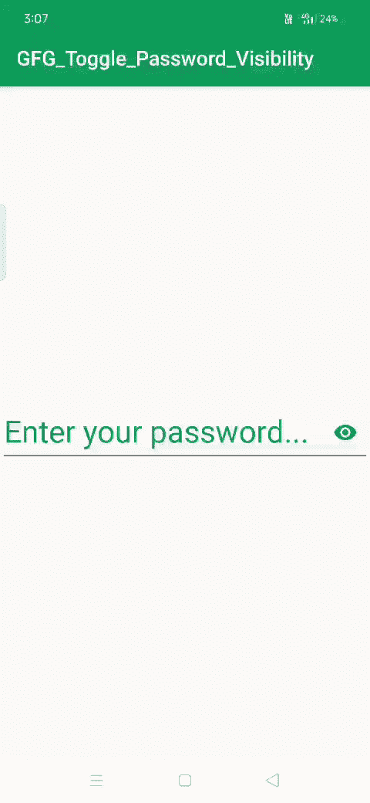

# 如何在安卓中切换密码可见性？

> 原文:[https://www . geesforgeks . org/如何切换-密码-安卓可见性/](https://www.geeksforgeeks.org/how-to-toggle-password-visibility-in-android/)

正如我们所知，切换意味着通过按一个按钮在两个不同的选项之间切换。因此，在本文中，我们将看到如何通过按下单个按钮(这里是眼睛按钮)来更改密码可见性，即输入密码类型后，我们还可以启用一个图标，该图标可以显示或隐藏用户正在键入的文本。为了实现这个项目，我们将使用**文本输入布局(线性布局的子级)**，这是安卓材料设计库附带的设计组件。由于我们将输入密码，将使用文本输入文本而不是普通的[编辑文本](https://www.geeksforgeeks.org/edittext-widget-in-android-using-java-with-examples/)，因为文本输入文本是编辑文本的子类，文本编辑文本是文本输入布局的子类。**有五个 XML 属性与密码可见性切换相关联。**

*   **passwordtogleenabled:**这个属性的值不是真就是假，所以当我们想要密码可转换的时候，就应该给这个属性赋予真值。
*   **passwordToggleTint:** 允许为颜色赋予可见性切换图标。
*   **passwordToggleTintMode:** 允许给切换图标不同的背景模式。
*   **passwordtoglawlable:**允许我们给切换图标一个不同的图标，而不是默认的眼睛图像。
*   **passwordToggleContentDescription:**允许我们对切换图标进行描述。

下面给出了一个 GIF 示例，来了解一下在本文中要做什么。请注意，我们将使用 **Kotlin** 语言来实现这个项目。



### **分步实施**

**第一步:创建新项目**

要在安卓工作室创建新项目，请参考[如何在安卓工作室创建/启动新项目](https://www.geeksforgeeks.org/android-how-to-create-start-a-new-project-in-android-studio/)。注意选择**科特林**作为编程语言。

**步骤 2:使用 activity_main.xml 文件**

现在转到代表应用程序用户界面的 **activity_main.xml** 文件。下面是 **activity_main.xml** 文件的代码。代码中添加了注释，以更详细地理解代码。

## 可扩展标记语言

```kt
<!--xml code for the project-->
<?xml version="1.0" encoding="utf-8"?>
<androidx.constraintlayout.widget.ConstraintLayout 
    xmlns:android="http://schemas.android.com/apk/res/android"                                              
    xmlns:app="http://schemas.android.com/apk/res-auto"
    xmlns:tools="http://schemas.android.com/tools"
    android:layout_width="match_parent"
    android:layout_height="match_parent"
    tools:context=".MainActivity">

<!--TextInput layout which acts as a wrapper to the edit text-->
<com.google.android.material.textfield.TextInputLayout
        android:layout_width="wrap_content"
        android:layout_height="wrap_content"
        android:textColorHint="#0F9D58"
        app:hintTextAppearance="@style/TextAppearance.AppCompat.Large"
        android:hint="Enter your password..."
        <!--Enabling the password toggle>                                                
        app:passwordToggleEnabled="true"
        <!--applying the tint to the password visibility toggle-->
        app:passwordToggleTint="@color/colorPrimary"

        android:scrollbarSize="25dp"
        app:layout_constraintBottom_toBottomOf="parent"
        app:layout_constraintLeft_toLeftOf="parent"
        app:layout_constraintRight_toRightOf="parent"
        app:layout_constraintTop_toTopOf="parent">

        <!--Using the TextInputEditText,which is 
            same as the edit text,but remember-->
        <!--that we need to use TextInputEditText 
            with TextInputLayout-->
 <com.google.android.material.textfield.TextInputEditText
            android:layout_width="match_parent"
            android:layout_height="match_parent"
            android:textSize="30dp"
            android:inputType="textPassword"
            android:ems="15"/>

 </com.google.android.material.textfield.TextInputLayout>

</androidx.constraintlayout.widget.ConstraintLayout>
```

**步骤 3:使用构建. gradle(应用程序级文件)**

在相关性部分导入对材料组件的相关性。

> 依赖项{
> 
> // …
> 
> 实现' com . Google . Android . material:material:<version>'</version>
> 
> // …
> 
> }

**第 4 步:使用 MainActivity.kt 文件**

转到 MainActivity.kt 文件，并参考以下代码。下面是 **MainActivity.kt** 文件的代码。代码中添加了注释，以更详细地理解代码。由于在这个项目中没有需要执行的逻辑，MainActivity 不包含任何代码。

## 我的锅

```kt
import androidx.appcompat.app.AppCompatActivity
import android.os.Bundle

class MainActivity : AppCompatActivity() {
    override fun onCreate(savedInstanceState: Bundle?) {
        super.onCreate(savedInstanceState)
        setContentView(R.layout.activity_main)
    }
}
```

### **输出:**

<video class="wp-video-shortcode" id="video-513494-1" width="640" height="360" preload="metadata" controls=""><source type="video/mp4" src="https://media.geeksforgeeks.org/wp-content/uploads/20201113151308/GFG_Toggle_Password_Visibility.mp4?_=1">[https://media.geeksforgeeks.org/wp-content/uploads/20201113151308/GFG_Toggle_Password_Visibility.mp4](https://media.geeksforgeeks.org/wp-content/uploads/20201113151308/GFG_Toggle_Password_Visibility.mp4)</video>