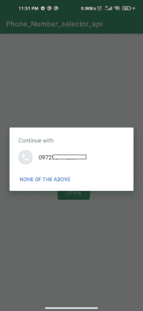

# 如何在安卓系统中使用手机选择器 API？

> 原文:[https://www . geesforgeks . org/如何使用手机-选择器-安卓系统中的 API/](https://www.geeksforgeeks.org/how-to-use-phone-selector-api-in-android/)

**电话选择器 API** 用于检测电话中正在使用的电话号码。使用此功能，您可以避免用户手动输入电话号码，并提示他们选择所需的号码。下面给出了一个示例图像，以了解我们将在本文中做什么。注意，我们将使用 **Kotlin** 语言来实现这个项目。



### 逐步实施

**第一步:创建新项目**

要在安卓工作室创建新项目，请参考[如何在安卓工作室创建/启动新项目](https://www.geeksforgeeks.org/android-how-to-create-start-a-new-project-in-android-studio/)。请注意，选择**科特林**作为编程语言

**第 2 步:向 build.gradle 文件添加依赖项，然后单击“立即同步”**

> 实现“com . Google . Android . GMS:play-services-auth:19 . 0 . 0”

**步骤 3:使用 activity_main.xml 文件**

转到 **activity_main.xml** 文件，参考以下代码。为了简单起见，我们只使用一个[文本视图](https://www.geeksforgeeks.org/textview-in-kotlin/)来显示选择后的数字。下面是 **activity_main.xml** 文件的代码。

## 可扩展标记语言

```
<?xml version="1.0" encoding="utf-8"?>
<androidx.constraintlayout.widget.ConstraintLayout 
    xmlns:android="http://schemas.android.com/apk/res/android"
    xmlns:app="http://schemas.android.com/apk/res-auto"
    xmlns:tools="http://schemas.android.com/tools"
    android:layout_width="match_parent"
    android:layout_height="match_parent"
    tools:context=".MainActivity">

    <TextView
        android:id="@+id/tv1"
        android:layout_width="wrap_content"
        android:layout_height="wrap_content"
        android:text="Hello World!"
        app:layout_constraintBottom_toBottomOf="parent"
        app:layout_constraintLeft_toLeftOf="parent"
        app:layout_constraintRight_toRightOf="parent"
        app:layout_constraintTop_toTopOf="parent" />

    <Button
        android:id="@+id/btn_open"
        android:layout_width="wrap_content"
        android:layout_height="wrap_content"
        android:layout_marginTop="30dp"
        android:text="Open"
        app:layout_constraintLeft_toLeftOf="@id/tv1"
        app:layout_constraintTop_toBottomOf="@id/tv1" />

</androidx.constraintlayout.widget.ConstraintLayout>
```

**第四步:在 MainActivity.kt 内部编写以下代码**

*   要检索电话号码提示，首先，通过创建 [**提示请求**](https://developers.google.com/android/reference/com/google/android/gms/auth/api/credentials/HintRequest) 对象来配置提示选择器对话框。然后，将 HintRequest 对象传递给[**credentialsclient . gethintpickerintent()**](https://developers.google.com/android/reference/com/google/android/gms/auth/api/credentials/CredentialsClient#getHintPickerIntent(com.google.android.gms.auth.api.credentials.HintRequest))以获得提示用户选择电话号码的意图。最后，用**startIntentSenderForResult()**开始意向。
*   **onActivityResult()** 方法将有助于获取用户选择的数字，然后您可以编写下一个逻辑来继续您的应用程序。

## 我的锅

```
import android.content.Intent
import android.content.IntentSender
import android.os.Bundle
import android.widget.Button
import android.widget.TextView
import android.widget.Toast
import androidx.appcompat.app.AppCompatActivity
import com.google.android.gms.auth.api.credentials.*

class MainActivity : AppCompatActivity() {

    lateinit var open_btn: Button
    lateinit var tv1: TextView

    companion object {
        var CREDENTIAL_PICKER_REQUEST = 1
    }

    override fun onCreate(savedInstanceState: Bundle?) {
        super.onCreate(savedInstanceState)
        setContentView(R.layout.activity_main)

        open_btn = findViewById(R.id.btn_open)
        tv1 = findViewById(R.id.tv1)

        // set on click listener to button 
        // to open the phone selector dialog
        open_btn.setOnClickListener {
            phoneSelection()
        }
    }

    private fun phoneSelection() {
        // To retrieve the Phone Number hints, first, configure
        // the hint selector dialog by creating a HintRequest object.
        val hintRequest = HintRequest.Builder()
            .setPhoneNumberIdentifierSupported(true)
            .build()

        val options = CredentialsOptions.Builder()
            .forceEnableSaveDialog()
            .build()

        // Then, pass the HintRequest object to 
        // credentialsClient.getHintPickerIntent()
        // to get an intent to prompt the user to 
        // choose a phone number.
        val credentialsClient = Credentials.getClient(applicationContext, options)
        val intent = credentialsClient.getHintPickerIntent(hintRequest)
        try {
            startIntentSenderForResult(
                intent.intentSender,
                CREDENTIAL_PICKER_REQUEST, null, 0, 0, 0, Bundle()
            )
        } catch (e: IntentSender.SendIntentException) {
            e.printStackTrace()
        }
    }

    override fun onActivityResult(requestCode: Int, resultCode: Int, data: Intent?) {
        super.onActivityResult(requestCode, resultCode, data)
        if (requestCode == CREDENTIAL_PICKER_REQUEST && resultCode == RESULT_OK) {

            // get data from the dialog which is of type Credential
            val credential: Credential? = data?.getParcelableExtra(Credential.EXTRA_KEY)

            // set the received data t the text view
            credential?.apply {
                tv1.text = credential.id
            }
        } else if (requestCode == CREDENTIAL_PICKER_REQUEST && resultCode == CredentialsApi.ACTIVITY_RESULT_NO_HINTS_AVAILABLE) {
            Toast.makeText(this, "No phone numbers found", Toast.LENGTH_LONG).show();
        }
    }
}
```

### 输出:

<video class="wp-video-shortcode" id="video-540492-1" width="640" height="360" preload="metadata" controls=""><source type="video/mp4" src="https://media.geeksforgeeks.org/wp-content/uploads/20210111210656/phone_selector_api.mp4?_=1">[https://media.geeksforgeeks.org/wp-content/uploads/20210111210656/phone_selector_api.mp4](https://media.geeksforgeeks.org/wp-content/uploads/20210111210656/phone_selector_api.mp4)</video>

**github link:**[https://github . com/intrigix/phone-selector](https://github.com/introidx/phone-Selecter)