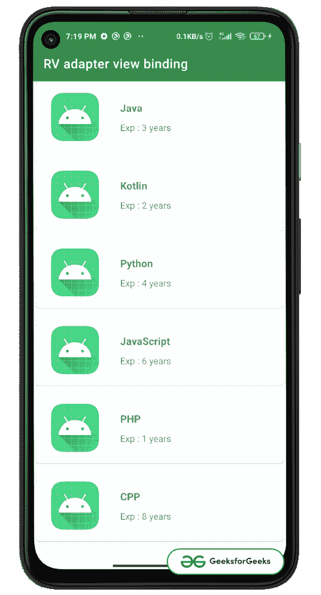

# 如何在安卓中使用 RecyclerView 适配器类中的视图绑定？

> 原文:[https://www . geeksforgeeks . org/如何使用-查看-绑定-in-recycle view-adapter-in-Android/](https://www.geeksforgeeks.org/how-to-use-view-binding-in-recyclerview-adapter-class-in-android/)

[视图绑定](https://www.geeksforgeeks.org/view-binding-in-android-jetpack/) 是[安卓喷气包](https://www.geeksforgeeks.org/introduction-to-android-jetpack/)的一部分，它通过以空安全的方式替换 findViewById()方法来提供与类绑定的视图。在本文中，我们将在[recycle view](https://www.geeksforgeeks.org/android-recyclerview/)的适配器类中看到它的实现。注意，我们将使用 **Kotlin** 语言来实现这个项目。

### **分步实施**

**第一步:创建新项目**

要在安卓工作室创建新项目，请参考[如何在安卓工作室创建/启动新项目](https://www.geeksforgeeks.org/android-how-to-create-start-a-new-project-in-android-studio/)。请注意，选择**科特林**作为编程语言

**第二步:添加视图绑定依赖关系**

转到 android 标签内的 build.gradle(app)和以下依赖项，点击**立即同步。**

> 构建功能{
> 
> 视图绑定为真
> 
> }

**步骤 3:使用 activity_main.xml 文件**

转到 **activity_main.xml** 文件，参考以下代码。下面是 **activity_main.xml** 文件的代码。它只有一个**回收视图**，我们将使用它来显示我们的数据。

## 可扩展标记语言

```
<?xml version="1.0" encoding="utf-8"?>
<androidx.constraintlayout.widget.ConstraintLayout
    xmlns:android="http://schemas.android.com/apk/res/android"
    xmlns:app="http://schemas.android.com/apk/res-auto"
    xmlns:tools="http://schemas.android.com/tools"
    android:layout_width="match_parent"
    android:background="#F5F8FD"
    android:layout_height="match_parent"
    tools:context=".MainActivity">

    <!--Add recycler view to main activity-->
    <androidx.recyclerview.widget.RecyclerView
        android:id="@+id/rv_list"
        android:layout_width="match_parent"
        android:layout_height="match_parent"
        tools:listitem="@layout/single_item"
        app:layoutManager="androidx.recyclerview.widget.LinearLayoutManager" />

</androidx.constraintlayout.widget.ConstraintLayout>
```

**第四步:新建布局文件，命名为 single_item.xml 文件**

转到 **single_item.xml** 文件，参考以下代码。下面是 **single_item.xml** 文件的代码。这是我们将在回收视图中使用的单一项目布局。

## 可扩展标记语言

```
<?xml version="1.0" encoding="utf-8"?>
<com.google.android.material.card.MaterialCardView
    xmlns:android="http://schemas.android.com/apk/res/android"
    xmlns:app="http://schemas.android.com/apk/res-auto"
    android:layout_width="match_parent"
    android:layout_marginBottom="10dp"
    android:layout_marginStart="5dp"
    android:layout_marginEnd="5dp"
    android:layout_height="110dp">

    <androidx.constraintlayout.widget.ConstraintLayout
        android:layout_width="match_parent"
        android:layout_height="match_parent">

          <!--Add image view, We will not set any data here.-->
        <ImageView
            android:id="@+id/iv_language"
            android:layout_width="80dp"
            android:layout_height="90dp"
            android:layout_marginStart="20dp"
            android:layout_marginTop="10dp"
            android:scaleType="fitCenter"
            android:src="@mipmap/ic_launcher"
            app:layout_constraintLeft_toLeftOf="parent"
            app:layout_constraintTop_toTopOf="parent" />

          <!--Text view for showing the language name-->
        <TextView
            android:id="@+id/tv_lang_name"
            android:layout_width="wrap_content"
            android:layout_height="wrap_content"
            android:layout_marginStart="30dp"
            android:layout_marginTop="30dp"
            android:text="Language"
            android:textSize="16sp"
            android:textStyle="bold"
            app:layout_constraintLeft_toRightOf="@id/iv_language"
            app:layout_constraintTop_toTopOf="parent" />

          <!--Text View for showing the exp-->
        <TextView
            android:id="@+id/tv_exp"
            android:layout_width="wrap_content"
            android:layout_height="wrap_content"
            android:layout_marginTop="10dp"
            android:text="Exp : 3 years"
            app:layout_constraintLeft_toLeftOf="@id/tv_lang_name"
            app:layout_constraintTop_toBottomOf="@id/tv_lang_name" />

    </androidx.constraintlayout.widget.ConstraintLayout>

</com.google.android.material.card.MaterialCardView>
```

**第五步:新建模型类**

创建一个新的类 **Language.kt** 我们将使用自定义通用“**语言**的数据来传入将在 RecyclerView 中显示的列表。

## 我的锅

```
// this is the Language model class
class Language(
    val name : String ="",
    val exp : String =""
)
```

**步骤 6:使用适配器类**

创建一个新类 **RvAdapter.kt** 这将作为回收视图的适配器类。使用视图绑定，我们使用布局的生成类 **single_item.xml** 即 **SingleItemBinding** 在我们的例子中，在 MainActivity.kt 的回收器视图中添加数据和视图。为了更好地理解，在代码前添加了注释。

## 我的锅

```
import android.view.LayoutInflater
import android.view.ViewGroup
import androidx.recyclerview.widget.RecyclerView
import com.geeksforgeeks.rvadapterviewbinding.databinding.SingleItemBinding

class RvAdapter(
    var languageList: List<Language>,
) : RecyclerView.Adapter<RvAdapter.ViewHolder>() {

    // create an inner class with name ViewHolder
    // It takes a view argument, in which pass the generated class of single_item.xml
    // ie SingleItemBinding and in the RecyclerView.ViewHolder(binding.root) pass it like this
    inner class ViewHolder(val binding: SingleItemBinding) : RecyclerView.ViewHolder(binding.root)

    // inside the onCreateViewHolder inflate the view of SingleItemBinding
    // and return new ViewHolder object containing this layout
    override fun onCreateViewHolder(parent: ViewGroup, viewType: Int): ViewHolder {
        val binding = SingleItemBinding.inflate(LayoutInflater.from(parent.context), parent, false)

        return ViewHolder(binding)
    }

    // bind the items with each item
      // of the list languageList
      // which than will be
    // shown in recycler view
    // to keep it simple we are
      // not setting any image data to view
    override fun onBindViewHolder(holder: ViewHolder, position: Int) {
        with(holder){
            with(languageList[position]){
                binding.tvLangName.text = this.name
                binding.tvExp.text = this.exp
            }
        }
    }

    // return the size of languageList
    override fun getItemCount(): Int {
        return languageList.size
    }
}
```

**第 7 步:使用 MainActivity.kt 文件**

转到 **MainActivity.kt** 文件，参考以下代码。下面是 **MainActivity.kt** 文件的代码。代码中添加了注释，以更详细地理解代码。

## 我的锅

```
import androidx.appcompat.app.AppCompatActivity
import android.os.Bundle
import com.geeksforgeeks.rvadapterviewbinding.databinding.ActivityMainBinding

class MainActivity : AppCompatActivity() {

    // view binding for the activity
    private var _binding : ActivityMainBinding? = null
    private val binding get() = _binding!!

    // create reference to the adapter and the list
    // in the list pass the model of Language
    private lateinit var rvAdapter: RvAdapter
    private lateinit var languageList : List<Language>

    override fun onCreate(savedInstanceState: Bundle?) {
        super.onCreate(savedInstanceState)
        _binding = ActivityMainBinding.inflate(layoutInflater)
        setContentView(binding.root)

        // load data to language list
        loadLanguage()

        // create  layoutManager
        val layoutManager: RecyclerView.LayoutManager = LinearLayoutManager(this)

        // pass it to rvLists layoutManager
        binding.rvList.setLayoutManager(layoutManager)

        // initialize the adapter,
          // and pass the required argument
        rvAdapter = RvAdapter(languageList)

        // attach adapter to the recycler view
        binding.rvList.adapter = rvAdapter
    }

    // add items to the list manually in our case
    private fun loadLanguage() {
        languageList = listOf(
            Language("Java" , "Exp : 3 years"),
            Language("Kotlin" , "Exp : 2 years"),
            Language("Python" , "Exp : 4 years"),
            Language("JavaScript" , "Exp : 6 years"),
            Language("PHP" , "Exp : 1 years"),
            Language("CPP" , "Exp : 8 years"),
        )
    }

    // on destroy of view make
      // the binding reference to null
    override fun onDestroy() {
        super.onDestroy()
        _binding = null
    }
}
```

**输出:**

