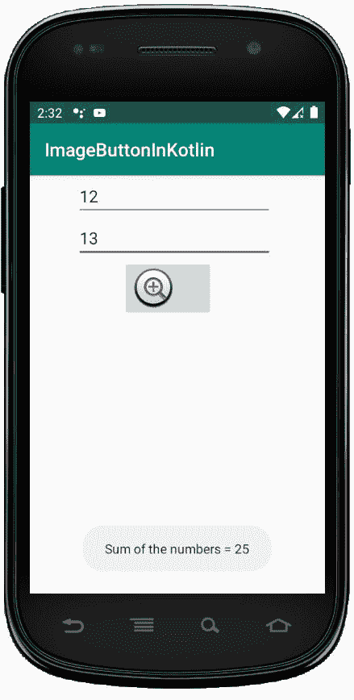

# 科特林

中的图像按钮

> 原文:[https://www.geeksforgeeks.org/imagebutton-in-kotlin/](https://www.geeksforgeeks.org/imagebutton-in-kotlin/)

安卓 **ImageButton** 是一个用户界面小部件，用来显示一个有图像的按钮，并且当我们点击它的时候执行完全一样的按钮，但是在这里，我们在 ImageButton 上添加了一个图像，而不是文本。安卓系统中有不同类型的按钮，如 ImageButton、ToggleButton 等。

我们可以简单的使用 activity_main.xml 文件中的<imagebutton>属性 **android:src** 或者使用 **setImageResource()** 方法给按钮添加一个图像。</imagebutton>

在安卓系统中，我们可以通过两种方式来创建 ImageButton 控件，可以是手动的，也可以是编程的。

首先我们按照以下步骤创建一个新项目:

1.  Click the file, and then **create a new** = > **new project** .
2.  After that, Kotlin support is included and click Next.
3.  Click **Next** button according to the convenience of selecting the minimum SDK.
4.  Then select **to clear** activity = > **Next** = > **to finish** .

## Switch widget 的不同属性

| XML attribute | describe |
| --- | --- |
| Android: id | Used to uniquely identify the control. |
| Android: src | The source file used to specify the picture. |
| 安卓:onClick | Used to specify what to do when clicking this button. |
| Android: Visibility | Used to set the visibility of image buttons. |
| Android: Background | Used to set the background color of the Image button. |
| 安卓：maxHeight | Used to set the maximum height of the Image button view. |
| 刘健仪:最大宽度 | Used to set the maximum width of the Image button view. |
| Android: filling | Used to set padding from left, right, top and bottom. |

## 在 activity_main.xml 文件中使用 ImageBotton

在这个文件中，我们包含了 Edittext 和 ImageButton，并设置了它们的属性，如 id、layout_width、提示等。

```
<?xml version="1.0" encoding="utf-8"?>
<LinearLayout xmlns:android="http://schemas.android.com/apk/res/android"
    android:orientation="vertical"
    android:layout_width="match_parent"
    android:layout_height="match_parent"
    android:id="@+id/linear_layout">

    <EditText
        android:id="@+id/Num1"
        android:layout_width="wrap_content"
        android:layout_height="wrap_content"
        android:layout_marginLeft="50dp"
        android:ems="10"
        android:hint= "Enter first number"/>

    <EditText
        android:id="@+id/Num2"
        android:layout_width="wrap_content"
        android:layout_height="wrap_content"
        android:layout_marginLeft="50dp"
        android:ems="10"
        android:hint= "Enter second number"/>

    <ImageButton
        android:id="@+id/imageBtn"
        android:layout_width="wrap_content"
        android:layout_height="wrap_content"
        android:layout_marginLeft="100dp"
        android:src="@android:drawable/btn_plus" />
</LinearLayout>
```

**修改 *strings.xml* 文件添加应用程序名称**

```
<resources>
    <string name="app_name">ImageButtonInKotlin</string>
</resources>
```

## 在 MainActivity.kt 文件

中访问 ImageButton 和 EditText 首先，我们为两个 edittext 声明两个变量 num1 和 num2，并使用 ids 访问它们。

```
val num1 = findViewById(R.id.Num1)
val num2 = findViewById<edittext>(R.id.Num2)</edittext> 
```

然后，我们为 ImageButton 声明变量 **imgbtn** 并设置 OnCLickListener 来检查填充是否为空

```
val imgbtn = findViewById(R.id.imageBtn)
    imgbtn.setOnClickListener {
     if (num1.text.toString().isEmpty() || num2.text.toString().isEmpty()) {
          Toast.makeText(applicationContext,
           "Enter both numbers", Toast.LENGTH_SHORT).show()
    } 
```

```
package com.geeksforgeeks.myfirstkotlinapp

import android.os.Bundle
import androidx.appcompat.app.AppCompatActivity
import android.widget.EditText
import android.widget.ImageButton
import android.widget.Toast

class MainActivity : AppCompatActivity() {
    override fun onCreate(savedInstanceState: Bundle?) {
        super.onCreate(savedInstanceState)
        setContentView(R.layout.activity_main)
        val num1 = findViewById<EditText>(R.id.Num1)
        val num2 = findViewById<EditText>(R.id.Num2)
        val imgbtn = findViewById<ImageButton>(R.id.imageBtn)
        imgbtn.setOnClickListener {
         if (num1.text.toString().isEmpty() || num2.text.toString().isEmpty()) {
              Toast.makeText(applicationContext,
                  "Enter both numbers", Toast.LENGTH_SHORT).show()
            }
            else {
                val num1 = Integer.parseInt(num1.text.toString())
                val num2 = Integer.parseInt(num2.text.toString())
                Toast.makeText(applicationContext,
                    "Sum of the numbers = " + (num1 + num2),
                    Toast.LENGTH_SHORT).show()
            }
        }
    }
}
```

## androidmanifest . XML 文件

```
<?xml version="1.0" encoding="utf-8"?>
<manifest xmlns:android="http://schemas.android.com/apk/res/android"
package="com.geeksforgeeks.myfirstkotlinapp">

<application
    android:allowBackup="true"
    android:icon="@mipmap/ic_launcher"
    android:label="@string/app_name"
    android:roundIcon="@mipmap/ic_launcher_round"
    android:supportsRtl="true"
    android:theme="@style/AppTheme">
    <activity android:name=".MainActivity">
        <intent-filter>
            <action android:name="android.intent.action.MAIN" />

            <category android:name="android.intent.category.LAUNCHER" />
        </intent-filter>
    </activity>
</application>

</manifest>
```

## 作为模拟器运行:

