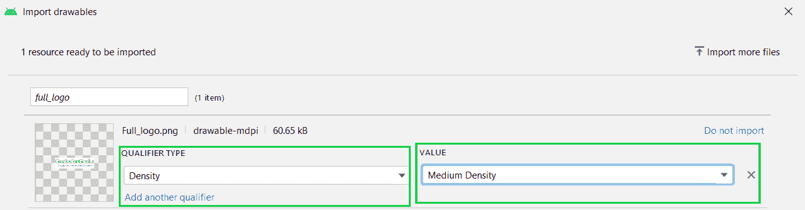

# 安卓中的 ImageView，示例

> 原文:[https://www . geesforgeks . org/imageview-in-Android-with-example/](https://www.geeksforgeeks.org/imageview-in-android-with-example/)

**ImageView** 类用于显示安卓应用中的任何一种图像资源，可以是 android.graphics.Bitmap，也可以是 Android . graphics . drawing able . drawing able(它是对任何可以在安卓中绘制的东西的通用抽象)。ImageView 类或 android.widget.ImageView 继承了 android.view.View 类，它是 Kotlin 的子类。任何课程。ImageView 的应用还在于对图像应用色调，以便重用可绘制的资源并在背景图像上创建覆盖。此外，ImageView 还用于控制图像的大小和移动。

### 向活动添加图像视图

每当将 ImageView 添加到活动中时，就意味着需要一个映像资源。因此，向 ImageView 类提供一个图像文件是没有意义的。这可以通过添加安卓工作室本身的图像文件来完成，或者我们可以添加自己的图像文件。安卓工作室拥有广泛的可绘制资源，这些资源在安卓应用布局中非常常见。以下是向 ImageView 类添加可绘制资源的步骤。

> **注意:**步骤在 Android Studio 版本上执行

打开要添加图像的 **activity_main.xml** 文件

 

从 activity_main.xml 文件的代码视图切换到设计视图。

 

**从 Android Studio** 添加图像将 ImageView 小部件拖动到应用程序的活动区域，将打开一个弹出对话框，从广泛的可绘制资源中进行选择，然后单击“确定”。

 

**添加安卓工作室可绘制资源以外的图像文件:**
点击最左侧面板的“资源管理器”选项卡，选择“导入可绘制资源”选项。

 

选择计算机上图像文件的路径，然后单击“确定”。之后，根据您的需要设置图像文件的“限定符类型”和“值”，然后单击“下一步”和“导入”。

 

将 ImageView 类拖到活动区域，将出现一个弹出对话框，其中包含您导入的图像文件。选择您的图像文件，然后单击“确定”，您的图像将被添加到活动中。

 

> **注意:**添加图像后，垂直和水平设置其约束布局，否则会显示错误。

### 图像视图的可扩展标记语言属性

<figure class="table">

| 

XML 属性

 | 

描述

 |
| --- | --- |
| android:id | 为了唯一地识别图像视图 |
| android:src/app:srcCompat | 添加插入图像的文件路径 |
| 安卓:背景 | 为插入的图像提供背景色 |
| 安卓:布局 _ 宽度 | 要设置图像的宽度 |
| 安卓:布局 _ 高度 | 要设置图像的高度 |
| 安卓:填充 | 从视图的左侧、右侧、顶部或底部向图像添加填充 |
| 安卓:scaleType | 重新调整图像大小或移动图像以固定其大小 |

</figure>

## 例子

### **分步实施**

**第一步:创建新项目**

要在安卓工作室创建新项目，请参考[如何在安卓工作室创建/启动新项目](https://www.geeksforgeeks.org/android-how-to-create-start-a-new-project-in-android-studio/)。

**步骤 2:使用 activity_main.xml 文件**

导航到**应用程序> res >布局> activity_main.xml** 并将下面的代码添加到该文件中。下面是 **activity_main.xml** 文件的代码。

## 可扩展标记语言

```kt
<?xml version="1.0" encoding="utf-8"?>
<androidx.constraintlayout.widget.ConstraintLayout 
    xmlns:android="http://schemas.android.com/apk/res/android"
    xmlns:app="http://schemas.android.com/apk/res-auto"
    xmlns:tools="http://schemas.android.com/tools"
    android:layout_width="match_parent"
    android:layout_height="match_parent"
    tools:context=".MainActivity">

    <ImageView
        android:id="@+id/GfG_full_logo"
        android:layout_width="0dp"
        android:layout_height="wrap_content"
        app:layout_constraintBottom_toBottomOf="parent"
        app:layout_constraintEnd_toEndOf="parent"
        app:layout_constraintStart_toStartOf="parent"
        app:layout_constraintTop_toTopOf="parent"
        app:layout_constraintVertical_bias="0.078"
        app:srcCompat="@drawable/full_logo" />

    <ImageView
        android:id="@+id/GfG_logo"
        android:layout_width="wrap_content"
        android:layout_height="wrap_content"
        app:layout_constraintBottom_toBottomOf="parent"
        app:layout_constraintEnd_toEndOf="parent"
        app:layout_constraintStart_toStartOf="parent"
        app:layout_constraintTop_toBottomOf="@+id/GfG_full_logo"
        app:srcCompat="@drawable/logo" />

</androidx.constraintlayout.widget.ConstraintLayout>
```

> **注**:以 app:layout_constraint 开头的 ImageView 的所有属性都是固定活动中图像位置的垂直和水平约束。这对于将约束添加到 ImageView 是非常必要的，否则，所有图像将占据活动布局的位置(0，0)。

**步骤 4:使用** **主活动文件**

转到**主活动**文件，参考以下代码。以下是**主活动**文件的代码。代码中添加了注释，以更详细地理解代码。因为在活动中，只添加了 2 个图像，没有其他操作，如触摸按钮等。因此，**主活动**文件看起来就像下面的代码。

## Java 语言(一种计算机语言，尤用于创建网站)

```kt
import androidx.appcompat.app.AppCompatActivity;
import android.os.Bundle;

public class MainActivity extends AppCompatActivity {
    @Override
    protected void onCreate(Bundle savedInstanceState) {
        super.onCreate(savedInstanceState);
        setContentView(R.layout.activity_main);
    }
}
```

## 我的锅

```kt
import androidx.appcompat.app.AppCompatActivity
import android.os.Bundle

class MainActivity : AppCompatActivity() {
    override fun onCreate(savedInstanceState: Bundle?)
    {
        super.onCreate(savedInstanceState)
            setContentView(R.layout.activity_main)
    }
}
```

### 输出:

