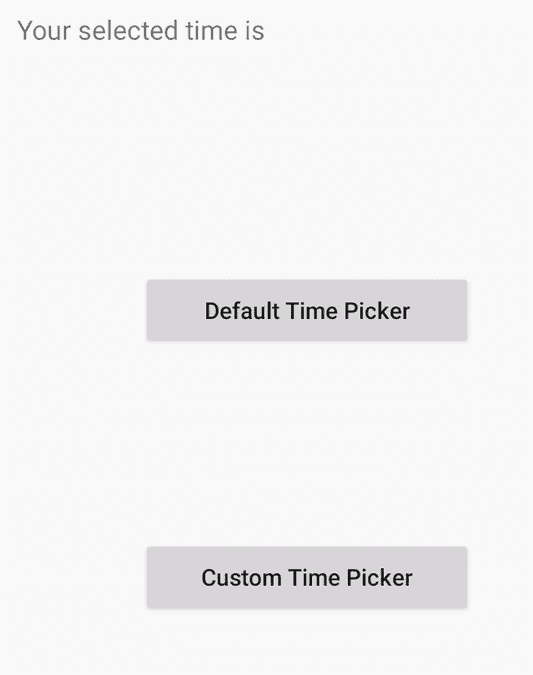

# 使用 SnapTimePicker

在安卓系统中实现定制的 TimePicker

> 原文:[https://www . geeksforgeeks . org/implement-customized-time picker-in-Android-using-snaptimepicker/](https://www.geeksforgeeks.org/implement-customized-timepicker-in-android-using-snaptimepicker/)

安卓[时间选择器](https://www.geeksforgeeks.org/timepicker-in-kotlin/)是一个用户界面控件，用于选择 24 小时格式或上午/下午模式的时间。它用于确保用户在应用程序中选择一天中的有效时间。默认时间选择器可以使用[安卓](https://www.geeksforgeeks.org/introduction-to-android-development/)中的快照时间选择器进行自定义。


**SnapTimePicker 的一些特性有:**

*   可选时间范围支持。
*   文本和颜色定制。
*   IOS 时间选择器喜欢与材料设计风格。

#### 方法

*   **步骤 1:** 在 **[build.gradle](https://www.geeksforgeeks.org/android-build-gradle/)** 文件中添加支持库，并在依赖项部分添加依赖项。

    ```kt
    implementation 'com.akexorcist:snap-time-picker:1.0.0'      
    ```

*   **第二步:**在**字符串. xml** 文件的值目录中添加以下代码。在此文件中添加应用程序中使用的所有字符串。这些字符串可以从应用程序或其他资源文件(如 XML 布局)中引用。

    ## 

    ```kt

    <resources>
        <string name="app_name">GFG | SnapTimePicker</string>
        <string name="title">Please select the time</string>
        <string name="selected_time_prefix">Your selected time is</string>

        <!-- %1$s:%2$s will add the string in HH:MM format 
        for more understanding follow the link at the end -->
        <string name="selected_time_format">%1$s:%2$s</string>

        <!-- >> means >> for more understanding follow 
        the link at the end -->
        <string name="time_prefix">>></string>

        <!-- << means << for more understanding follow 
        the link at the end -->
        <string name="time_suffix"><<</string>
    </resources>       
    ```

*   **第三步:**在 **activity_main.xml** 文件中添加以下代码。在该文件中，添加[按钮](https://www.geeksforgeeks.org/button-in-kotlin/)选择时间，添加[文本视图](https://www.geeksforgeeks.org/textview-in-kotlin/)显示所选时间。

    ## activity _ main . XML

    ```kt

    <?xml version="1.0" encoding="utf-8"?>
    <androidx.constraintlayout.widget.ConstraintLayout
        xmlns:android="http://schemas.android.com/apk/res/android"
        xmlns:app="http://schemas.android.com/apk/res-auto"
        android:layout_width="match_parent"
        android:layout_height="match_parent">

        <LinearLayout
            android:layout_width="match_parent"
            android:layout_height="wrap_content"
            android:layout_marginTop="24dp"
            android:orientation="vertical"
            android:padding="30dp"
            app:layout_constraintEnd_toEndOf="parent"
            app:layout_constraintHorizontal_bias="0.0"
            app:layout_constraintStart_toStartOf="parent"
            app:layout_constraintTop_toTopOf="parent">

            <TextView
                android:layout_width="wrap_content"
                android:layout_height="wrap_content"
                android:text="Your selected time is"
                android:textSize="16sp"/>

            <TextView
                android:id="@+id/selectedTime"
                android:layout_width="wrap_content"
                android:layout_height="wrap_content"
                android:textSize="20sp"/>
        </LinearLayout>

        <Button
            android:id="@+id/defaultTimePicker"
            android:layout_width="200dp"
            android:layout_height="wrap_content"
            android:layout_gravity="center_horizontal"
            android:layout_marginStart="104dp"
            android:layout_marginBottom="112dp"
            android:text="Default Time Picker"
            android:textAllCaps="false"
            app:layout_constraintBottom_toTopOf="@+id/customTimePicker"
            app:layout_constraintEnd_toEndOf="parent"
            app:layout_constraintHorizontal_bias="0.0"
            app:layout_constraintStart_toStartOf="parent" />

        <Button
            android:id="@+id/customTimePicker"
            android:layout_width="200dp"
            android:layout_height="wrap_content"
            android:layout_gravity="center_horizontal"
            android:layout_marginStart="104dp"
            android:layout_marginBottom="212dp"
            android:text="Custom Time Picker"
            android:textAllCaps="false"
            app:layout_constraintBottom_toBottomOf="parent"
            app:layout_constraintStart_toStartOf="parent" />
    </androidx.constraintlayout.widget.ConstraintLayout>
    ```

*   **第四步:**在 **MainActivity.kt** 文件中添加以下代码。在该文件中，向按钮添加 **`onClickListner()`** 方法，以便每当用户点击按钮时，将创建一个**时间选择器**对话框。

    ## MainActivity.kt 公司

    ```kt
    package com.madhav.maheshwari.snaptimepicker

    import android.os.Bundle
    import androidx.appcompat.app.AppCompatActivity
    import com.akexorcist.snaptimepicker.SnapTimePickerDialog
    import kotlinx.android.synthetic.main.activity_main.*

    class MainActivity : AppCompatActivity() {
        override fun onCreate(savedInstanceState: Bundle?) {
            super.onCreate(savedInstanceState)
            setContentView(R.layout.activity_main)

            defaultTimePicker.setOnClickListener {
                // Default TimePicker
                SnapTimePickerDialog.Builder().apply {
                    setTitle(R.string.title)
                    setTitleColor(android.R.color.white)
                }.build().apply {
                    setListener {
                        // when the user select time onTimePicked
                        // function get invoked automatically which
                        // sets the time in textViewTime.
                            hour, minute ->
                        onTimePicked(hour, minute)
                    }
                }.show(
                    supportFragmentManager,
                    SnapTimePickerDialog.TAG
                )
            }

            customTimePicker.setOnClickListener {
                // Custom TimePicker
                SnapTimePickerDialog.Builder().apply {
                    setTitle(R.string.title)
                    setPrefix(R.string.time_prefix)
                    setSuffix(R.string.time_suffix)
                    setThemeColor(R.color.colorAccent)
                    setTitleColor(android.R.color.black)
                }.build().apply {
                    setListener {
                        // when the user select time onTimePicked
                        // function get invoked automatically which
                        // sets the time in textViewTime.
                            hour, minute ->
                        onTimePicked(hour, minute)
                    }
                }.show(
                    supportFragmentManager,
                    SnapTimePickerDialog.TAG
                )
            }

        }

        private fun onTimePicked(selectedHour: Int, selectedMinute: Int) {
            // Pads the string to the specified length
            // at the beginning with the specified
            // character or space.
            val hour = selectedHour.toString()
                .padStart(2, '0')
            val minute = selectedMinute.toString()
                .padStart(2, '0')
            selectedTime.text = String.format(
                getString(
                    R.string.selected_time_format,
                    hour, minute
                )
            )
        }
    }
    ```

    #### 输出:在模拟器上运行

    <video class="wp-video-shortcode" id="video-459907-1" width="320" height="540" preload="metadata" controls=""><source type="video/mp4" src="https://media.geeksforgeeks.org/wp-content/uploads/20200717131302/2020_07_17_13_01_37_0011.mp4?_=1">[https://media.geeksforgeeks.org/wp-content/uploads/20200717131302/2020_07_17_13_01_37_0011.mp4](https://media.geeksforgeeks.org/wp-content/uploads/20200717131302/2020_07_17_13_01_37_0011.mp4)</video>

    #### 优点:

    与简单时间选择器相比，使用快照时间选择器的优势在于:

    *   SnapTimePicker 可以根据需求进行定制。
    *   它非常容易使用。
    *   它给 IOS 一种应用的感觉。