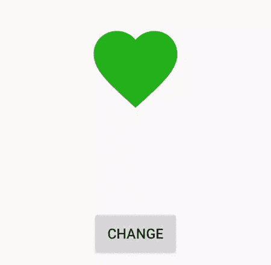

# 在安卓中使用 MorphView 实现反向动画矢量绘图

> 原文:[https://www . geesforgeks . org/implement-reverse-animated vectordrable-using-morph view-in-Android/](https://www.geeksforgeeks.org/implement-reverse-animatedvectordrawables-using-morphview-in-android/)

**morphoview**是一个用于反向 AnimatedVectorDrawables 的便利库。[**animated vectordrawinables**](https://developer.android.com/reference/android/graphics/drawable/AnimatedVectorDrawable)类是在 API 21 中引入的，用于将 Vector Drawables 制作成漂亮且轻松的动画。以下是使用 AnimatedVectorDrawable 可以执行的一些操作:

*   旋转、缩放、平移矢量图形
*   将矢量绘制成动画，如填充颜色等。
*   绘制路径并进行路径变形



#### 方法

*   **第一步:**在 **[build.gradle](https://www.geeksforgeeks.org/android-build-gradle/)** 文件中添加支持库，并在依赖项部分添加依赖项。

    ```
    implementation 'com.akaita.android:morphview:1.0.0'      
    ```

*   **步骤 2:** 现在在可绘制文件夹中创建 **avd_fav.xml** 文件，并添加以下代码。将此添加到 **activity_main.xml** 文件中**的 **avdFirst** 中。这将作为视图的主要图像。从 [**链接**](https://www.flaticon.com/) 下载矢量文件。

    ## avd _ fav . XML

    ```

    <?xml version="1.0" encoding="utf-8"?>
    <animated-vector xmlns:android="http://schemas.android.com/apk/res/android"
        xmlns:aapt="http://schemas.android.com/aapt"
        xmlns:tools="http://schemas.android.com/tools"
        tools:ignore="NewApi">
        <aapt:attr name="android:drawable">
            <vector
                android:name="vector"
                android:width="24dp"
                android:height="24dp"
                <!-- The width of the canvas 
                     the drawing is on. -->    
                android:viewportWidth="24"
                <!-- The height of the canvas
                     the drawing is on. -->    
                android:viewportHeight="24">
                <group android:name="group">
                    <path
                       android:name="path"
                        <!-- The specification of the 
                             operations that define the path. -->
                        android:pathData="M2.01 21L23 12 2.01
                                3 2 10l15 2-15 2z"
                        <!-- color of send drawable -->
                        android:fillColor="#0055FF"
                        android:strokeWidth="1"/>
                </group>
            </vector>
        </aapt:attr>
        <target android:name="path">
            <aapt:attr name="android:animation">
                <set>
                    <objectAnimator
                        <!-- Amount of time (in milliseconds) 
                             to display this frame. -->
                        android:duration="300"
                        android:interpolator="@android:interpolator/fast_out_slow_in"
                        android:propertyName="pathData"
                        <!-- Value the animation starts from. -->
                        android:valueFrom="M 3.5 1.5 C 4.5 3.833 5.5
                               6.167 6.5 8.5 C 7.03 9.736 7.559 10.972
                               8.089 12.207 L 9.5 15.5 L 12.5 22.5 L
                               15.397 15.74 C 15.931 14.494 16.466
                               13.247 17 12 C 17.502 10.83 18.003 9.659
                               18.505 8.489 C 19.503 6.159 20.502 3.83
                               21.5 1.5 C 19.167 1.5 16.833 1.5 14.5 1.5
                               C 13.833 6.5 13.167 11.5 12.5 16.5 C
                               11.833 11.5 11.167 6.5 10.5 1.5 C 8.167
                               1.5 5.833 1.5 3.5 1.5 C 3.5 1.5 3.5
                               1.5 3.5 1.5"
                        <!-- Value the animation animates to. -->
                        android:valueTo="M 2 8.5 C 2 11.131 3.647 13.423
                                6.385 16.147 C 7.581 17.338 8.984
                                18.61 10.55 20.03 L 12 21.35 L 12
                                21.35 L 13.45 20.04 C 15.129 18.514
                                16.622 17.159 17.872 15.893 C 20.455
                                13.277 22 11.048 22 8.5 C 22 5.42 19.58
                                3 16.5 3 C 15.63 3 14.777 3.203 14.006
                                3.565 C 13.235 3.928 12.545 4.45 12
                                5.09 C 11.584 4.601 11.083 4.181
                                10.525 3.848 C 9.624 3.309 8.575
                                3 7.5 3 C 4.42 3 2 5.42 2 8.5"
                        android:valueType="pathType" />
                    <objectAnimator
                        android:duration="300"
                        <!-- Sets the acceleration curve for 
                             the indeterminate animation. -->
                        android:interpolator="@android:interpolator/fast_out_slow_in"
                        android:propertyName="fillColor"
                        <!-- color of send drawable -->
                        android:valueFrom="#0055FF"
                        <!-- color of heart drawable -->
                        android:valueTo="#24B31A"
                        android:valueType="colorType" />
                </set>
            </aapt:attr>
        </target>
        <target android:name="group">
            <aapt:attr name="android:animation">
                <set>
                    <!-- here we define the animating 
                         properties on target objects -->
                    <objectAnimator
                        android:duration="250"
                        <!-- Sets the acceleration curve for 
                             the indeterminate animation. -->
                        android:interpolator="@android:interpolator/fast_out_slow_in"
                        android:propertyName="pivotX"
                        android:valueFrom="12"
                        android:valueTo="12"
                        android:valueType="floatType" />
                    <objectAnimator
                        android:duration="250"
                        <!-- Sets the acceleration curve for 
                             the indeterminate animation. -->
                        android:interpolator="@android:interpolator/fast_out_slow_in"
                        android:propertyName="pivotY"
                        android:valueFrom="12"
                        android:valueTo="12"
                        android:valueType="floatType" />
                    <objectAnimator
                        android:duration="250"
                        <!-- Sets the acceleration curve for 
                             the indeterminate animation. -->
                        android:interpolator="@android:interpolator/fast_out_slow_in"
                        android:propertyName="rotation"
                        android:valueFrom="-90"
                        android:valueTo="0"
                        android:valueType="floatType" />
                </set>
            </aapt:attr>
        </target>
    </animated-vector>
    ```** 
*   **步骤 3:** 现在在可绘制文件夹中创建 **avd_send.xml** 文件，并添加以下代码。将此添加到 **activity_main.xml** 文件中**的**avdssecond**中。这将作为视图的次映像。从 [**链接**](https://www.flaticon.com/) 下载矢量文件。

    ## avd _ send . XML

    ```

    <?xml version="1.0" encoding="utf-8"?>
    <animated-vector
        xmlns:tools="http://schemas.android.com/tools"
        xmlns:android="http://schemas.android.com/apk/res/android"
        xmlns:aapt="http://schemas.android.com/aapt"
        tools:ignore="NewApi">
        <aapt:attr name="android:drawable">
            <vector
                android:name="vector"
                android:width="24dp"
                android:height="24dp"
                <!-- The width of the canvas 
                     the drawing is on. -->     
                android:viewportWidth="24"
                <!-- The height of the canvas
                     the drawing is on. -->     
                android:viewportHeight="24">
                <group android:name="group">
                    <path
                        android:name="path"
                        <!-- The specification of the 
                             operations that define the path. -->
                        android:pathData="M 12 21.35 L 10.55 20.03 C 5.4
                                          15.36 2 12.28 2 8.5 C 2 5.42
                                          4.42 3 7.5 3 C 9.24 3 10.91
                                          3.81 12 5.09 C 13.09 3.81
                                          14.76 3 16.5 3 C 19.58 3 22
                                          5.42 22 8.5 C 22 12.28 18.6
                                          15.36 13.45 20.04 L 12
                                          21.35 Z"
                        <!-- color of heart drawable -->
                        android:fillColor="#24B31A"
                        android:strokeWidth="1"/>
                </group>
            </vector>
        </aapt:attr>
        <target android:name="path">
            <aapt:attr name="android:animation">
                <set>
                    <objectAnimator
                        android:propertyName="pathData"
                        <!-- Amount of time (in milliseconds) 
                             to display this frame. -->           
                        android:duration="300"
                        <!-- Value the animation starts from -->
                        android:valueFrom="M 2 8.5 C 2 11.131 3.647 13.423
                                6.385 16.147 C 7.581 17.338 8.984
                                18.61 10.55 20.03 L 12 21.35 L 12
                                21.35 L 13.45 20.04 C 15.129 18.514
                                16.622 17.159 17.872 15.893 C 20.455
                                13.277 22 11.048 22 8.5 C 22 5.42 19.58
                                3 16.5 3 C 15.63 3 14.777 3.203 14.006
                                3.565 C 13.235 3.928 12.545 4.45 12 5.09
                                C 11.584 4.601 11.083 4.181 10.525 3.848
                                C 9.624 3.309 8.575
                                3 7.5 3 C 4.42 3 2 5.42 2 8.5"
                        <!-- Value the animation animates to -->
                        android:valueTo="M 3.5 1.5 C 4.5 3.833 5.5 6.167
                                6.5 8.5 C 7.03 9.736 7.559 10.972
                                8.089 12.207 L 9.5 15.5 L 12.5 22.5
                                L 15.397 15.74 C 15.931 14.494 16.466
                                13.247 17 12 C 17.502 10.83 18.003
                                9.659 18.505 8.489 C 19.503 6.159
                                20.502 3.83 21.5 1.5 C 19.167 1.5 16.833
                                1.5 14.5 1.5 C 13.833 6.5 13.167 11.5 12.5
                                16.5 C 11.833 11.5 11.167 6.5 10.5 1.5 C
                                8.167 1.5 5.833 1.5 3.5 1.5 C 3.5 1.5 3.5
                                1.5 3.5 1.5"
                        android:valueType="pathType"
                        android:interpolator="@android:interpolator/fast_out_slow_in"/>
                    <objectAnimator
                        android:propertyName="fillColor"
                        android:duration="300"
                        android:valueFrom="#24B31A"
                        android:valueTo="#0055FF"
                        android:valueType="colorType"
                        android:interpolator="@android:interpolator/fast_out_slow_in"/>
                </set>
            </aapt:attr>
        </target>
        <target android:name="group">
            <aapt:attr name="android:animation">
                <set>
                    <!-- here we define the animating 
                         properties on target objects -->      
                    <objectAnimator
                        android:propertyName="pivotX"
                        android:duration="250"
                        android:valueFrom="12"
                        android:valueTo="12"
                        android:valueType="floatType"
                        <!-- Sets the acceleration curve for 
                             the indeterminate animation. -->
                        android:interpolator="@android:interpolator/fast_out_slow_in"/>
                    <objectAnimator
                        android:propertyName="pivotY"
                        android:duration="250"
                        android:valueFrom="12"
                        android:valueTo="12"
                        android:valueType="floatType"
                        <!-- Sets the acceleration curve for 
                             the indeterminate animation. -->
                        android:interpolator="@android:interpolator/fast_out_slow_in"/>
                    <objectAnimator
                        android:propertyName="rotation"
                        android:duration="250"
                        android:valueFrom="0"
                        android:valueTo="-90"
                        android:valueType="floatType"
                        <!-- Sets the acceleration curve for 
                             the indeterminate animation. -->
                        android:interpolator="@android:interpolator/fast_out_slow_in"/>
                </set>
            </aapt:attr>
        </target>
    </animated-vector>
    ```** 
*   **第 4 步:**在 **activity_main.xml** 文件中添加以下代码。在该文件中，将 **MorphView** 添加到布局中，并在 **avdFirst** 中添加 **avd_fav.xml** 文件，在 **MorphView** 中添加 **avd_send.xml** 文件。

    ## activity _ main . XML

    ```

    <androidx.constraintlayout.widget.ConstraintLayout
        xmlns:app="http://schemas.android.com/apk/res-auto"
        xmlns:android="http://schemas.android.com/apk/res/android"
        android:layout_width="match_parent"
        android:layout_height="match_parent">

        <com.akaita.android.morphview.MorphView
            android:id="@+id/morphView"
            android:layout_width="100dp"
            android:layout_height="100dp"
            app:avdFirst="@drawable/avd_fav"
            app:avdSecond="@drawable/avd_send"
            app:layout_constraintBottom_toBottomOf="parent"
            app:layout_constraintEnd_toEndOf="parent"
            app:layout_constraintStart_toStartOf="parent"
            app:layout_constraintTop_toTopOf="parent" />

        <Button
            android:id="@+id/button"
            android:layout_width="wrap_content"
            android:layout_height="wrap_content"
            android:layout_marginBottom="148dp"
            android:text="Change"
            app:layout_constraintBottom_toBottomOf="parent"
            app:layout_constraintEnd_toEndOf="parent"
            app:layout_constraintStart_toStartOf="parent" />

    </androidx.constraintlayout.widget.ConstraintLayout>
    ```

*   **第五步:**在 **MainActivity.kt** 文件中添加以下代码。在此文件中，将 **`setOnClickListener()`** 添加到按钮中，这样，每当用户点击更改按钮时，它就会更改**animated vectordrable**。

    ## MainActivity.kt 公司

    ```

    package org.geeksforgeeks.morphView          

    import androidx.appcompat.app.AppCompatActivity
    import android.os.Bundle
    import android.view.View
    import kotlinx.android.synthetic.main.activity_main.*

    class MainActivity : AppCompatActivity() {
        override fun onCreate(savedInstanceState: Bundle?) {
            super.onCreate(savedInstanceState)
            setContentView(R.layout.activity_main)

           // whenever user clicks on change button this function
           // will get invoked automatically.
           button.setOnClickListener(View.OnClickListener {
               // It will change the avdFirst into 
               // avdSecond file and vice versa.
               morphView.morph()
           })

        }
    }
    ```

    #### 输出:在模拟器上运行

    <video class="wp-video-shortcode" id="video-461489-1" width="320" height="540" preload="metadata" controls=""><source type="video/mp4" src="https://media.geeksforgeeks.org/wp-content/uploads/20200718140315/Record_2020-07-18-14-00-48_69fa71ed7e998de6cab47c8740bea3c11.mp4?_=1">[https://media.geeksforgeeks.org/wp-content/uploads/20200718140315/Record_2020-07-18-14-00-48_69fa71ed7e998de6cab47c8740bea3c11.mp4](https://media.geeksforgeeks.org/wp-content/uploads/20200718140315/Record_2020-07-18-14-00-48_69fa71ed7e998de6cab47c8740bea3c11.mp4)</video>