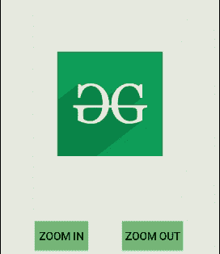

# 在安卓中实现放大或缩小

> 原文:[https://www . geeksforgeeks . org/implement-放大或缩小-放大-缩小-android/](https://www.geeksforgeeks.org/implement-zoom-in-or-zoom-out-in-android/)

**放大**和**缩小**动画分别用于在[安卓](https://www.geeksforgeeks.org/introduction-to-android-development/)应用中放大和缩小视图大小。开发人员经常使用这些类型的动画为应用程序提供动态特性。用户也可以通过观看这些动画来感受应用程序中发生的变化。



### 刻度标签的可扩展标记语言属性

放大和缩小动画的特征在 XML 文件中通过使用**缩放标签**来定义。

<figure class="table">

| XML 属性 | 描述 |
| --- | --- |
| 安卓:持续时间 | 用于以毫秒为单位定义动画的持续时间 |
| android:fromXScale | 用于设置视图在 X 轴上的初始大小 |
| android:fromYScale | 用于设置视图在 Y 轴上的初始大小 |
| android:pivotX | 定义对象放大/缩小点的 X 坐标 |
| Android:pivot(旋转) | 定义对象放大/缩小点的 Y 坐标 |
| android:toXScale | 用于设置视图在 X 轴上的最终尺寸 |
| 安卓:toYScale | 用于设置视图在 Y 轴上的最终尺寸 |

</figure>

### 如何在安卓中添加放大/缩小动画

下面的示例演示了在图像文件中实现放大和缩小动画的步骤。将使用 [ImageView](https://www.geeksforgeeks.org/imageview-in-kotlin/) 在活动中添加一个图像文件。

> **注意:**安卓工作室 4.0 版
> 执行以下步骤

**第一步:创建新项目**

1.  单击文件，然后单击新建= >新建项目。
2.  选择语言作为 Kotlin。
3.  根据您的需要选择最小的软件开发工具包。

**第二步:修改 activity_main.xml 文件**
下面是 **activity_main.xml** 文件的代码，在一个活动中添加一个 [TextView](https://www.geeksforgeeks.org/textview-in-kotlin/) 、 [ImageView](https://www.geeksforgeeks.org/imageview-in-kotlin/) 和两个[按钮](https://www.geeksforgeeks.org/button-in-kotlin/)。

**文件名:activity_main.xml**

## 可扩展标记语言

```kt
<?xml version="1.0" encoding="utf-8"?>
<androidx.constraintlayout.widget.ConstraintLayout
    xmlns:android="http://schemas.android.com/apk/res/android"
    xmlns:app="http://schemas.android.com/apk/res-auto"
    xmlns:tools="http://schemas.android.com/tools"
    android:layout_width="match_parent"
    android:layout_height="match_parent"
    android:background="#168BC34A"
    tools:context=".MainActivity" >

    <TextView
        android:id="@+id/textView"
        android:layout_width="0dp"
        android:layout_height="wrap_content"
        android:fontFamily="@font/roboto"
        android:text="@string/heading"
        android:textAlignment="center"
        android:textColor="@android:color/holo_green_light"
        android:textSize="36sp"
        android:textStyle="bold"
        app:layout_constraintBottom_toBottomOf="parent"
        app:layout_constraintEnd_toEndOf="parent"
        app:layout_constraintStart_toStartOf="parent"
        app:layout_constraintTop_toTopOf="parent"
        app:layout_constraintVertical_bias="0.060000002" />

    <ImageView
        android:id="@+id/imageView"
        android:layout_width="179dp"
        android:layout_height="172dp"
        app:layout_constraintBottom_toBottomOf="parent"
        app:layout_constraintEnd_toEndOf="parent"
        app:layout_constraintStart_toStartOf="parent"
        app:layout_constraintTop_toBottomOf="@+id/textView"
        app:layout_constraintVertical_bias="0.31"
        app:srcCompat="@drawable/logo" />

    <Button
        android:id="@+id/zoomInButton"
        android:layout_width="wrap_content"
        android:layout_height="wrap_content"
        android:background="#AB4CAF50"
        android:fontFamily="@font/roboto"
        android:padding="5dp"
        android:text="@string/zoomInButtonText"
        android:textSize="18sp"
        android:textStyle="bold"
        app:layout_constraintBottom_toBottomOf="parent"
        app:layout_constraintEnd_toStartOf="@+id/zoomOutButton"
        app:layout_constraintStart_toStartOf="parent"
        app:layout_constraintTop_toBottomOf="@+id/imageView"
        app:layout_constraintVertical_bias="0.76" />

    <Button
        android:id="@+id/zoomOutButton"
        android:layout_width="wrap_content"
        android:layout_height="wrap_content"
        android:background="#AB4CAF50"
        android:fontFamily="@font/roboto"
        android:padding="5dp"
        android:text="@string/zoomOutButtonText"
        android:textSize="18sp"
        android:textStyle="bold"
        app:layout_constraintBottom_toBottomOf="parent"
        app:layout_constraintEnd_toEndOf="parent"
        app:layout_constraintHorizontal_bias="0.77"
        app:layout_constraintStart_toStartOf="parent"
        app:layout_constraintTop_toBottomOf="@+id/imageView"
        app:layout_constraintVertical_bias="0.76" />
</androidx.constraintlayout.widget.ConstraintLayout>
```

**第三步:定义图像**
放大缩小动画的 XML 文件通过右键 **res = > New = >安卓资源目录**在应用的 **res** 文件夹中创建新目录。选择**资源类型为 anim** ，**目录名也应为 anim** 。在该目录下创建 2 个动画资源文件，即**放大**和**缩小**。这两个文件是保存动画细节的 XML 文件。下面是这两个文件的代码。

**文件名:zoom_in.xml**

## 可扩展标记语言

```kt
<?xml version="1.0" encoding="utf-8"?>
<set xmlns:android="http://schemas.android.com/apk/res/android"
    android:fillAfter = "true">

    <scale
        xmlns:android = "http://schemas.android.com/apk/res/android"
        android:duration = "1000"
        android:fromXScal = "1"
        android:fromYScale = "1"
        android:pivotX = "50%"
        android:pivotY = "50%"
        android:toXScale = "2"
        android:toYScale = "2"/>

</set>
```

**文件名:zoom_out.xm**

## 可扩展标记语言

```kt
<?xml version="1.0" encoding="utf-8"?>
<set xmlns:android="http://schemas.android.com/apk/res/android"
    android:fillAfter = "true">

    <scale
        xmlns:android="http://schemas.android.com/apk/res/android"
        android:duration = "2500"
        android:fromXScale = "1"
        android:fromYScale = "1"
        android:pivotX = "50%"
        android:pivotY = "50%"
        android:toXScale = ".2"
        android:toYScale = ".2" />

</set>
```

> set 标签下的 **android:fillAfter** 属性用于固定图像文件的最终大小，直到出现任何其他动画。

**第四步:修改 MainActivity.kt 文件**
下面是 **MainActivity.kt** 文件的代码，根据用户点击的按钮在 ImageView 小部件上加载并启动动画。

文件名:MainActivity.kt

## Java 语言(一种计算机语言，尤用于创建网站)

```kt
package com.example.zomminout

import android.os.Bundle
import android.view.animation.AnimationUtils
import android.widget.Button
import android.widget.ImageView
import androidx.appcompat.app.AppCompatActivity

class MainActivity : AppCompatActivity() {

    override fun onCreate(savedInstanceState: Bundle?) {
        super.onCreate(savedInstanceState)
        setContentView(R.layout.activity_main)

        // assigning id of the button
        // which zoom in the image
        val buttonZoomIn: Button = findViewById(R.id.zoomInButton)

        // assigning id of the button
        // which zoom out the image
        val buttonZoomOut: Button = findViewById(R.id.zoomOutButton)

        // assigning id of imageview on
        // which zoom in/out will be performed
        val image: ImageView = findViewById(R.id.imageView)

        // actions to be performed when
        // "Zoom In" button is clicked
        buttonZoomIn.setOnClickListener() {

            // loading the animation of
            // zoom_in.xml file into a variable
            val animZoomIn = AnimationUtils.loadAnimation(this,
                                                R.anim.zoom_in)
            // assigning that animation to
            // the image and start animation
            image.startAnimation(animZoomIn)
        }

        // actions to be performed when
        // "Zoom Out" button is clicked
        buttonZoomOut.setOnClickListener() {

            // loading the animation of
            // zoom_out.xml file into a variable
            val animZoomOut = AnimationUtils.loadAnimation(this,
                                                R.anim.zoom_out)

            // assigning that animation to
            // the image and start animation
            image.startAnimation(animZoomOut)
        }
    }
}
```

**第五步:修改 strings.xml 文件**
活动中使用的所有字符串都列在这个文件中。

**文件名:strings.xml**

## 可扩展标记语言

```kt
<resources>
    <string name="app_name">ZoomInOut</string>
    <string name="heading">Zoom In/Out in Android</string>
    <string name="zoomOutButtonText">Zoom Out</string>
    <string name="zoomInButtonText">Zoom In</string>
</resources>
```

### 输出:在模拟器上运行

<video class="wp-video-shortcode" id="video-455577-1" width="640" height="360" preload="metadata" controls=""><source type="video/mp4" src="https://media.geeksforgeeks.org/wp-content/uploads/20200718211127/Android_Zoom_In_Out_Recording.mp4?_=1">[https://media.geeksforgeeks.org/wp-content/uploads/20200718211127/Android_Zoom_In_Out_Recording.mp4](https://media.geeksforgeeks.org/wp-content/uploads/20200718211127/Android_Zoom_In_Out_Recording.mp4)</video>