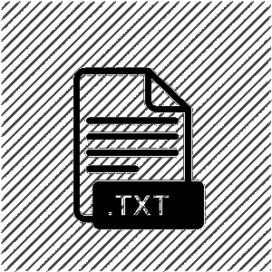

# 在安卓中从文本文件中插入和获取文本

> 原文:[https://www . geesforgeks . org/从安卓文本文件中插入并获取文本/](https://www.geeksforgeeks.org/insert-and-fetch-text-from-a-text-file-in-android/)

安卓系统中的文本文件可以用于多种功能。它可以被私人持有以存储关键信息和敏感数据。它还可以用来存储应用程序在各种情况下可以使用的基本信息。由于文本文件对输入和存储没有限制，因此它们可以作为存储数据的最有效方法之一。



因此，在本文中，我们将展示如何在安卓系统中从文本文件中插入和提取文本。

### 逐步实施

**第一步:在安卓工作室新建项目**

要在安卓工作室创建新项目，请参考[如何在安卓工作室创建/启动新项目](https://www.geeksforgeeks.org/android-how-to-create-start-a-new-project-in-android-studio/)。我们在 **Kotlin** 中演示了该应用程序，因此在创建新项目时，请确保选择 Kotlin 作为主要语言。

**步骤 2:使用 activity_main.xml 文件**

导航到**应用程序> res >布局> activity_main.xml** 并将下面的代码添加到该文件中。下面是 **activity_main.xml** 文件的代码。在布局文件中添加一个[编辑文本](https://www.geeksforgeeks.org/android-edittext-in-kotlin/)、两个[按钮](https://www.geeksforgeeks.org/button-in-kotlin/)、[和一个](https://www.geeksforgeeks.org/button-in-kotlin/)[文本视图](https://www.geeksforgeeks.org/textview-in-kotlin/)。编辑文本将接受输入字符串。按钮 1 将在触发时将字符串保存到文本文件中。按钮 2 被触发时，将在文本视图中显示文本文件数据。

## 可扩展标记语言

```
<?xml version="1.0" encoding="utf-8"?>
<RelativeLayout 
    xmlns:android="http://schemas.android.com/apk/res/android"
    xmlns:app="http://schemas.android.com/apk/res-auto"
    xmlns:tools="http://schemas.android.com/tools"
    android:layout_width="match_parent"
    android:layout_height="match_parent"
    tools:context=".MainActivity">

    <EditText
        android:id="@+id/edit_text"
        android:layout_width="match_parent"
        android:layout_height="50sp"/>

    <Button
        android:id="@+id/button1"
        android:layout_width="wrap_content"
        android:layout_height="wrap_content"
        android:layout_centerHorizontal="true"
        android:layout_below="@id/edit_text"
        android:text="Save"/>

    <Button
        android:id="@+id/button2"
        android:layout_width="wrap_content"
        android:layout_height="wrap_content"
        android:layout_centerHorizontal="true"
        android:layout_below="@id/button1"
        android:text="Show"/>

    <TextView
        android:id="@+id/text_view"
        android:layout_width="wrap_content"
        android:layout_height="wrap_content"
        android:layout_centerHorizontal="true"
        android:layout_below="@id/button2"/>

</RelativeLayout>
```

**第三步:使用**T2【主活动. kt】文件

转到 **MainActivity.kt** 文件，参考以下代码。下面是 **MainActivity.kt** 文件的代码。代码中添加了注释，以更详细地理解代码。

## 我的锅

```
import android.content.Context
import androidx.appcompat.app.AppCompatActivity
import android.os.Bundle
import android.widget.Button
import android.widget.EditText
import android.widget.TextView
import android.widget.Toast
import java.io.InputStreamReader
import java.io.OutputStreamWriter
import java.lang.Exception

class MainActivity : AppCompatActivity() {
    override fun onCreate(savedInstanceState: Bundle?) {
        super.onCreate(savedInstanceState)
        setContentView(R.layout.activity_main)

        // Declaring EditText, Buttons and TextViews from the layout file
        val mEditText = findViewById<EditText>(R.id.edit_text)
        val mButtonSave = findViewById<Button>(R.id.button1)
        val mButtonShow = findViewById<Button>(R.id.button2)
        val mTextView = findViewById<TextView>(R.id.text_view)

        // What happens when Save Button is pressed
        mButtonSave.setOnClickListener {
            if(mEditText.text.toString().isNotEmpty()){

                // For First time: Creates a text file and writes string into it
                // Else: Opens the text file and writes the string
                try {
                    val fileOutputStream = openFileOutput("mytextfile.txt", Context.MODE_PRIVATE)
                    val outputWriter = OutputStreamWriter(fileOutputStream)
                    outputWriter.write(mEditText.text.toString())
                    outputWriter.close()
                    Toast.makeText(baseContext, "File saved successfully!", Toast.LENGTH_SHORT).show()
                } catch (e: Exception) {
                    e.printStackTrace()
                }
            } else {
                Toast.makeText(applicationContext, "No input?", Toast.LENGTH_SHORT).show()
            }
        }

        // What happens when show button is pressed
        mButtonShow.setOnClickListener {

              // Tries to fetch data from the text file
            try {
                val fileInputStream = openFileInput("mytextfile.txt")
                val inputReader = InputStreamReader(fileInputStream)
                val output = inputReader.readText()

                // Data is displayed in the TextView
                mTextView.text = output
            } catch (e: Exception) {
                e.printStackTrace()
            }
        }
    }
}
```

**输出:**

您可以看到，我们能够从文本文件中写入和读取数据。

<video class="wp-video-shortcode" id="video-684175-1" width="640" height="360" preload="metadata" controls=""><source type="video/mp4" src="https://media.geeksforgeeks.org/wp-content/uploads/20210826112224/oo5.mp4?_=1">[https://media.geeksforgeeks.org/wp-content/uploads/20210826112224/oo5.mp4](https://media.geeksforgeeks.org/wp-content/uploads/20210826112224/oo5.mp4)</video>