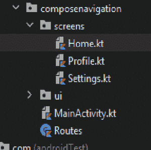

# Jetpack 在安卓中合成导航和传递数据

> 原文:[https://www . geesforgeks . org/jet pack-compose-navigation-and-passing-data-in-Android/](https://www.geeksforgeeks.org/jetpack-compose-navigation-and-passing-data-in-android/)

几乎每个应用都使用某种导航，允许用户从一个屏幕移动到另一个屏幕。在本文中，我们将学习使用撰写方式在喷气背包撰写中实现**导航**。我们将建立一个简单的应用程序，演示喷气背包合成导航，它将有三个屏幕(主页，个人资料和设置)。它将导航到带有一些数据的设置屏幕和不带任何数据的配置文件屏幕。下面给出了一个示例视频，让我们了解一下在本文中要做什么。

<video class="wp-video-shortcode" id="video-640797-1" width="640" height="360" preload="metadata" controls=""><source type="video/mp4" src="https://media.geeksforgeeks.org/wp-content/uploads/20210704223653/screen-20210704-213850.mp4?_=1">[https://media.geeksforgeeks.org/wp-content/uploads/20210704223653/screen-20210704-213850.mp4](https://media.geeksforgeeks.org/wp-content/uploads/20210704223653/screen-20210704-213850.mp4)</video>

**先决条件:**

1.  [**科特林**](https://www.geeksforgeeks.org/kotlin-programming-language/) **基础知识。**
2.  知识 [**喷气背包作曲**](https://www.geeksforgeeks.org/basics-of-jetpack-compose-in-android/) **。**

### **分步实施**

**步骤 1:创建一个新项目**(或者在现有的合成项目中使用它)

要在 Android Studio Canary 版本中创建新项目，请参考文章[如何使用 Jetpack Compose 在 Android Studio Canary 版本中创建新项目。](https://www.geeksforgeeks.org/how-to-create-a-new-project-in-android-studio-canary-version-with-jetpack-compose/)



项目结构

**步骤 2:添加依赖项:**

打开 build . grade le(app)并将此行添加到依赖项中。

> 实现“androidx . navigation:navigation-compose:2 . 4 . 0-alpha 04”

**步骤 3:创建路线**

创建一个名为**路线**的文件。添加以下代码。它将包含所有屏幕的路径名。

## 我的锅

```kt
// It contains route names to all three screens
sealed class Routes(val route: String) {
    object Home : Routes("home")
    object Profile : Routes("profile")
    object Settings : Routes("setting")
}
```

**第 4 步:使用屏幕**

它将有三个屏幕，所以我们需要创建三个可组合的。创建一个名为**屏幕**的包，并创建三个文件(Home.kt、Profile.kt、Settings.kt)。**使用主屏幕:**

## 我的锅

```kt
@Composable
fun Home(navController: NavHostController) {

    // Create a basic counter to display on screen
    var counter by remember {
        mutableStateOf(0)
    }

    // Box composable to center Items
    Box(
        modifier = Modifier
            .fillMaxSize()
            .background(Color.White), contentAlignment = Alignment.Center
    ) {

        // A Column composable
        Column {

            // A Text Composable to show counter on Screen
            Text(text = "Home, Counter is $counter", color = Color.Black)

            Spacer(modifier = Modifier.height(20.dp))

            // A button Composable which when clicked will increase the counter
            Button(onClick = { counter++ }) {
                Text(text = "Increment Counter", color = Color.White)
            }

            Spacer(modifier = Modifier.height(20.dp))

            // A button composable to navigate to Profile Screen
            Button(onClick = {
                navController.navigate(Routes.Profile.route)
            }) {
                Text(text = "Navigate to Profile", color = Color.White)
            }

            Spacer(modifier = Modifier.height(20.dp))

            // A Button Composable to navigate to
            // Settings Screen when clicked
            Button(onClick = {
                navController.navigate(Routes.Settings.route + "/$counter")
            }) {
                Text(text = "Navigate to Settings", color = Color.White)
            }
        }
    }
}
```

**使用轮廓屏幕:**

## 我的锅

```kt
// Composable function which contains
// basic Composable functions
@Composable
fun Profile() {
    Box(
        modifier = Modifier
            .fillMaxSize()
            .background(Color.White), contentAlignment = Alignment.Center
    ) {

        Column {
            Text(
                text = "Navigation without arguments",
                Modifier.padding(10.dp),
                color = Color.Black
            )
            Text(text = "Profile Screen", Modifier.padding(10.dp), color = Color.Black)
        }
    }
}
```

**使用设置屏幕:**

## 我的锅

```kt
// Settings Composable which receives counter as parameter
// passed down as arguments from home screen
@Composable
fun Setting(counter: String?) {
    Box(
        modifier = Modifier
            .fillMaxSize()
            .background(Color.White), contentAlignment = Alignment.Center
    ) {
        Column {

            Text(text = "Navigation with arguments", Modifier.padding(10.dp), color = Color.Black)

            // Display the counter
            Text(
                text = "Settings Screen, passed data is $counter",
                Modifier.padding(10.dp),
                color = Color.Black
            )
        }
    }
}
```

**步骤 5:使用主要活动和导航组件**

在 **MainActivity.kt** 中创建一个名为 ScreenMain 的函数，该函数将包含导航用的 NavHost 和 Composable。为了更好的理解，请参考代码中的注释。

## 我的锅

```kt
@Composable
fun ScreenMain() {

    val navController = rememberNavController()

    NavHost(navController = navController, startDestination = Routes.Home.route) {

        // First route : Home
        composable(Routes.Home.route) {

            // Lay down the Home Composable
            // and pass the navController
            Home(navController = navController)
        }

        // Another Route : Profile
        composable(Routes.Profile.route) {
            // Profile Screen
            Profile()
        }

        // Settings Route, Notice the "/{id}" in last,
        // its the argument passed down from homeScreen
        composable(Routes.Settings.route + "/{id}") { navBackStack ->

            // Extracting the argument
            val counter = navBackStack.arguments?.getString("id")

            // Setting screen,
            // Pass the extracted Counter
            Setting(counter = counter)
        }
    }
}
```

最后，从**主活动**的 onCreate 中的**设置内容**调用这个可组合。

## 我的锅

```kt
class MainActivity : ComponentActivity() {
    override fun onCreate(savedInstanceState: Bundle?) {
        super.onCreate(savedInstanceState)
        setContent {
            Surface(color = MaterialTheme.colors.background) {
                ScreenMain()
            }
        }
    }
}
```

此外，您可以在使用合成动画应用编程接口打开屏幕时添加动画。

**输出:**

<video class="wp-video-shortcode" id="video-640797-2" width="640" height="360" preload="metadata" controls=""><source type="video/mp4" src="https://media.geeksforgeeks.org/wp-content/uploads/20210704223653/screen-20210704-213850.mp4?_=2">[https://media.geeksforgeeks.org/wp-content/uploads/20210704223653/screen-20210704-213850.mp4](https://media.geeksforgeeks.org/wp-content/uploads/20210704223653/screen-20210704-213850.mp4)</video>

从 [Github](https://github.com/sunny52525/GFG-articles/tree/master/ComposeNavigation) 获取完整的项目。