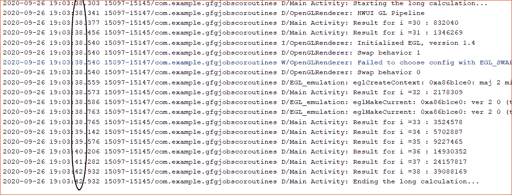

# 科特林验尸官中的工作、等待、取消

> 原文:[https://www . geesforgeks . org/jobs-waiting-cancel-in-kot Lin-coroutines/](https://www.geeksforgeeks.org/jobs-waiting-cancellation-in-kotlin-coroutines/)

**先决条件:**

*   [安卓上的科特林 corroutines](https://www.geeksforgeeks.org/kotlin-coroutines-on-android/)
*   [科特林验尸官](https://www.geeksforgeeks.org/dispatchers-in-kotlin-coroutines/)
*   [柯特林验尸官暂停功能](https://www.geeksforgeeks.org/suspend-function-in-kotlin-coroutines/)

在本文中，将讨论以下主题，如[协同工作](https://www.geeksforgeeks.org/kotlin-coroutines-on-android/)中有哪些工作，如何等待协同工作，以及如何取消协同工作。每当新的协同程序启动时，它都会返回一个作业。退回的工作可以用在很多地方，比如可以用来等待验尸官做一些工作，也可以用来取消验尸官。该作业可用于调用许多功能，如用于等待协同执行的 **join()** 方法和用于取消协同执行的 **cancel()** 方法。

### 工作的定义

根据官方文件，工作的定义如下:

> 工作是一个可取消的东西，它的生命周期以完成而告终。协同作业是用启动协同生成器创建的。它运行指定的代码块，并在该代码块完成时完成。

### 如何获得这份工作？

正如我们所讨论的，当一个新的协同程序启动时，一个作业将被返回，所以现在让我们以编程的方式来看看该作业是如何被返回的，以及该作业是如何被使用的。

## 我的锅

```
// sample kotlin program in kotlin
import androidx.appcompat.app.AppCompatActivity
import android.os.Bundle
import kotlinx.coroutines.Dispatchers
import kotlinx.coroutines.GlobalScope
import kotlinx.coroutines.launch

class MainActivity : AppCompatActivity() {
    override fun onCreate(savedInstanceState: Bundle?) {
        super.onCreate(savedInstanceState)
        setContentView(R.layout.activity_main)

        // A job is returned
        val job = GlobalScope.launch(Dispatchers.Default) {

        }
    }
}
```

### 利用工作可以完成的事情

协同作业可以通过作业界面上可用的功能来控制。工作界面提供的许多功能如下:

*   **start()**
*   **join()**
*   **取消()**

### join()方法

**join()** 函数是一个暂停函数，即可以从一个协同函数或另一个暂停函数中调用。作业阻塞所有线程，直到编写它的协同程序或上下文完成它的工作。只有当协同结束时， **join()** 函数后的行才会被执行。让我们举一个例子来演示 **join()** 函数的工作原理。

## 我的锅

```
// sample kotlin program for demonstrating job.join method
import androidx.appcompat.app.AppCompatActivity
import android.os.Bundle
import android.util.Log
import kotlinx.coroutines.*

class MainActivity : AppCompatActivity() {

    val TAG:String = "Main Activity"

    override fun onCreate(savedInstanceState: Bundle?) {
        super.onCreate(savedInstanceState)
        setContentView(R.layout.activity_main)

        // creating/launching a coroutine will return the job
        val job = GlobalScope.launch(Dispatchers.Default) {
            repeat(5)
            {
                Log.d(TAG, "Coroutines is still working")
                // delay the coroutine by 1sec
                delay(1000)
            }
        }

        runBlocking {
              // waiting for the coroutine to finish it's work
            job.join()
            Log.d(TAG, "Main Thread is Running")
        }
    }
}
```

**日志输出如下:**

时间戳由椭圆形圆圈显示


可以看到，直到正在运行的协同程序完成其工作，日志语句才被允许执行，这可能只是由于 **join()** 方法。

### 取消()方法

**cancel()** 方法用于取消 coroutine，无需等待它完成工作。可以说，它与 join 方法正好相反，即 **join()** 方法等待 coroutine 完成其全部工作并阻塞所有其他线程，而 **cancel()** 方法在遇到时杀死 coroutine 即停止 coroutine。让我们举一个例子来演示 **cancel()** 功能的工作。

## 我的锅

```
// sample kotlin program
import androidx.appcompat.app.AppCompatActivity
import android.os.Bundle
import android.util.Log
import kotlinx.coroutines.*

class MainActivity : AppCompatActivity() {

    val TAG:String = "Main Activity"

    override fun onCreate(savedInstanceState: Bundle?) {
        super.onCreate(savedInstanceState)
        setContentView(R.layout.activity_main)

        val job = GlobalScope.launch(Dispatchers.Default) {
            repeat(5)
            {
                Log.d(TAG, "Coroutines is still working")
                delay(1000)
            }
        }

        runBlocking {
              // delaying the coroutine by 2sec
            delay(2000)

            // canceling/stopping  the coroutine 
            job.cancel()
            Log.d(TAG, "Main Thread is Running")
        }
    }
}
```

**日志输出如下:**

时间戳由椭圆形圆圈显示


取消协同并不总是像上面的例子那样容易。应该记住，当有人使用 **cancel()** 方法时，coroutine 应该知道将会遇到 cancel 方法，即可能会遇到 cancel 方法，并且 coroutine 仍在运行。简而言之，需要有足够的时间告诉验尸官它已经被取消了。重复功能中的**延迟()**功能确保协同程序有足够的时间准备让我们举个例子，试着理解这一段:

## 我的锅

```
// sample kotlin program 
import androidx.appcompat.app.AppCompatActivity
import android.os.Bundle
import android.util.Log
import kotlinx.coroutines.*

class MainActivity : AppCompatActivity() {

    val TAG:String = "Main Activity"

    override fun onCreate(savedInstanceState: Bundle?) {
        super.onCreate(savedInstanceState)
        setContentView(R.layout.activity_main)

        val job = GlobalScope.launch(Dispatchers.Default) {
            Log.d(TAG,"Starting the long calculation...")

            // running the loop from 30 to 40
            for(i in 30..40)
            {
                Log.d(TAG, "Result for i =$i : ${fib(i)}")
            }
            Log.d(TAG, "Ending the long calculation...")
        }

        runBlocking {
            delay(2000)
            job.cancel()
            Log.d(TAG, "Main Thread is Running")
        }
    }

    // fibonacci function
    fun fib(n:Int):Long
    {
        return if(n==0) 0
        else if(n==1) 1
        else fib(n-1) + fib(n-2)
    }
}
```

**日志输出如下:**

时间戳由椭圆形圆圈显示


可以看出，即使遇到了 **cancel()** 方法，我们的协同学也会继续计算数字的斐波那契结果。这是因为我们的协同程序忙于计算，没有时间自行取消。暂停那里没有暂停功能(像**延迟()**，我们没有足够的时间告诉验尸官已经取消了。所以我们必须手动检查，如果验尸官已经取消或没有。这可以通过使用**激活**来检查验尸官是否激活来完成。

## 我的锅

```
// sample kotlin program 
import androidx.appcompat.app.AppCompatActivity
import android.os.Bundle
import android.util.Log
import kotlinx.coroutines.*

class MainActivity : AppCompatActivity() {

    val TAG:String = "Main Activity"

    override fun onCreate(savedInstanceState: Bundle?) {
        super.onCreate(savedInstanceState)
        setContentView(R.layout.activity_main)

        val job = GlobalScope.launch(Dispatchers.Default) {
            Log.d(TAG, "Starting the long calculation...")
            for(i in 30..40)
            {
                  // using isActive fuctionality to check whether the
                  // coroutine is active or not
                if(isActive)
                Log.d(TAG, "Result for i =$i : ${fib(i)}")
            }
            Log.d(TAG, "Ending the long calculation...")
        }

        runBlocking {
            delay(2000)
            job.cancel()
            Log.d(TAG, "Main Thread is Running")
        }
    }

    fun fib(n:Int):Long
    {
        return if(n==0) 0
        else if(n==1) 1
        else fib(n-1) + fib(n-2)
    }
}
```

**日志输出如下:**

时间戳由椭圆形圆圈显示


可以看出，使用**isaactive**增加了协同对其取消的意识，并且与没有使用 isaactive 时相比，取消后它执行的计算非常少。

### 带超时()

Kotlin coroutine 对上述问题提出了一个很好的解决方案，即 coroutine 会自动取消，在经过一定时间后不做任何进一步的计算，而 **withTimeOut()** 有助于这样做。无需使用**润堵()**功能手动取消验尸官。让我们看看**带超时()**功能是如何工作的:

## 我的锅

```
// sample kotlin program
import androidx.appcompat.app.AppCompatActivity
import android.os.Bundle
import android.util.Log
import kotlinx.coroutines.*

class MainActivity : AppCompatActivity() {

    val TAG:String = "Main Activity"

    override fun onCreate(savedInstanceState: Bundle?) {
        super.onCreate(savedInstanceState)
        setContentView(R.layout.activity_main)

        val job = GlobalScope.launch(Dispatchers.Default) {
            Log.d(TAG, "Starting the long calculation...")

            // using withTimeOut function
            // which runs the coroutine for 3sec
            withTimeout(3000L)
            {
                for(i in 30..40)
                {
                    if(isActive)
                        Log.d(TAG, "Result for i =$i : ${fib(i)}")
                }
            }
            Log.d(TAG, "Ending the long calculation...")
        }

    }

    fun fib(n:Int):Long
    {
        return if(n==0) 0
        else if(n==1) 1
        else fib(n-1) + fib(n-2)
    }
}
```

**日志输出如下:**

时间戳由椭圆形圆圈显示

