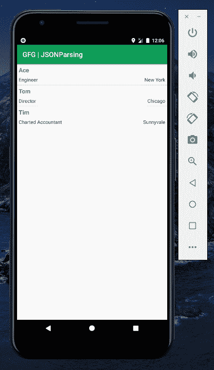

# 安卓中的 JSON 解析

> 原文:[https://www.geeksforgeeks.org/json-parsing-in-android/](https://www.geeksforgeeks.org/json-parsing-in-android/)

[**JSON(JavaScript Object notification)**](https://www.geeksforgeeks.org/json-full-form/)是一种简单明了的交换服务器数据的数据交换格式，是 [XML](https://www.geeksforgeeks.org/difference-between-json-and-xml/) 的更好替代。这是因为 JSON 是一种轻量级的结构化语言。安卓支持 **JSONStringer、JSONObject、JSONArray、**等所有 JSON 类以及所有其他形式来解析 JSON 数据，获取程序需要的信息。JSON 的主要优势是它是一个独立于语言的，JSON 对象将包含像键/值对一样的数据。一般来说，JSON 节点将以**方括号([)** 或**花括号({)** 开始。方括号和花括号的主要区别在于**方括号([)** 代表 **JSONArray 节点**的开始。而**花括号({)** 代表 **JSONObject** 。因此需要调用适当的方法来获取数据。有时 JSON 数据以[]开头。然后我们需要使用 **getJSONArray()** 方法来获取数据。同样，如果它以{ }开头，那么我们需要使用 **getJSONobject()** 方法。JSON 文件的语法如下:

```kt
{ 
"Name": "GeeksforGeeks", 
"Estd": 2009, 
"age": 10, 
"address": { 
    "buildingAddress": "5th & 6th Floor Royal Kapsons, A- 118", 
    "city": "Sector- 136, Noida", 
    "state": "Uttar Pradesh (201305)", 
    "postalCode": "201305"
}, 

```

在本文中，我们将解析安卓系统中的一个 JSON 文件。注意，我们将使用**语言来实现这个项目。**

### **逐步实施**

**要解析安卓系统中的 JSON 文件，请执行以下步骤:**

****第一步:创建新项目****

**要在安卓工作室创建新项目，请参考[如何在安卓工作室创建/启动新项目](https://www.geeksforgeeks.org/android-how-to-create-start-a-new-project-in-android-studio/)。注意选择**科特林**作为编程语言。**

****步骤 2:使用 activity_main.xml 文件****

**转到代表应用程序用户界面的 **activity_main.xml** 文件。创建一个 [**列表视图**](https://www.geeksforgeeks.org/android-listview-in-kotlin/) 如图所示。下面是**activity _ main . XML**文件的代码。**

## **可扩展标记语言**

```kt
<?xml version="1.0" encoding="utf-8"?>
<LinearLayout 
    xmlns:android="http://schemas.android.com/apk/res/android"
    android:layout_width="fill_parent"
    android:layout_height="fill_parent"
    android:orientation="vertical" >

    <!--This listView will display the list items-->
    <ListView
        android:id="@+id/user_list"
        android:layout_width="fill_parent"
        android:layout_height="wrap_content"
        android:dividerHeight="1dp" />

</LinearLayout>
```

****第三步:创建另一个布局资源文件****

**转到 **app > res >布局>右键单击>新建>布局资源文件**并创建另一个布局 **list_row.xml** 以在**列表视图**中显示数据。下面是 **list_row.xml** 文件的代码。**

## **可扩展标记语言**

```kt
<?xml version="1.0" encoding="utf-8"?>
<RelativeLayout 
    xmlns:android="http://schemas.android.com/apk/res/android"
    android:layout_width="fill_parent"
    android:layout_height="wrap_content"
    android:orientation="horizontal"
    android:padding="5dip">

    <!--TextView to display the name-->
    <TextView
        android:id="@+id/name"
        android:layout_width="wrap_content"
        android:layout_height="wrap_content"
        android:textSize="17dp"
        android:textStyle="bold" />

    <!--TextView to display the designation-->
    <TextView
        android:id="@+id/designation"
        android:layout_width="wrap_content"
        android:layout_height="wrap_content"
        android:layout_below="@id/name"
        android:layout_marginTop="7dp"
        android:textColor="#343434"
        android:textSize="14dp" />

    <!--TextView to display the location-->
    <TextView
        android:id="@+id/location"
        android:layout_width="wrap_content"
        android:layout_height="wrap_content"
        android:layout_alignBaseline="@+id/designation"
        android:layout_alignBottom="@+id/designation"
        android:layout_alignParentRight="true"
        android:textColor="#343434"
        android:textSize="14dp" />
</RelativeLayout>
```

****第 4 步:使用 MainActivity.kt 文件****

**转到 **MainActivity.kt** 文件，参考以下代码。下面是 **MainActivity.kt** 文件的代码。代码中添加了注释，以更详细地理解代码。**

## **我的锅**

```kt
import android.os.Bundle
import android.util.Log
import android.widget.ListAdapter
import android.widget.ListView
import android.widget.SimpleAdapter
import androidx.appcompat.app.AppCompatActivity
import org.json.JSONException
import org.json.JSONObject
import java.util.*

class MainActivity : AppCompatActivity() {
    override fun onCreate(savedInstanceState: Bundle?) {
        super.onCreate(savedInstanceState)
        setContentView(R.layout.activity_main)

        // private string declare in the latter section of the program
        val jsonStr = listData
        try {

            // Create a userList string hashmap arraylist
            val userList = ArrayList<HashMap<String, String?>>()

            // Declaring the listView from the layout file
            val lv = findViewById<ListView>(R.id.user_list)

            // Initializing the JSON object and extracting the information
            val jObj = JSONObject(jsonStr)
            val jsonArry = jObj.getJSONArray("users")
            for (i in 0 until jsonArry.length()) {
                val user = HashMap<String, String?>()
                val obj = jsonArry.getJSONObject(i)
                user["name"] = obj.getString("name")
                user["designation"] = obj.getString("designation")
                user["location"] = obj.getString("location")
                userList.add(user)
            }

            // ListAdapter to broadcast the information to the list elements
            val adapter: ListAdapter = SimpleAdapter(
                this, userList, R.layout.list_row,
                arrayOf("name", "designation", "location"), intArrayOf(
                    R.id.name,
                    R.id.designation, R.id.location
                )
            )
            lv.adapter = adapter
        } catch (ex: JSONException) {
            Log.e("JsonParser Example", "unexpected JSON exception", ex)
        }
    }

    // JSON object in the form of input stream
    private val listData: String
        get() = ("{ \"users\" :[" +
                "{\"name\":\"Ace\",\"designation\":\"Engineer\",\"location\":\"New York\"}" +
                ",{\"name\":\"Tom\",\"designation\":\"Director\",\"location\":\"Chicago\"}" +
                ",{\"name\":\"Tim\",\"designation\":\"Charted Accountant\",\"location\":\"Sunnyvale\"}] }")
}
```

### ****输出:在仿真器上运行****

****