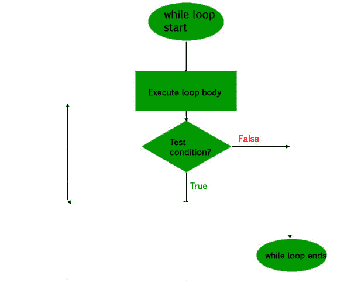

# 柯特林边做边循环

> 原文:[https://www.geeksforgeeks.org/kotlin-do-while-loop/](https://www.geeksforgeeks.org/kotlin-do-while-loop/)

像 Java 一样， *do-while* 循环是一个控制流语句，它在不检查条件的情况下至少执行一个代码块一次，然后重复执行该块，或者不执行，它完全依赖于 do-while 块末尾的一个布尔条件。它与 *while* 循环形成对比，因为 while 循环仅在条件变为真时执行块，但是 *do-while* 循环首先执行代码，然后评估表达式或测试条件。

***【do-while】*循环工作–**
首先执行块内的所有语句，然后评估条件。如果条件为真，则再次执行代码块。只要表达式的计算结果为真，就重复执行代码块的过程。如果表达式变为 false，循环将终止，并将控制转移到 do-while 循环旁边的语句。

它也被称为**后测试循环**，因为它在块执行后检查条件。

**当循环-** 时*的语法*

```kt
do {
      // code to run
{
while(condition)

```

**流程图:**

<center></center>

**Kotlin 程序，使用 do-while 循环找到一个数的阶乘–**

```kt
fun main(args: Array<String>) {
    var number = 6
    var factorial = 1

    do {
        factorial *= number
        number--
    }while(number > 0)
    println("Factorial of 6 is $factorial")
}
```

**输出:**

```kt
Factorial of 6 is 720
```

**科特林程序使用边做边循环打印表 2–**

```kt
fun main(args: Array<String>) {
    var num = 2
    var i = 1

    do {
        println("2 * $i = "+ num * i)
        i++
    }while(i < 11)
}
```

**输出:**

```kt
2 * 1 = 2
2 * 2 = 4
2 * 3 = 6
2 * 4 = 8
2 * 5 = 10
2 * 6 = 12
2 * 7 = 14
2 * 8 = 16
2 * 9 = 18
2 * 10 = 20

```