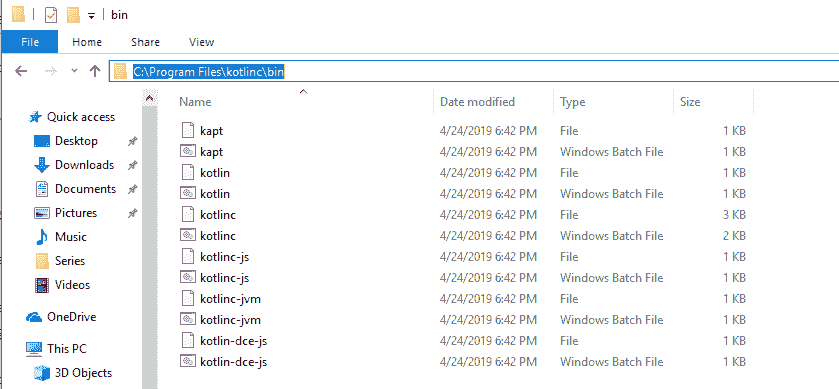
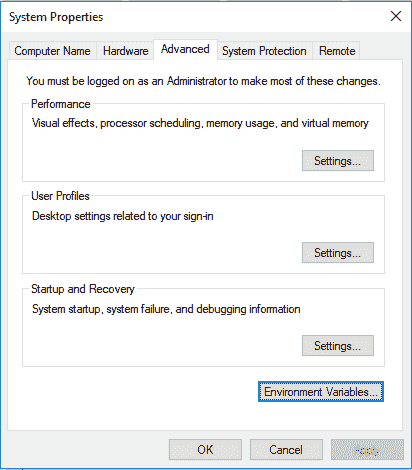
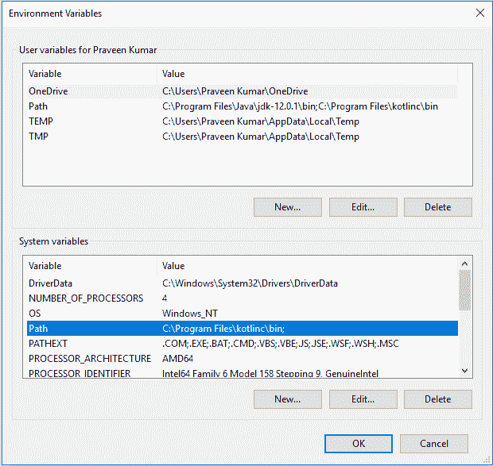
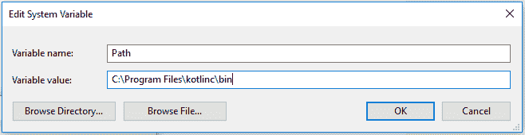

# 命令行的科特林环境设置

> 原文:[https://www . geesforgeks . org/kot Lin-环境-命令行设置/](https://www.geeksforgeeks.org/kotlin-environment-setup-for-command-line/)

在本文中，我们将看到如何在命令行编译器上为 Kotlin 设置环境。

**安装 Kotlin 的先决条件–**
Kotlin 运行在 Java 虚拟机上，因此需要安装 JDK，并在本地系统环境变量中设置路径。要在系统中安装 JDK 和 JRE 并在环境变量中设置路径，请参考本文–[在 Java 中设置环境](https://www.geeksforgeeks.org/setting-environment-java/)。

**下载 kotlin 编译器–**
你可以从 [Github Releases](https://github.com/JetBrains/kotlin/releases/tag/v1.3.31) 下载最新版本的 Kotlin 独立编译器。现在最新的版本是 1.3.31。

**为命令行设置科特林编译器–**

*   首先，将下载的文件提取到您有写权限的任何位置。
*   将路径复制到 kotlinc 的 bin 目录。
    
*   现在打开我的电脑属性-> **高级系统设置**，然后点击**环境变量**。
    
*   单击系统变量中的路径，然后单击编辑按钮。
    
*   现在把复制的 bin 目录路径粘贴在这里，点击确定->确定->确定。
    
*   在命令提示符下键入 **kotlinc** 验证安装。
    T3】