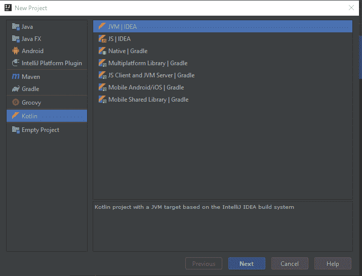
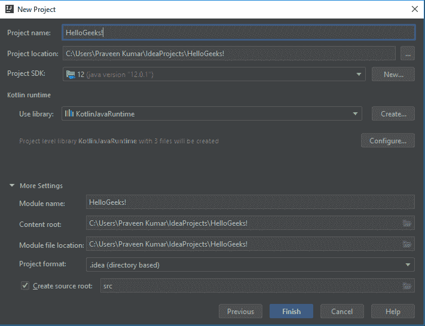
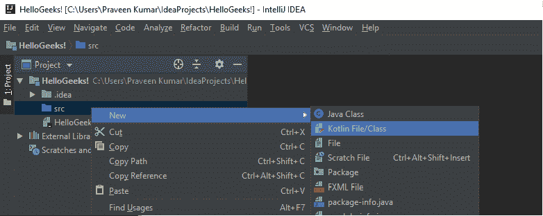
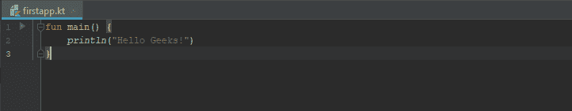
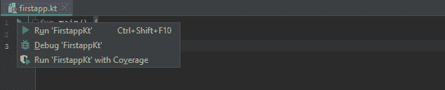
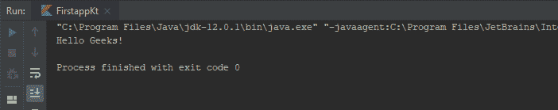

# 用 Intellij IDEA 设置 Kotlin 环境

> 原文:[https://www . geesforgeks . org/kot Lin-environment-setup-with-intellij-idea/](https://www.geeksforgeeks.org/kotlin-environment-setup-with-intellij-idea/)

**Kotlin** 是由 JetBrains 开发的一种静态类型的通用编程语言，已经构建了像 IntelliJ IDEA、PhpStorm、Appcode 等世界一流的 ide。它于 2011 年由捷脑科首次推出。Kotlin 是面向对象的语言，也是比 Java 更好的语言，但仍然可以与 Java 代码完全互操作。

让我们看看如何使用 Intellij IDEA 为 Kotlin 设置环境，并运行我们的第一个 Kotlin 代码。

1.  要开始，请安装 IntelliJ IDEA 的最新版本。可以从[捷脑](http://www.jetbrains.com/idea/download/#section=windows)下载免费社区版。
    T3】
2.  Once you have installed the Intellij IDEA, create a Kotlin application.
    Creating a new project from File -> New -> Project.Then select **Kotlin -> JVM | IDEA** .

    

3.  Name your project and select the SDK version for it. Here we name the project **HelloGeeks!**.

    

4.  Now you have new project HelloGeeks!. Create a new Kotlin file under the source(src) folder and let’s name it is **firstapp.kt**

    

5.  Once the file is created, write the main function. IntelliJ IDEA offers a template to do this in a faster way. Just type main and press tab. Add a line of code to print out ‘Hello Geeks!’.

    

6.  Running the application.Now the application is ready to run. The easiest way is to click the green Run button in the sidebar and select Run ‘FirstappKt’. You can run directly by pressing **Ctrl + Shift + F10**.

    

7.  If your program compiles successfully you will see the output in the Run Tool Window.

    