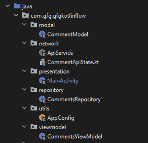

# 安卓中的 Kotlin 流，示例

> 原文:[https://www . geeksforgeeks . org/kot Lin-带示例的安卓流量/](https://www.geeksforgeeks.org/kotlin-flow-in-android-with-example/)

柯特林流是柯特林花冠的最新成员之一。使用科特林流，我们可以异步处理正在顺序执行的数据流。

### 我们将在本文中构建什么？

我们将构建一个简单的应用程序，从应用编程接口获取一些数据并显示在屏幕上。这是一个演示柯特林流程工作原理的简单应用程序。它将使用 MVVM 建筑。

**先决条件:**

1.  良好的[安卓](https://www.geeksforgeeks.org/android-tutorial/)知识
2.  [科特林](https://www.geeksforgeeks.org/kotlin-programming-language/)知识
3.  [MVVM 建筑基础](https://www.geeksforgeeks.org/introduction-to-model-view-view-model-mvvm/)
4.  [改装库](https://www.geeksforgeeks.org/introduction-retofit-2-android-set-1/)基础
5.  [柯特林花冠](https://www.geeksforgeeks.org/kotlin-coroutines-on-android/)基础
6.  [视图绑定基础](https://www.geeksforgeeks.org/view-binding-in-android-jetpack/)

### **分步实施**

**第一步:创建新项目**

要在安卓工作室创建新项目，请参考如何在安卓工作室创建/启动新项目。注意选择**科特林**作为编程语言。

**第二步:项目结构**

我们将遵循一些模式来保存我们的文件。根据此项目结构创建文件夹和文件。本文稍后将解释其用途。



项目结构

**步骤 3:添加所需的依赖关系**

导航到**渐变脚本>构建.渐变(模块:应用)**，并在依赖项部分添加以下依赖项。

> //改装依赖性
> 
> 实现“com.squareup.retrofit2:改装:2.9.0”
> 
> // json 转换器工厂
> 
> 实现' com . squareup . retro fit 2:converter-gson:2 . 1 . 0 '
> 
> // Coroutines(包括 kotlin 流)
> 
> 实现' org . jet brains . kot linx:kot linx-coroutines-Android:1 . 5 . 0 '
> 
> //生命周期组件
> 
> 实现“androidx . life cycle:life cycle-extensions:2 . 2 . 0”
> 
> 实现“androidx . life cycle:life cycle-view model-ktx:2 . 3 . 1”
> 
> 实现“androidx . life cycle:life cycle-runtime-ktx:2 . 3 . 1”

**第 4 步:使用 activity_main.xml**

导航到**应用程序> res >布局> activity_main.xml** 并将下面的代码添加到该文件中。下面是 **activity_main.xml** 文件的代码。

## 可扩展标记语言

```
<?xml version="1.0" encoding="utf-8"?>
<androidx.constraintlayout.widget.ConstraintLayout
    xmlns:android="http://schemas.android.com/apk/res/android"
    xmlns:app="http://schemas.android.com/apk/res-auto"
    xmlns:tools="http://schemas.android.com/tools"
    android:layout_width="match_parent"
    android:layout_height="match_parent"
    android:padding="16dp"
    tools:context=".presentation.MainActivity">

    <androidx.constraintlayout.widget.Guideline
        android:id="@+id/guideline2"
        android:layout_width="wrap_content"
        android:layout_height="wrap_content"
        android:orientation="vertical"
        app:layout_constraintGuide_percent="0.3" />

    <EditText
        android:id="@+id/search_edit_text"
        android:layout_width="0dp"
        android:layout_height="wrap_content"
        android:autofillHints="Search Comments By Id"
        android:inputType="numberSigned"
        app:layout_constraintLeft_toLeftOf="parent"
        app:layout_constraintRight_toLeftOf="@id/button"
        app:layout_constraintTop_toTopOf="parent" />

    <Button
        android:id="@+id/button"
        android:layout_width="wrap_content"
        android:layout_height="wrap_content"
        android:text="Search"
        app:layout_constraintRight_toRightOf="parent"
        app:layout_constraintTop_toTopOf="parent" />

    <ProgressBar
        android:layout_width="match_parent"
        android:id="@+id/progress_bar"
        android:layout_height="wrap_content"
        app:layout_constraintBottom_toTopOf="@+id/textView"
        app:layout_constraintEnd_toEndOf="parent"
        android:visibility="gone"
        app:layout_constraintStart_toStartOf="parent"
        app:layout_constraintTop_toBottomOf="@id/search_edit_text" />

    <TextView
        android:id="@+id/textView"
        android:layout_width="wrap_content"
        android:layout_height="wrap_content"
        android:layout_marginTop="20dp"
        android:layout_marginEnd="20dp"
        android:layout_marginRight="20dp"
        android:text="Comment Id"
        android:textStyle="bold"
        app:layout_constraintEnd_toStartOf="@+id/guideline2"
        app:layout_constraintHorizontal_bias="1.0"
        app:layout_constraintStart_toStartOf="parent"
        app:layout_constraintTop_toBottomOf="@id/search_edit_text" />

    <TextView
        android:id="@+id/comment_id_textview"
        android:layout_width="wrap_content"
        android:layout_height="wrap_content"
        android:layout_marginStart="20dp"
        android:layout_marginLeft="20dp"
        android:layout_marginTop="20dp"
        android:textStyle="bold"
        app:layout_constraintBottom_toBottomOf="@+id/textView"
        app:layout_constraintEnd_toEndOf="parent"
        app:layout_constraintHorizontal_bias="0.0"
        app:layout_constraintStart_toEndOf="@+id/guideline2"
        app:layout_constraintTop_toBottomOf="@id/search_edit_text" />

    <TextView
        android:id="@+id/textView2"
        android:layout_width="wrap_content"
        android:layout_height="wrap_content"
        android:layout_marginTop="20dp"
        android:layout_marginEnd="20dp"
        android:layout_marginRight="20dp"
        android:text="Name"
        android:textStyle="bold"
        app:layout_constraintEnd_toStartOf="@+id/guideline2"
        app:layout_constraintHorizontal_bias="1.0"
        app:layout_constraintStart_toStartOf="parent"
        app:layout_constraintTop_toBottomOf="@id/comment_id_textview" />

    <TextView
        android:id="@+id/name_textview"
        android:layout_width="wrap_content"
        android:layout_height="wrap_content"
        android:layout_marginStart="20dp"
        android:layout_marginLeft="20dp"
        android:textStyle="bold"
        app:layout_constraintBottom_toBottomOf="@+id/textView2"
        app:layout_constraintEnd_toEndOf="parent"
        app:layout_constraintHorizontal_bias="0.0"
        app:layout_constraintStart_toEndOf="@+id/guideline2"
        app:layout_constraintTop_toTopOf="@+id/textView2" />

    <TextView
        android:id="@+id/textView3"
        android:layout_width="wrap_content"
        android:layout_height="wrap_content"
        android:layout_marginTop="20dp"
        android:layout_marginEnd="20dp"
        android:layout_marginRight="20dp"
        android:text="Email"
        android:textStyle="bold"
        app:layout_constraintEnd_toStartOf="@+id/guideline2"
        app:layout_constraintHorizontal_bias="1.0"
        app:layout_constraintStart_toStartOf="parent"
        app:layout_constraintTop_toBottomOf="@id/name_textview" />

    <TextView
        android:id="@+id/email_textview"
        android:layout_width="wrap_content"
        android:layout_height="wrap_content"
        android:layout_marginStart="20dp"
        android:layout_marginLeft="20dp"
        android:layout_marginTop="20dp"
        android:textStyle="bold"
        app:layout_constraintBottom_toBottomOf="@+id/textView3"
        app:layout_constraintEnd_toEndOf="parent"
        app:layout_constraintHorizontal_bias="0.0"
        app:layout_constraintStart_toEndOf="@+id/guideline2"
        app:layout_constraintTop_toBottomOf="@id/name_textview" />

    <TextView
        android:id="@+id/textView4"
        android:layout_width="wrap_content"
        android:layout_height="wrap_content"
        android:layout_marginTop="20dp"
        android:layout_marginEnd="20dp"
        android:layout_marginRight="20dp"
        android:text="Comment"
        android:textStyle="bold"
        app:layout_constraintEnd_toStartOf="@+id/guideline2"
        app:layout_constraintHorizontal_bias="1.0"
        app:layout_constraintStart_toStartOf="parent"
        app:layout_constraintTop_toBottomOf="@id/email_textview" />

    <TextView
        android:id="@+id/comment_textview"
        android:layout_width="wrap_content"
        android:layout_height="wrap_content"
        android:layout_marginStart="20dp"
        android:layout_marginLeft="20dp"
        android:layout_marginTop="20dp"
        android:textStyle="bold"
        app:layout_constraintBottom_toBottomOf="@+id/textView4"
        app:layout_constraintEnd_toEndOf="parent"
        app:layout_constraintHorizontal_bias="0.0"
        app:layout_constraintStart_toEndOf="@+id/guideline2"
        app:layout_constraintTop_toBottomOf="@id/email_textview" />

</androidx.constraintlayout.widget.ConstraintLayout>
```