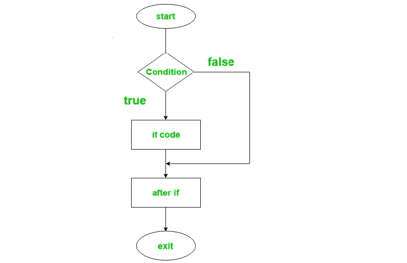
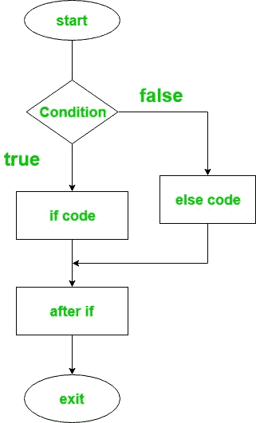
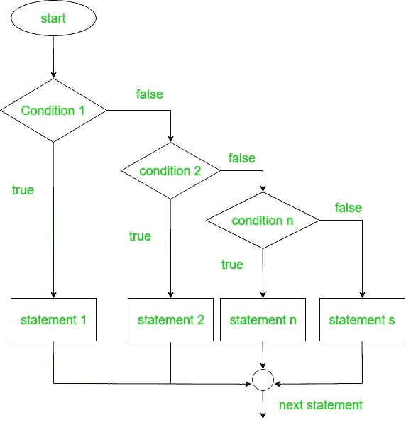
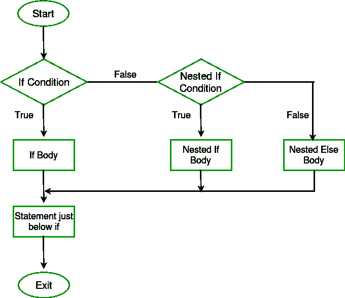

# 柯特林 if-else 表达式

> 原文:[https://www.geeksforgeeks.org/kotlin-if-else-expression/](https://www.geeksforgeeks.org/kotlin-if-else-expression/)

编程中的决策类似于现实生活中的决策。同样在编程中，当某些条件得到满足时，需要执行特定的代码块。编程语言使用控制语句根据特定条件控制程序的执行流程。如果条件为真，则进入条件块并执行指令。
柯特林中有不同类型的 if-else 表达式:

*   if 表达式
*   if-else 表达式
*   if-else-if 梯形表达式
*   嵌套 if 表达式

**if 语句:**
用于指定要执行或不执行的语句块，即如果某个条件为真，则要执行的语句或语句块无法执行。
**语法:**

```
if(condition) {

       // code to run if condition is true
}
```

**流程图:**



**例:**

## Java 语言(一种计算机语言，尤用于创建网站)

```
fun main(args: Array<String>) {
    var a = 3
    if(a > 0){
        print("Yes,number is positive")
    }
}
```

**输出:**

```
Yes, number is positive
```

**if-else 语句:**
if-else 语句包含两个语句块。if 语句用于在条件为真时执行代码块，else 语句用于在条件为假时执行代码块。
**语法:**

```
 if(condition) { 
        // code to run if condition is true
}
else { 
       // code to run if condition is false
}
```

**流程图:**



下面是柯特林程序，用来寻找两个数字中较大的值。

## Java 语言(一种计算机语言，尤用于创建网站)

```
fun main(args: Array<String>) {
        var a = 5
        var b = 10
        if(a > b){
            print("Number 5 is larger than 10")
        }
        else{
            println("Number 10 is larger than 5")
        }
    }
```

**输出:**

```
Number 10 is larger than 5
```

**柯特林 if-else 表达式为三元运算符–**
在柯特林中，if-else 可以用作表达式，因为它返回值。与 java 不同，Kotlin 中没有三元运算符，因为 if-else 根据条件返回值，工作方式与三元完全相似。
下面是使用 if-else 表达式查找两个数字之间较大值的 Kotlin 程序。

## Java 语言(一种计算机语言，尤用于创建网站)

```
fun main(args: Array<String>) {
    var a = 50
    var b = 40

    // here if-else returns a value which
    // is to be stored in max variable
    var max = if(a > b){                 
        print("Greater number is: ")
        a
    }
    else{
        print("Greater number is:")
        b
    }
    print(max)
}
```

**输出:**

```
Greater number is: 50
```

**【if-else-if】阶梯表达式:**
在这里，用户可以放多个条件。所有的 if 语句都是从上到下执行的。一个接一个地检查所有的条件，如果发现任何条件为真，那么与 if 语句相关的代码将被执行，所有其他语句将被旁路到块的末尾。如果这些条件都不成立，那么默认情况下将执行最终的 else 语句。
**语法:**

```
if(Firstcondition) { 
    // code to run if condition is true
}
else if(Secondcondition) {
    // code to run if condition is true
}
else{
}
```

**流程图:**



下面是 Kotlin 程序来确定数字是正的、负的还是等于零。

## Java 语言(一种计算机语言，尤用于创建网站)

```
import java.util.Scanner

fun main(args: Array<String>) {

    // create an object for scanner class
    val reader = Scanner(System.`in`)      
    print("Enter any number: ")

    // read the next Integer value
    var num = reader.nextInt()            
    var result  = if ( num > 0){
        "$num is positive number"
    }
    else if( num < 0){
        "$num is negative number"
    }
    else{
        "$num is equal to zero"
    }
    println(result)

}
```

**输出:**

```
Enter any number: 12
12 is positive number

Enter any number: -11
-11 is negative number

Enter any number: 0
0 is zero
```

**嵌套 if 表达式:**
嵌套 if 语句意味着一个 if 语句位于另一个 if 语句内部。如果第一个条件为真，则对要执行的相关块进行编码，并再次检查嵌套在第一个块中的 If 条件，如果它也为真，则执行与其相关的代码。它会一直持续到最后一个条件成立。
**语法:**

```
if(condition1){
            // code 1
      if(condition2){
                  // code2
      }
}
```

**流程图:**



下面是确定三个整数中最大值的 Kotlin 程序。

## Java 语言(一种计算机语言，尤用于创建网站)

```
import java.util.Scanner

fun main(args: Array<String>) {

    // create an object for scanner class
    val reader = Scanner(System.`in`)      
    print("Enter three numbers: ")

    var num1 = reader.nextInt()
    var num2 = reader.nextInt()
    var num3 = reader.nextInt()

    var max  = if ( num1 > num2) {
        if (num1 > num3) {
            "$num1 is the largest number"
        }
        else {
            "$num3 is the largest number"
        }
    }
    else if( num2 > num3){
        "$num2 is the largest number"
    }
    else{
        "$num3 is the largest number"
    }
    println(max)

}
```

**输出:**

```
Enter three numbers: 123 231 321
321 is the largest number
```