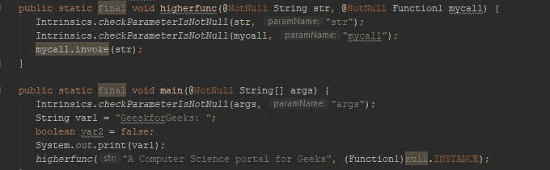
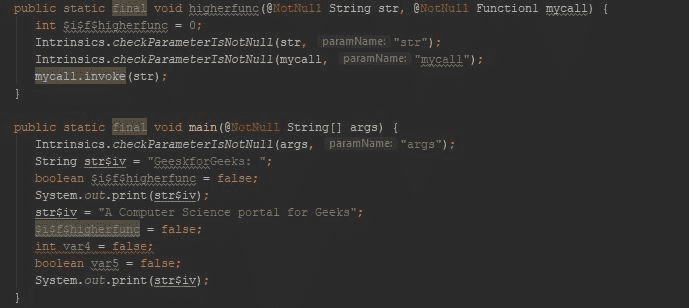

# 柯特林内嵌函数

> 原文:[https://www.geeksforgeeks.org/kotlin-inline-functions/](https://www.geeksforgeeks.org/kotlin-inline-functions/)

在 Kotlin 中，高阶函数或 lambda 表达式都存储为一个**对象**，因此函数对象和类的内存分配以及虚拟调用可能会引入运行时开销。有时我们可以通过内联 lambda 表达式来消除内存开销。为了减少这种高阶函数或 lambda 表达式的内存开销，我们可以使用**内联**关键字，该关键字最终请求编译器不分配内存，而只是在调用位置复制该函数的内联代码。

**例:**

## 我的锅

```
fun higherfunc( str : String, mycall :(String)-> Unit) {

    // inovkes the print() by passing the string str
    mycall(str)
}

// main function
fun main(args: Array<String>) {
    print("GeeskforGeeks: ")
    higherfunc("A Computer Science portal for Geeks",::print)
}
```

**字节码:**和 Java 一样，Kotlin 也是平台无关的语言，所以它先转换成字节码。我们可以获得字节码作为**工具- >科特林- >显示科特林字节码**。然后，反编译得到这个字节码。



在上面的字节码中，要关注的主要部分是:

```
mycall.invoke(str)
```

*mycall* 通过将字符串作为参数传递来调用打印功能。在调用 print()时，它会创建一个额外的调用并增加内存开销。

**工作原理类似**

```
mycall(new Function() {
        @Override
        public void invoke() {
         //println statement is called here.
        }
    });
```

如果我们调用大量的函数作为参数，每一个参数加起来就是方法计数，那么对内存和性能会有很大的影响。

**在上面的程序中内联关键字会做什么？**

## 我的锅

```
inline fun higherfunc( str : String, mycall :(String)-> Unit){
    // inovkes the print() by passing the string str
    mycall(str)
}
// main function
 fun main(args: Array<String>) {
    print("GeeskforGeeks: ")
    higherfunc("A Computer Science portal for Geeks",::print)
}
```

**字节码:**



借助**内联**关键字， **println** lambda 表达式以 System.out.println 的形式复制到主函数中，无需进一步调用。

### 非本地控制流

在柯特林中，如果我们想从 lambda 表达式返回，那么柯特林编译器不允许我们这样做。借助 inline 关键字，我们可以从 lambda 表达式本身返回，并退出调用 inline 函数的函数。

**在λ表达式中使用返回的柯特林程序:**

## 我的锅

```
var lambda = { println("Lambda expression") 
              return }      // normally lambda expression does not allow return
                           // statement, so gives compile time error
fun main(args: Array<String>) {
    lambda()
}
```

**输出:**

```
Error:(4, 5) Kotlin: 'return' is not allowed here
```

通常情况下，它不允许从 lambda 返回，并给出一个错误。

## 我的锅

```
var lambda1 = { println("Lambda expression")}

fun main(args: Array<String>) {
    lambda1()
}
```

**输出:**

```
Lambda expression
```

正常情况下，没有它也能正常工作并打印报表。

**使用 Lambda 中的返回作为内联函数的参数的 Kotlin 程序:**

## 我的锅

```
fun main(args: Array<String>){
    println("Main function starts")
    inlinedFunc({ println("Lambda expression 1")
    return },      // inlined function allow return
                   // statement in lambda expression
                   // so, does not give compile time error

    { println("Lambda expression 2")} )

    println("Main function ends")
}
    // inlined function
inline fun inlinedFunc( lmbd1: () -> Unit, lmbd2: () -> Unit  ) { 
    lmbd1()
    lmbd2()
}
```