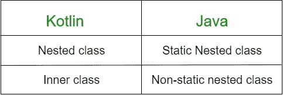

# 柯特林嵌套类和内部类

> 原文:[https://www . geeksforgeeks . org/kot Lin-嵌套类和内部类/](https://www.geeksforgeeks.org/kotlin-nested-class-and-inner-class/)

## 嵌套类

一个类在另一个类中声明，那么它被称为**嵌套**类。默认情况下，嵌套类是**静态的**，因此我们可以使用 dot()访问嵌套类属性或变量。)表示法，而不创建类的对象。
**声明语法:**

```kt
class outerClass {
       ............
      // outer class properties or member function

      class nestedClass { 
            ..........
            // inner class properties or member function
      }
}
```

> **注意:**嵌套类不能访问外部类的成员，但是我们可以从外部类访问嵌套类的属性，而无需为嵌套类创建对象。

**访问嵌套类属性的 Kotlin 程序:**

## 我的锅

```kt
// outer class declaration
class outerClass {
    var str = "Outer class"
    // nested class declaration
    class nestedClass {
        val firstName  = "Praveen"
        val lastName = "Ruhil"
    }
}
fun main(args: Array<String>) {
    // accessing member of Nested class
    print(outerClass.nestedClass().firstName)
    print(" ")
    println(outerClass.nestedClass().lastName)
}
```

**输出:**

```kt
Praveen Ruhil
```

在 Kotlin 中，要访问嵌套类的成员函数，我们需要为嵌套类创建对象，并使用它调用成员函数。

**访问嵌套类成员函数的 Kotlin 程序:**

## 我的锅

```kt
// outer class declaration
class outerClass {
    var str = "Outer class"
    // nested class declaration
    class nestedClass {
        var s1 = "Nested class"
        // nested class member function
        fun nestfunc(str2: String): String {
            var s2 = s1.plus(str2)
            return s2
        }
    }
}
fun main(args: Array<String>) {
    // creating object of Nested class
    val nested = outerClass.nestedClass()
    // invoking the nested member function by passing string
    var result = nested.nestfunc(" member function call successful")
    println(result)
}
```

**输出:**

```kt
Nested class member function call successful
```

### 与 Java 的比较

当我们考虑功能和用例时，Kotlin 类与 Java 类非常相似，但并不完全相同。Kotlin 中的嵌套类类似于 Java 中的静态嵌套类，而 Inner 类类似于 Java 中的非静态嵌套类。



## 科特林内班

当我们可以使用关键字 **inner** 在另一个类中声明一个类时，那么它被称为 inner class。在内部类的帮助下，我们可以在内部类中访问外部类属性。

```kt
class outerClass {
       ............
      // outer class properties or member function

      inner class innerClass { 
            ..........
            // inner class properties or member function
      }
}
```

在下面的程序中，我们试图从内部类成员函数访问 **str** 。但它不起作用，并给出编译时错误。
**科特林内班程序:**

## 我的锅

```kt
// outer class declaration
class outerClass {
    var str = "Outer class"
    // innerClass declaration without using inner keyword
    class innerClass {
        var s1 = "Inner class"
        fun nestfunc(): String {
            // can not access the outer class property str
            var s2 = str
            return s2
        }
    }
}
// main function
fun main(args: Array<String>) {
    // creating object for inner class
    val inner= outerClass().innerClass()
    // inner function call using object
    println(inner.nestfunc())
}
```

**输出:**

```kt
Error:(9, 22) Kotlin: Unresolved reference: str
```

首先，在内部类前面使用 **inner** 关键字。然后，创建一个外部类的实例，否则我们不能使用内部类。

## 我的锅

```kt
// outer class declaration
class outerClass {
    var str = "Outer class"
    // innerClass declaration with using inner keyword
    inner class innerClass {
        var s1 = "Inner class"
        fun nestfunc(): String {
            // can access the outer class property str
            var s2 = str
            return s2
        }
    }
}
// main function
fun main(args: Array<String>) {
    // creating object for inner class
    val inner= outerClass().innerClass()
    // inner function call using object
    println(inner.nestfunc()+" property accessed successfully from inner class ")
}
```

**输出:**

```kt
Outer class property accessed successfully from inner class
```