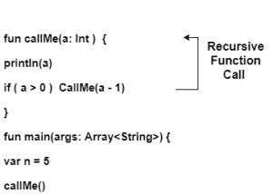

# 柯特林递归

> 原文:[https://www.geeksforgeeks.org/kotlin-recursion/](https://www.geeksforgeeks.org/kotlin-recursion/)

在本教程中，我们将学习柯特林递归函数。像其他编程语言一样，我们可以在 Kotlin 中使用递归。
一个调用自身的函数叫做**递归**函数，这个重复的过程叫做**递归**。

无论何时调用函数，都有两种可能性——

1.  正常函数调用
2.  递归函数调用

## 正常函数调用

当从`main()`块调用一个函数时，它被称为正常函数调用。在下面的例子中，一次调用`sum()`，它执行它的指令，并以返回数字之和结束。如果我们想再次执行该函数，那么我们应该在主模块中再次调用`sum()`。

**从 main()块调用 sum()函数–**

<center></center>

## 递归函数调用

当一个函数调用它自己时，它就被称为递归函数调用。每个递归函数都应该有终止条件，否则程序执行进入无限循环并导致堆栈溢出错误。

**从自己的块中调用 callMe()函数–**

<center></center>

这里，我们使用了终止条件`if( a > 0)`，否则它将进入无限循环。它打印从 5 到 0 的值。

**例 1:不使用终止条件**求一个数的阶乘

```kt
// Kotlin program of factorial using recursion
fun Fact(num: Int):Long{
    return  num*Fact(num-1)  // no terminate condition
}    
//main method
fun main() {
    println("Factorial of 5 is: "+Fact(5))
//Recursive call
}
```

**输出:**

```kt
Exception in thread "main" java.lang.StackOverflowError
```

**例 2:使用终止条件求一个数的阶乘。**

```kt
// Kotlin program of factorial using recursion
fun Fact(num: Int):Long{
    return if(num==1) num.toLong()        // terminate condition
    else num*Fact(num-1)
}
//main method
fun main() {
    println("Factorial of 5 is: "+Fact(5))
//Recursive call
}
```

**输出:**

```kt
Factorial of 5 is: 120
```

### 阶乘程序的工作–

Fact()的递归调用在下图中逐步说明:-

<center></center>

**例 3:用递归求数组元素的和**

```kt
        // two parameters passed an array and size of array
fun sum(args: Array<Int> , index:Int ):Int{    
    return if(index<=0) 0
    else (sum(args ,index-1) + args[index-1])      // recursive function call
}

fun main() {
    // array initialization
    val array = arrayOf(1,2,3,4,5,6,7,8,9,10)  
    // size of array
    val n = array.size 
    val result = sum(array,n)             // normal function call
    println("The sum of array elements is: $result")
}
```

**输出:**

```kt
The sum of array elements is: 55
```

**解释:**
这里，我们初始化了一个数组，并作为参数传递给 sum()函数。在每次递归调用中，索引值递减 1。如果索引等于零或小于，则终止它并返回所有元素的总和。