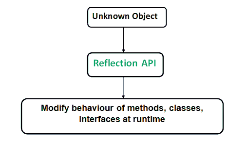

# 科特林反射

> 原文:[https://www.geeksforgeeks.org/kotlin-reflection/](https://www.geeksforgeeks.org/kotlin-reflection/)

**反射**是一组语言和库特性，提供了在运行时内省给定程序的特性。Kotlin 反射用于利用类及其成员，如属性、[函数](https://www.geeksforgeeks.org/kotlin-functions/)、[构造函数](https://www.geeksforgeeks.org/kotlin-constructor/)等。运行时。
除了 Java 反射 API 之外，Kotlin 还以简单的功能风格提供了自己的一套反射 API。标准的 [Java 反射](https://www.geeksforgeeks.org/reflection-in-java/)构造也可以在 Kotlin 中获得，并且可以完美地与它的代码一起工作。
**柯特林反射可在:**获得

```kt
kotlin.reflect package
```



### 科特林反射的特征–

1.  它提供对属性和可空类型的访问
2.  Kotlin 反射比 Java 反射有一些额外的特性。
3.  kotlin 反射有助于访问由某种语言编写的 JVM 代码

### 类别参考–

要在运行时获得静态已知的类引用，请使用**类引用运算符**。同样，对一个类的引用也可以从该类的实例中获得，这种引用被称为**有界类引用**。在继承的情况下，使用实例可以获得对对象符合的确切类型的引用。
**演示课程参考的示例**

## Java 语言(一种计算机语言，尤用于创建网站)

```kt
// A sample empty class
class ReflectionDemo {
}

fun main()
{
    // Reference obtained using class name
    val abc = ReflectionDemo::class
    println("This is a class reference $abc")

    // Reference obtained using object
    val obj = ReflectionDemo()
    println("This is a bounded class reference ${obj::class}")
}
```

**输出**

```kt
This is a class reference class kotlin1.com.programmingKotlin.chapter1.ReflectionDemo
This is a bounded class reference class kotlin1.com.programmingKotlin.chapter1.ReflectionDemo 
```

### 功能参考–

我们可以获得在柯特林中定义的每个命名函数的**函数引用**。这可以通过功能名称前的**和**:操作符**来完成。这些函数引用可以用作其他函数的参数。在重载函数的情况下，我们可以显式指定函数的类型，也可以根据内容隐式确定。
**功能参考演示示例****

## Java 语言(一种计算机语言，尤用于创建网站)

```kt
fun add(a: Int,b: Int) : Int{
    return a+b;
}

fun add(a: String,b: String): String{
    return """$a$b"""
}

fun isDivisibleBy3(a: Int): Boolean{
    return a%3 == 0
}
fun main(){
    // Function reference obtained using :: operator
    val ref1 = ::isDivisibleBy3
    val array = listOf<Int>(1,2,3,4,5,6,7,8,9)
    println(array.filter(ref1))

    // Function reference obtained for an overloaded function
    // By explicitly specifying the type
    val ref2: (String,String) -> String = ::add;
    println(ref2)

    // Function reference obtained implicitly
    val x = add(3,5)
    println(x)
}
```

**输出**

```kt
[3, 6, 9]
fun add(kotlin.String, kotlin.String): kotlin.String
8 
```

### 属性参考–

我们可以使用**:运算符**，以与函数类似的方式获取**属性引用**。如果属性属于某个类，则还应该使用 **::** 运算符指定类名。这些属性引用允许我们将属性视为对象，也就是说，我们可以使用 get 函数获取这些值，或者使用 set 函数对其进行修改。
**演示属性参考的示例**

## Java 语言(一种计算机语言，尤用于创建网站)

```kt
class Property(var a: Float){
}

val x = 10;

fun main(){
    // Property Reference for a package level property
    val z = ::x
    println(z.get())
    println(z.name)

    // Property Reference for a class property
    val y = Property::a
    println(y.get(Property(5.899f)))
}
```

**输出**

```kt
10
x
5.899 
```

### 构造函数引用–

对类的**构造函数**的引用可以通过与对方法和属性的引用类似的方式获得。这些引用可以用作返回该类型对象的函数的引用。然而，这些用途很少。
**示例演示构造器参考文献**

## Java 语言(一种计算机语言，尤用于创建网站)

```kt
class Property(var a: Float){
}
fun main(){
    // Constructor Reference
    val y = ::Property
    println(y.name)
}
```

**输出**

```kt
<init>
```