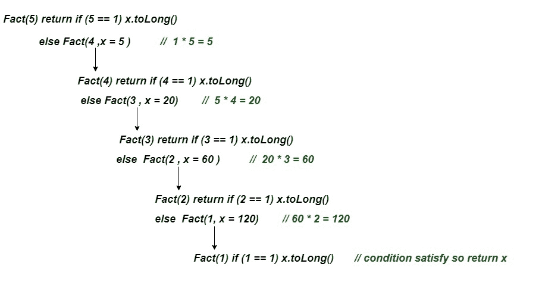

# 柯特林尾部递归

> 原文:[https://www.geeksforgeeks.org/kotlin-tail-recursion/](https://www.geeksforgeeks.org/kotlin-tail-recursion/)

在传统的**递归**调用中，我们首先执行我们的递归调用，然后我们取递归调用的返回值并计算结果。但是在**尾部递归**中，我们首先执行计算，然后执行递归调用，将当前步骤的结果传递给下一个递归调用。最后，递归和尾部递归给出了相同的输出。

尾部递归必须遵循的规则是递归调用应该是方法的最后一次**调用。**

### **使用尾部递归的好处–**

1.  **在尾部递归中，函数调用是该函数执行的最后一件事，当前函数中没有任何内容可以执行。因此，不需要将当前函数调用保存在堆栈内存中，编译器可以将该堆栈空间重新用于下一次递归调用。**
2.  **在尾部递归中，我们在程序执行过程中没有得到 **`StackOverflowError`** 。**

****例 1:用尾递归求一个数的阶乘。****

```
// Kotlin program of factorial using tail-recursion
fun Fact(num: Int, x:Int):Long{

    return if(num==1)   // terminate condition
        x.toLong()
    else
        Fact(num-1,x*num)   //tail recursion
}
fun main() {
    var n = 1
    var result = Fact(5,n)
    println("Factorial of 5 is: $result")
}
```

****输出:****

```
Factorial of 5 is: 120
```

****上述程序的工作-**** 

<center>****</center>

****例 2:用尾部递归求数组元素的和****

```
// two parameters passed an array and size of array
fun sum(args: Array<Int> , index:Int, s : Int = 0 ):Int{
    return if(index<=0) s
    else sum(args ,index-1, s + args[index-1])     // tail-recursion
}

fun main() {
    // array initialization
    val array = arrayOf(1,2,3,4,5,6,7,8,9,10)
    // size of array
    val n = array.size
    val result = sum(array,n)             // normal function call
    println("The sum of array elements is: $result")
}
```

****输出:****

```
The sum of array elements is: 55
```

****解释:**
在这里，我们将数组作为参数与`sum()`函数中的另外两个参数一起传递。参数的默认值等于零。每次递归调用，我们都从数组的最后一个索引开始计算元素的总和。通过最后一次递归调用，我们将得到*的*中所有元素的和，并在条件满足时返回。**