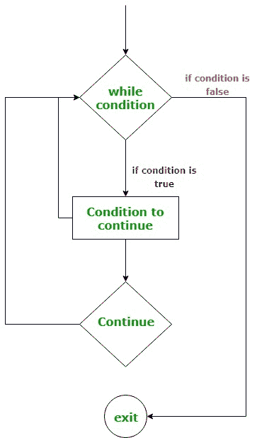
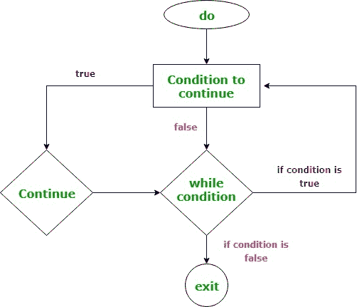
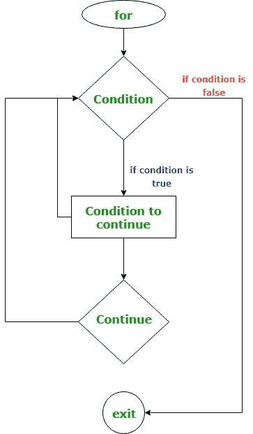

# 科特林无标签继续

> 原文:[https://www.geeksforgeeks.org/kotlin-unlabeled-continue/](https://www.geeksforgeeks.org/kotlin-unlabeled-continue/)

在本文中，我们将学习如何在 kotlin 中使用**继续**。当在编程中使用循环时，有时希望跳过循环的当前迭代。在这种情况下，我们可以在程序中使用 continue 语句。基本上，*继续*用于针对特定条件重复循环。它跳过以下语句，继续循环的下一次迭代。
在 kotlin 中有两种类型的 continue-
我们将学习如何在 while、do-while 和 for 循环中使用未标记的 continue。

### 在 while 循环中使用未标记的继续–

在 Kotlin 中，未标记的 continue 用于跳过最近的封闭 while 循环的当前迭代。如果继续的条件为真，则跳过以下继续指令，到达 while 循环的起点。同样，它将检查条件，并且循环将处于重复模式，直到变为假。
**无标记继续 while 循环的语法-**

```
while(condition) {
    //code
      if(condition for continue) {
      continue
      }
   //code
}
```

**流程图-**



**Kotlin 程序使用 continue in while 循环。**

## Java 语言(一种计算机语言，尤用于创建网站)

```
fun main(args: Array<String>) {
    var num = 0
    while (num <= 12) {
        if (num % 3 == 0) {
            num++
            continue
        }
        println(num)
        num++
    }
}
```

**输出:**

```
1
2
4
5
7
8
10
11
```

在上面的程序中，我们打印数字并跳过所有 3 的倍数。表达式(num % 3 == 0)用于检查数字是否能被 3 整除。如果是 3 的倍数，则递增数字，而不将其打印到标准输出。

### 在边做边循环中使用未标记的继续–

在 do-while 中，我们还可以使用*未标记的 continue* 跳过最近的闭合循环的迭代。这里，我们需要把继续的条件放在**做**块。如果条件变为假，它将跳过以下指令并将控制转移到 while 条件。
**边做边循环中无标记继续的语法-**

```
do{
     // codes 
     if(condition for continue) {
     continue
     }
} 
while(condition)
```

**流程图-**



**Kotlin 程序在 do-while 循环中继续使用。**

## Java 语言(一种计算机语言，尤用于创建网站)

```
fun main(args: Array<String>) {
    var num = 1
    do {
        if (num <= 5 || num >=15) {
            num++
            continue
        }
        println("$num")
        num++
    } while (num < 20)
}
```

**输出:**

```
6
7
8
9
10
11
12
13
14
```

在上面的程序中，我们使用了条件(num <= 5 || num > =15)将数字的打印跳过到小于等于 5 且大于等于 15 的标准输出。所以，它只打印从 6 到 14 的数字。

### 使用无标记继续循环–

在 for 循环中，我们也可以使用未标记的 continue 跳过当前迭代到结束循环。在下面的程序中，我们取了一个字符串数组和遍历数组行星的迭代器。表达式(i < 2)跳过小于 2 的数组索引的迭代，这意味着它不打印存储在索引 0 和 1 的字符串。
**无标记继续循环的语法-**

```
for(iteration through iterator) 
{  
   //code
   if(condition for continue){
   continue
   }
}
```

**流程图-**



**使用的 Kotlin 程序继续循环。**

## Java 语言(一种计算机语言，尤用于创建网站)

```
fun main(args: Array<String>) {
    var planets = arrayOf("Earth", "Mars", "Venus", "Jupiter", "Saturn")
    for (i in planets.indices) {
        if(i < 2){
            continue
        }
        println(planets[i])
    }
}
```

**输出:**

```
Venus
Jupiter
Saturn
```