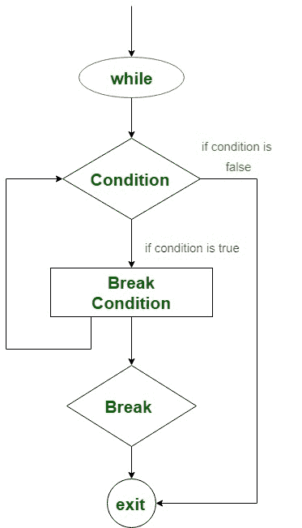
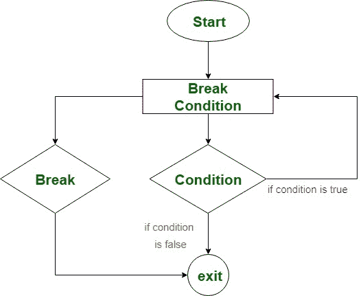
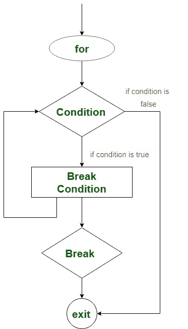

# 科特林无标签休息

> 原文:[https://www.geeksforgeeks.org/kotlin-unlabelled-break/](https://www.geeksforgeeks.org/kotlin-unlabelled-break/)

当我们处理循环时，如果满足某个条件，想要立即停止循环的执行，在这种情况下，我们可以使用 **break** 或 **return** 表达式退出循环。
在本文中，我们将讨论学习如何使用 **break** 表达式退出循环。当 break 表达式在程序中遇到时，它终止于最近的封闭循环。
Kotlin 中有两种类型的 *break* 表达式:
我们将学习*如何在 while、do-while 和 for loop 中使用未标记的 break 表达式*。

### 在 while 循环中使用*无标记中断*

当循环满足特定条件而不检查测试表达式时，使用无标记断点退出循环。然后，将控制转移到 while 块的以下语句。
**while 循环的中断语法–**

```
while(test expression) {
       // code to run
            if(break condition) {
              break
            }
      // another code to run
}
```

**流程图-**



**Kotlin 程序求 1 到 10 的整数之和。**

## Java 语言(一种计算机语言，尤用于创建网站)

```
fun main(args: Array<String>) {
    var sum = 0
    var i = 1
    while(i <= Int.MAX_VALUE) {
        sum += i
        i++
        if(i == 11) {
            break
        }
    }
    print("The sum of integers from 1 to 10: $sum")
}
```

**输出:**

```
The sum of integers from 1 to 10: 55
```

在上面的程序中，我们借助 while 循环和 break 表达式计算了从 1 到 10 的整数之和。取一个变量和，用 0 初始化。另一个变量 *i* 迭代循环，并用 1 初始化。
现在，迭代器从(i = 1)继续执行 sum 语句。当迭代器值 *i* 变为 11 时，它执行中断表达式并退出循环，而不检查测试表达式(i < = Int)。最大值)。然后，控制传递到 while 块的以下语句 print()，它打印整数之和= 55

### 在边做边循环中使用*无标记断点*-

在 do-while 循环中，我们还可以使用 break 表达式退出循环，而无需检查测试表达式。
**边做边循环中断的语法–**

```
do {
   //code to run
     if(break condition) {
           break
     }
while(test expression)
```

**流程图-**



**柯特林程序打印数组的元素**

## Java 语言(一种计算机语言，尤用于创建网站)

```
fun main(args: Array<String>) {
    var names = arrayOf("Earth","Mars","Venus","Jupiter","Saturn","Uranus")
    var i = 0

    do{
        println("The name of $i th planet: "+names[i])
        if(names[i]=="Jupiter") {
            break
        }
        i++
    }while(i<=names.size)
}
```

**输出:**

```
The name of 0 th planet: Earth
The name of 1 th planet: Mars
The name of 2 th planet: Venus
The name of 3 th planet: Jupiter
```

在上面的程序中，我们遍历数组来打印行星的名称。首先，初始化一个数组**用行星名命名**，而 *i* 是测试表达式的迭代器。我们使用**名称计算数组的大小。
*做*块首先打印数组的元素，并且每次将数组在任意索引处的值与“Jupiter”进行比较。如果匹配，则递增迭代器并再次执行。如果匹配，则执行中断表达式并退出 **do-while** 循环，而不检查测试表达式。** 

### 在循环中使用*无标记断点*—

我们可以在数组或字符串中遍历 for 循环时使用 break 表达式。
**破门而入的语法为循环-**

```
for(iteration through iterator) {
               // code to run
      if(break condition){
          break
      }
}
```

**流程图-**



**Kotlin 程序打印字符串到一个特定的字符**
在下面的程序中，我们通过比较字符值遍历字符串到一个特定的位置。首先，用值“GeeksforGeeks”初始化一个数组名。然后使用迭代器遍历 for 循环，打印字符值，并在每个位置与字符进行比较。如果匹配，则退出循环并将控件转移到下面的语句。

## Java 语言(一种计算机语言，尤用于创建网站)

```
fun main(args: Array<String>) {

    var name = "GeeksforGeeks"
    for (i in name){
     print("$i")
          if(i == 's') {
            break
          }
    }
}
```

**输出:**

```
Geeks
```