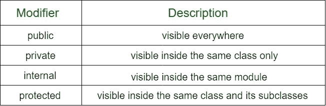

# 柯特林可见性修改器

> 原文:[https://www.geeksforgeeks.org/kotlin-visibility-modifiers/](https://www.geeksforgeeks.org/kotlin-visibility-modifiers/)

在 Kotlin 中，**可见性修饰符**用于将类、对象、接口、构造函数、函数、属性及其设置器的可访问性限制在一定的级别。不需要设置 getters 的可见性，因为它们与属性具有相同的可见性。
科特林有**四个**可见性修改器。



如果没有指定的修改器，那么默认情况下是**公共**。让我们开始逐一讨论上述修饰语。

### 1.公共编辑

在 Kotlin 中，默认修改器是**公共**。它可能是整个语言中最常用的修饰符，并且对谁能看到被修改的元素有额外的限制。与 Java 不同，在 Kotlin 中，没有必要将任何东西声明为**public**–它是默认修饰符，如果我们不声明另一个修饰符的话–**public**在 Kotlin 中的工作原理与 Java 相同。当我们将**公共**修饰符应用于顶级元素——直接在包中声明的类、函数或变量时，任何其他代码都可以访问它。如果我们将**公共**修饰符应用于嵌套元素——一个内部类，或者类中的函数——那么任何可以访问容器的代码也可以访问这个元素。

## 我的锅

```kt
// by default public
class A {            
    var int = 10
}

// specified with public modifier
public class B {    
    var int2 = 20
    fun display() { 
    println("Accessible everywhere")        
    }
}
```