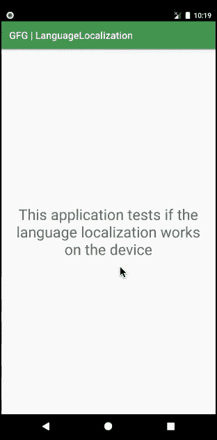
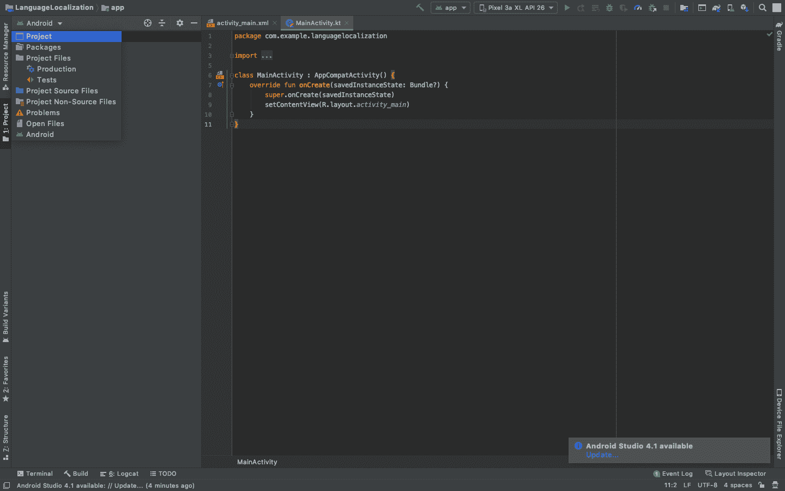
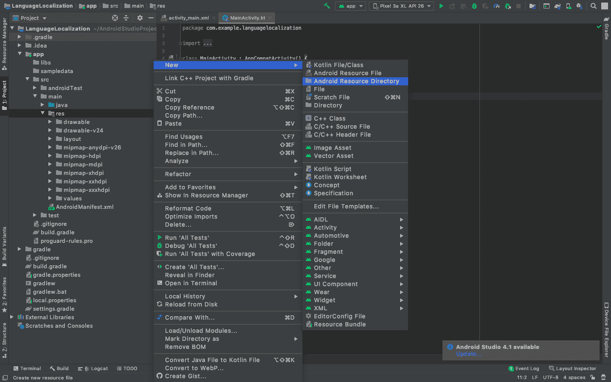
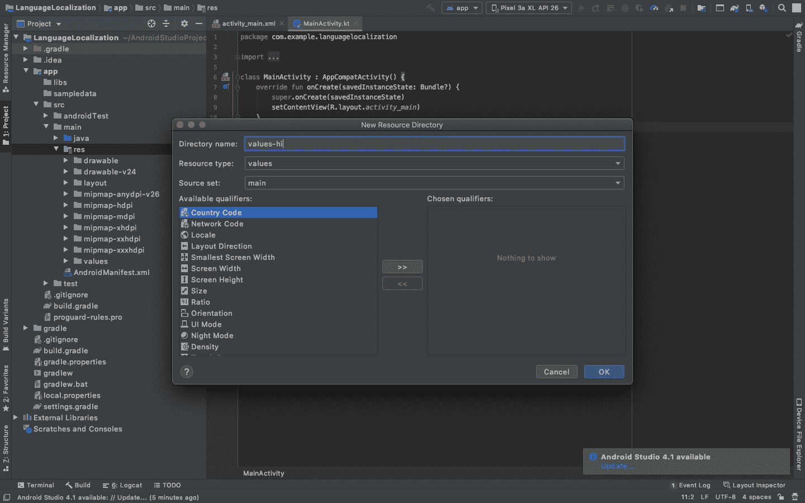
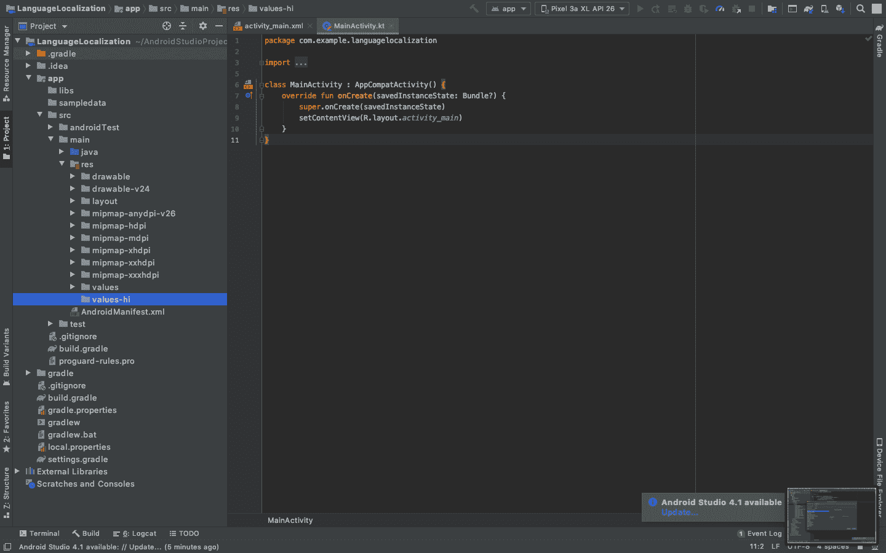
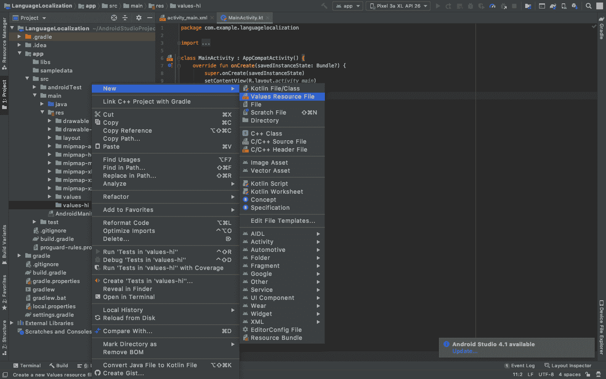
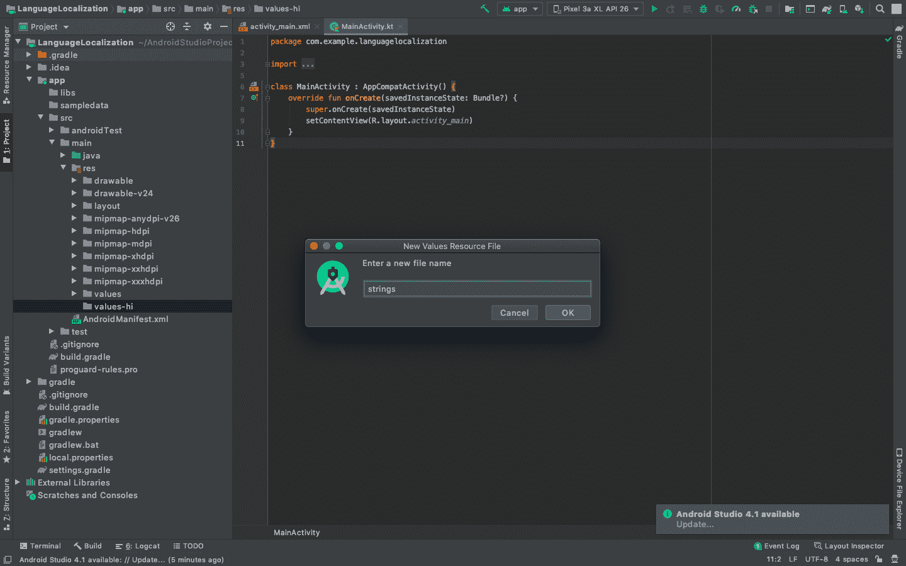
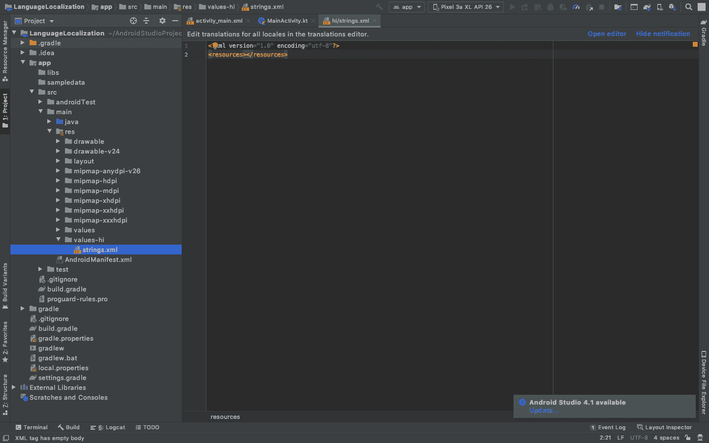
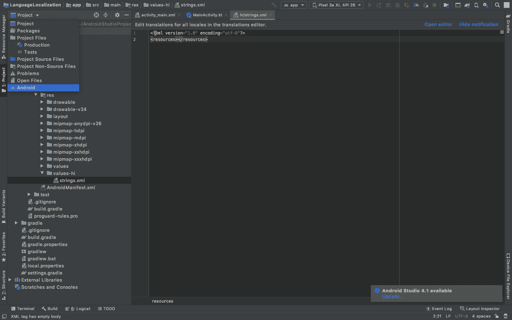
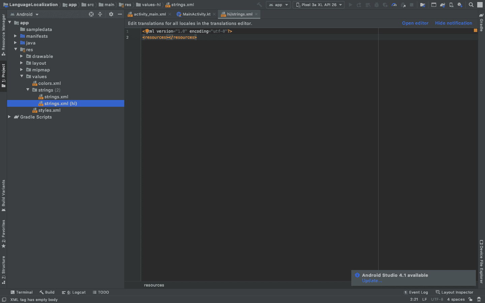

# 安卓系统语言本地化示例

> 原文:[https://www . geesforgeks . org/language-localization-in-Android-with-example/](https://www.geeksforgeeks.org/language-localization-in-android-with-example/)

**语言本地化**是根据需求将应用上下文转换为多种语言的过程。安卓是一个整体操作系统，运行在全球数百万台设备上，并在不同的群体中运行。由于多样性范围很大，一个方便本地语言的特性为任何安卓应用程序增加了优势。这种特性的实现需要为我们应用程序使用的本地人适当地处理文本、音频文件、数字、货币和图形。通过这篇文章，我们想展示通过安卓应用程序改变上下文语言(如果明确声明的话)的特性的实现。下面给出一个 GIF 示例，了解一下 在这篇 文章中我们要做什么。请注意，我们将使用 **Kotlin** 语言来实现这个项目。



### 逐步实施

要使应用程序根据设备在安卓系统中的偏好更改上下文语言，请执行以下步骤:

**第一步:创建新项目**

要在安卓工作室创建新项目，请参考[如何在安卓工作室创建/启动新项目](https://www.geeksforgeeks.org/android-how-to-create-start-a-new-project-in-android-studio/)。注意选择**科特林**作为编程语言。

**步骤 2:创建一个文件夹值-hi 来存储自定义消息**

按照以下步骤创建文件夹**值-hi** 。 **-hi** 扩展定义了如果设备的首选项设置为**印地语(hi)** ，应用程序中的上下文将根据 values-hi 文件夹中的数据进行设置。

点击安卓并选择项目选项:



现在展开文件夹，直到找到资源文件夹，右键单击它，选择新建，然后单击安卓资源目录。



将目录名设置为值-hi



值高文件夹现在已创建



**第三步:创建一个 strings.xml 文件**

在该文件夹中创建一个 **strings.xml** 文件，该文件应包含一条**自定义消息**。这个文件**的实体应该匹配**默认字符串. xml 文件的实体。

现在在值高文件夹中添加一个值资源文件



给它一个名称，字符串，它创建一个. XML 文件



strings.xml 文件在 values-hi 文件夹中创建



返回安卓视图，检查新创建的文件是否存在。



该文件位于值/字符串文件夹下



**第 4 步:将自定义消息值添加到 string.xml(常规)和 string.xml (hi)**

向预先存在的以及新创建的 strings.xml 文件中添加自定义消息。两个文件的**实体必须相同**，上下文可能不同。下面是**字符串. xml** 文件的代码。

## 可扩展标记语言

```kt
<resources>

    <string name="app_name">GFG | LanguageLocalization</string>
    <string name="custom_message">This application tests if the language localization works on the device</string>

</resources>
```

下面是 **strings.xml (hi)** 文件的代码。

## 可扩展标记语言

```kt
<?xml version="1.0" encoding="utf-8"?>
<resources>

  <!--custom_message in the desired language-->
  <!--App name also changes-->
  <string name="app_name">GFG | भाषा स्थानीयकरण</string>
  <string name="custom_message">यह एप्लिकेशन परीक्षण करता है कि भाषा स्थानीयकरण डिवाइस पर काम करती है या नहीं।</string>

</resources>
```

**第 5 步:使用 activity_main.xml 文件**

现在转到 **activity_main.xml** 文件，该文件表示应用程序的用户界面。创建一个显示自定义消息的[文本视图](https://www.geeksforgeeks.org/textview-in-kotlin/)。下面是**activity _ main . XML**文件的代码。

## 可扩展标记语言

```kt
<?xml version="1.0" encoding="utf-8"?>
<RelativeLayout 
    xmlns:android="http://schemas.android.com/apk/res/android"
    xmlns:tools="http://schemas.android.com/tools"
    android:layout_width="match_parent"
    android:layout_height="match_parent"
    tools:context=".MainActivity">

    <!--TextView to display the custom message-->
    <TextView
        android:layout_width="wrap_content"
        android:layout_height="wrap_content"
        android:layout_centerInParent="true"
        android:gravity="center"
        android:text="@string/custom_message"
        android:textAlignment="center"
        android:textSize="30sp" />

</RelativeLayout>
```

**第 6 步:使用 MainActivity.kt 文件**

不会对 **MainActivity.kt** 文件进行任何更改。保持**主活动文件不变。**

## 我的锅

```kt
import androidx.appcompat.app.AppCompatActivity
import android.os.Bundle

class MainActivity : AppCompatActivity() {
    override fun onCreate(savedInstanceState: Bundle?) {
        super.onCreate(savedInstanceState)
        setContentView(R.layout.activity_main)
    }
}
```

### **输出:在仿真器上运行**

<video class="wp-video-shortcode" id="video-502547-1" width="640" height="360" preload="metadata" controls=""><source type="video/mp4" src="https://media.geeksforgeeks.org/wp-content/uploads/20201018103007/LanguageLocalization.mp4?_=1">[https://media.geeksforgeeks.org/wp-content/uploads/20201018103007/LanguageLocalization.mp4](https://media.geeksforgeeks.org/wp-content/uploads/20201018103007/LanguageLocalization.mp4)</video>