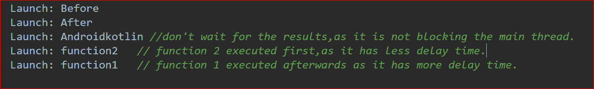
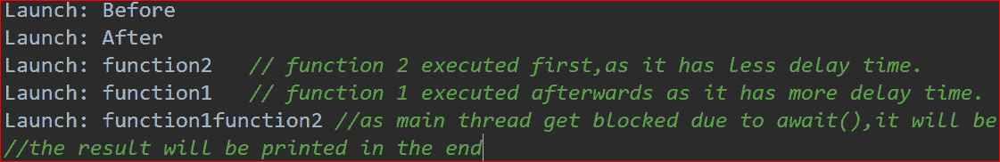

# 在科特林 Coroutines 中启动与异步

> 原文:[https://www . geesforgeks . org/launch-vs-async-in-kot Lin-coroutines/](https://www.geeksforgeeks.org/launch-vs-async-in-kotlin-coroutines/)

**先决条件:** [安卓系统上的科特林卡罗廷](https://www.geeksforgeeks.org/kotlin-coroutines-on-android/)

[科特林](https://www.geeksforgeeks.org/kotlin-programming-language/)团队将花冠定义为“**轻质螺纹**”。它们是实际线程可以执行的任务。Coroutines 在 1.3 版本中被添加到 Kotlin 中，并且是基于其他语言的既定概念。Kotlin coroutines 引入了一种新的并发风格，可以在 Android 上使用来简化异步代码。

> ***官方文档说 coroutines 是轻量级线程。通过轻量级，** **意味着创建协同程序不会分配新线程。取而代之的是，他们使用预定义的线程池和智能调度来决定接下来执行哪个任务，以及以后执行哪个任务**。*

Kotlin 中主要有两个功能来启动[协同程序](https://www.geeksforgeeks.org/kotlin-coroutines-on-android/)。

*   **发射{ }**
*   **异步{ }**

### **启动功能**

启动不会阻塞主线程，但另一方面，代码剩余部分的执行不会等待启动结果，因为启动不是挂起调用。以下是使用启动的柯特林程序:

## 我的锅

```kt
// Kotlin Program For better understanding of launch
fun GFG()
{
  var resultOne = "Android"
  var resultTwo = "Kotlin"
  Log.i("Launch", "Before")
  launch(Dispatchers.IO) { resultOne = function1() }
  launch(Dispatchers.IO) { resultTwo = function2() }
  Log.i("Launch", "After")
  val resultText = resultOne + resultTwo
  Log.i("Launch", resultText)
}

suspend fun function1(): String
{
  delay(1000L)
  val message = "function1"
  Log.i("Launch", message)
  return message
}

suspend fun function2(): String
{
  delay(100L)
  val message = "function2"
  Log.i("Launch", message)
  return message
}
```

当你在[安卓 IDE](https://www.geeksforgeeks.org/guide-to-install-and-set-up-android-studio/) 中运行代码时，日志结果会是:



## 我的锅

```kt
// pseudo kotlin code for demonstration of launch
GlobalScope.launch(Dispatchers.Main)
{
  // do on IO thread
  fetchUserAndSaveInDatabase()
}

suspend fun fetchUserAndSaveInDatabase()
{
  // fetch user from network
  // save user in database
  // and do not return anything
}
```

由于**fetchusareandsavindabase()**没有返回任何东西，我们可以使用启动来完成该任务，然后在主线程上做一些事情。

**何时使用发射？**

可以在用户不想使用返回结果的地方使用 Launch，返回的结果将在以后执行一些其他工作时使用。例如，它可以在涉及更新或改变颜色等任务的地方使用，因为在这种情况下返回的信息将毫无用处。

### **异步功能**

Async 也用于启动 coroutines，但是它在程序中 **await()** 函数的入口点阻塞主线程。下面是一个使用异步的柯特林程序:

## 我的锅

```kt
// kotlin program for demonstration of async
fun GFG
{
  Log.i("Async", "Before")
  val resultOne = Async(Dispatchers.IO) { function1() }
  val resultTwo = Async(Dispatchers.IO) { function2() }
  Log.i("Async", "After")
  val resultText = resultOne.await() + resultTwo.await()
  Log.i("Async", resultText)
}

suspend fun function1(): String
{
  delay(1000L)
  val message = "function1"
  Log.i("Async", message)
  return message
}

suspend fun function2(): String
{
  delay(100L)
  val message = "function2"
  Log.i("Async", message)
  return message
}
```

需要注意的一点是，Async 并行调用 result1 和 result2 两个网络，而对于 launch，不进行并行函数调用。当你在[安卓 IDE](https://www.geeksforgeeks.org/guide-to-install-and-set-up-android-studio/) 中运行代码时，日志结果会是:



**何时使用异步？**

当并行进行两个或多个网络调用时，但是您需要在计算输出之前等待答案，即使用 async 处理并行运行的多个任务的结果。如果您使用异步，不等待结果，它将与启动完全相同。

### 差异表

下表列出了启动和异步之间的差异:

<figure class="table">

| 

**启动**

 | 

异步

 |
| --- | --- |
| 发射基本上是火了就忘了。 | Async 基本上是执行任务并返回结果。 |
| launch{}不返回任何内容。 | async{ }，它有一个 await()函数返回 coroutine 的结果。 |
| 当您需要并行执行网络调用时，不能使用 launch{}。 | 仅当需要并行执行网络调用时才使用异步。 |
| launch{}不会阻塞您的主线程。 | Async 将在 await()函数的入口点阻塞主线程。 |
| 代码其他部分的执行不会等待启动结果，因为启动不是挂起调用 | 代码其他部分的执行将不得不等待 await()函数的结果。 |
| 在任何情况下，启动都不可能像异步一样工作。 | 如果您使用异步，不等待结果，它将与启动完全相同。 |
| 如果不需要调用方法的结果，可以在某些地方使用 Launch。 | 当您需要并行运行的多个任务的结果时，请使用 async。 |
| 示例:它可用于涉及更新或更改颜色等任务的地方，如获取用户和保存在数据库中。 | 示例:想象一下这样的情况，当我们必须使用两个并行的网络调用从数据库中获取两个用户的数据，然后使用它们根据他们的数据计算一些结果。 |

</figure>