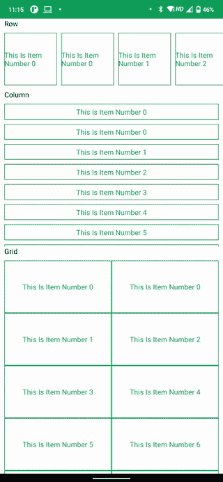

# 安卓 Jetpack 合成中的惰性组件——列、行、网格

> 原文:[https://www . geesforgeks . org/lazy-composables-in-Android-jet pack-compose-columns-row-grids/](https://www.geeksforgeeks.org/lazy-composables-in-android-jetpack-compose-columns-rows-grids/)

在 Jetpack compose 中，我们有像**列**和**行**这样的组件，但是当应用程序需要在一行或多列中显示大量项目时，如果由**行**或**列【compose 来完成，效率就不高了。因此，我们在 Jetpack Compose 中有懒惰组件。我们主要有三种惰性组件行、列和网格。在本文中，我们将研究所有三种懒惰行为。我们将构建一个简单的应用程序，演示这三个组件的实际操作。**



**先决条件:**

*   [科特林](https://www.geeksforgeeks.org/kotlin-programming-language/)知识。
*   知识[喷气背包合成](https://www.geeksforgeeks.org/basics-of-jetpack-compose-in-android/)。

### **分步实施**

**步骤 1:创建一个新项目(或在现有的合成项目中使用它)**

要在 Android Studio Canary 版本中创建新项目，请参考文章[如何使用 Jetpack Compose 在 Android Studio Canary 版本中创建新项目。](https://www.geeksforgeeks.org/how-to-create-a-new-project-in-android-studio-canary-version-with-jetpack-compose/)

**第二步:添加颜色(** ***可选)***

打开**界面>主题> Colors.kt** 并添加

> val GreenGfg =颜色(0x ff 0 F9 d88)

**步骤 3:创建将要显示的行和列项目**

打开 **MainActivity.kt** 并创建两个组件，一个用于行项目，一个用于列项目

## 我的锅

```kt
// Row Item with item Number 
@Composable
fun RowItem(number: Int) {

    // Simple Row Composable
    Row(
        modifier = Modifier
            .size(100.dp) // Size 100 dp
            .background(Color.White) // Background White
            .border(1.dp, GreenGfg), // Border color green

        // Align Items in Center
        verticalAlignment = Alignment.CenterVertically,
        horizontalArrangement = Arrangement.Center

    ) {
        // Text Composable which displays some 
        // kind of message , text color is green
        Text(text = "This Is Item Number $number", color = GreenGfg)
    }
}

// Similar to row composable created above
@Composable
fun ColumnItem(number: Int) {

    Column(
        modifier = Modifier
            .fillMaxWidth()
            .height(30.dp)
            .background(Color.White)
            .border(1.dp, GreenGfg),
        verticalArrangement = Arrangement.Center,
        horizontalAlignment = Alignment.CenterHorizontally

    ) {
        Text(text = "This Is Item Number $number", color = GreenGfg)
    }
}
```

**第四步:与懒人合作**

未连线**列**或**行**可组合我们不能将可组合直接放在**懒人组合里面。**懒人 Composables 提供了在 LazyScope 中放置物品的功能。主要有五个重载函数。

<figure class="table">

| 

功能

 | 

参数

 | 

功能

 |
| --- | --- | --- |
| 项目 | (音乐)可设定的 | 将一个项目放入 LazyScope |
| 项目 | 计数、键(可选)、可组合 | 将*计数*项放入 LazyScope 中 |
| 项目 | List 组件 | 放置与列表大小相同的项目数， |
| 项目 | 数组，可组合 | 放置与数组大小相同的项目数， |
| 项目索引 | 阵列/列表，可组合 | 放置与数组大小相同的项目数，并提供项目(列表中)和当前项目的索引。 |

</figure>

**第 4.1 步:懒排**

在 **MainActivity.kt、**中创建一个可组合的，这里我们将放置惰性行来演示惰性行

## 我的锅

```kt
@Composable
fun LazyRowExample(numbers: Array<Int>) {

    // Place A lazy Row
    LazyRow(
        contentPadding = PaddingValues(8.dp),
        horizontalArrangement = Arrangement.spacedBy(8.dp)
    ) {

        // item places one item on the LazyScope
        item {
            RowItem(number = 0)
        }

        // items(count) places number of items supplied
        // as count and gives current count in the lazyItemScope
        items(10) {currentCount->
            RowItem(number = currentCount)
        }

        // items(list/array) places number of items same as
        // the size of list/array and gives current list/array
        // item in the lazyItemScope
        items(numbers) {arrayItem-> // Here numbers is Array<Int> so we 
                                      // get Int in the scope.
            RowItem(number = arrayItem)
        }

        // items(list/array) places number of items same 
        // as the size of list/array and gives current list/array 
        // item and currentIndex in the lazyItemScope
        itemsIndexed(numbers) { index: Int, item: Int ->
            RowItem(number = index)
        }
    }
}
```

**第 4.2 步:懒柱**

在**主活动**中创建可组合。kt，这里我们将放置惰性柱来演示惰性柱

## 我的锅

```kt
@Composable
fun ColumnExample(numbers: Array<Int>) {

    LazyColumn(
        contentPadding = PaddingValues(8.dp),
        verticalArrangement = Arrangement.spacedBy(8.dp)
    ) {
        // item places one item on the LazyScope
        item {
            ColumnItem(number = 0)
        }

        // items(count) places number of items supplied 
        // as count and gives current count in the lazyItemScope
        items(10) {currentCount->
            ColumnItem(number = currentCount)
        }

        // items(list/array) places number of items same
        // as the size of list/array and gives current 
        // list/array item in the lazyItemScope
        items(numbers) {arrayItem->
            ColumnItem(number = arrayItem)
        }

        // items(list/array) places number of items 
        // same as the size of list/array and gives
        // current list/array item and currentIndex 
        // in the lazyItemScope
        itemsIndexed(numbers) { index, item ->
            ColumnItem(number = index)
        }
    }
}
```

**第 4.3 步:惰性网格**

在 MainActivity.kt 中创建一个可组合的，这里我们将放置 LazyVerticalGrid。它几乎和其他惰性可组合的一样，但是它需要一个额外的参数 ***单元格*** ，这是一行中网格项目的数量/一个项目的最小宽度。细胞可以是**细胞。固定(计数)**，它固定一个网格行中显示的项目。它接受的另一个值是 **GridCells。自适应(最小宽度)，**它设置每个网格项目的最小宽度。

## 我的锅

```kt
// add the annotation, 
// since [LazyVerticalGrid] is Experimental Api
@ExperimentalFoundationApi
@Composable
fun GridExample(numbers: Array<Int>) {
    // Lazy Vertical grid
    LazyVerticalGrid(
        // fix the item in one row to be 2.
        cells = GridCells.Fixed(2),

        contentPadding = PaddingValues(8.dp),

        ) {
        item {
            RowItem(number = 0)
        }
        items(10) {
            RowItem(number = it)
        }
        items(numbers) {
            RowItem(number = it)
        }
        itemsIndexed(numbers) { index, item ->
            RowItem(number = index)
        }
    }
}
```

**第五步:将配料放在屏幕上**

现在将这三个示例都放在**主活动**类的 setContentView 中。

## 我的锅

```kt
class MainActivity : ComponentActivity() {

    // Creates array as [0,1,2,3,4,5,.....99]
    private val numbers: Array<Int> = Array(100) { it + 1 }

    @ExperimentalFoundationApi
    override fun onCreate(savedInstanceState: Bundle?) {
        super.onCreate(savedInstanceState)
        setContent {
            LazyComponentsTheme {

                Column(
                    modifier = Modifier
                        .fillMaxSize()
                        .background(Color.White)
                ) {
                    // Place the row and column 
                    // to take 50% height of screen
                    Column(Modifier.fillMaxHeight(0.5f)) {

                        // Heading
                        Text(
                            text = "Row",
                            color = Color.Black,
                            modifier = Modifier.padding(start = 8.dp)
                        )

                        // Lazy Row, pass the numbers array
                        LazyRowExample(numbers = numbers)

                        // Heading
                        Text(
                            text = "Column",
                            color = Color.Black,
                            modifier = Modifier.padding(start = 8.dp)
                        )
                        // Lazy Column, Pass the numbers array
                        LazyColumnExample(numbers = numbers)
                    }

                    Column(Modifier.fillMaxHeight()) {

                        // Heading
                        Text(
                            text = "Grid",
                            color = Color.Black,
                            modifier = Modifier.padding(start = 8.dp)
                        )

                        // Lazy Grid
                        GridExample(numbers = numbers)
                    }
                }
            }
        }
    }
}
```

**完整代码:**

> **注意**:在运行这段完整的代码之前，一定要做好步骤 2，或者用自己的颜色替换 GreenGfg。

## 我的锅

```kt
import android.os.Bundle
import androidx.activity.ComponentActivity
import androidx.activity.compose.setContent
import androidx.compose.foundation.ExperimentalFoundationApi
import androidx.compose.foundation.background
import androidx.compose.foundation.border
import androidx.compose.foundation.layout.*
import androidx.compose.foundation.lazy.*
import androidx.compose.material.Text
import androidx.compose.runtime.Composable
import androidx.compose.ui.Alignment
import androidx.compose.ui.Modifier
import androidx.compose.ui.graphics.Color
import androidx.compose.ui.unit.dp
import com.gfg.lazycomponents.ui.theme.GreenGfg
import com.gfg.lazycomponents.ui.theme.LazyComponentsTheme

class MainActivity : ComponentActivity() {

    // Creates array as [0,1,2,3,4,5,.....99]
    private val numbers: Array<Int> = Array(100) { it + 1 }

    @ExperimentalFoundationApi
    override fun onCreate(savedInstanceState: Bundle?) {
        super.onCreate(savedInstanceState)
        setContent {
            LazyComponentsTheme {

                Column(
                    modifier = Modifier
                        .fillMaxSize()
                        .background(Color.White)
                ) {
                    // Place the row and column
                    // to take 50% height of screen
                    Column(Modifier.fillMaxHeight(0.5f)) {

                        // Heading
                        Text(
                            text = "Row",
                            color = Color.Black,
                            modifier = Modifier.padding(start = 8.dp)
                        )

                        // Lazy Row,pass the numbers array
                        LazyRowExample(numbers = numbers)

                        // Heading
                        Text(
                            text = "Column",
                            color = Color.Black,
                            modifier = Modifier.padding(start = 8.dp)
                        )
                        // Lazy Column, Pass the numbers array
                        LazyColumnExample(numbers = numbers)
                    }

                    Column(Modifier.fillMaxHeight()) {

                        // Heading
                        Text(
                            text = "Grid",
                            color = Color.Black,
                            modifier = Modifier.padding(start = 8.dp)
                        )

                        // Lazy Grid
                        GridExample(numbers = numbers)
                    }
                }
            }
        }
    }
}

@Composable
fun LazyRowExample(numbers: Array<Int>) {
    // Place A lazy Row
    LazyRow(
        contentPadding = PaddingValues(8.dp),

        // Each Item in LazyRow have a 8.dp margin
        horizontalArrangement = Arrangement.spacedBy(8.dp)
    ) {

        // item places one item on the LazyScope
        item {
            RowItem(number = 0)
        }

        // items(count) places number of items supplied
        // as count and gives current count in the lazyItemScope
        items(10) {currentCount->
            RowItem(number = currentCount)
        }

        // items(list/array) places number of items 
        // same as the size of list/array and gives 
        // current list/array item in the lazyItemScope
        items(numbers) {arrayItem-> // Here numbers is Array<Int> so we 
                                      // get Int in the scope.
            RowItem(number = arrayItem)
        }

        // items(list/array) places number of items 
        // same as the size of list/array and gives
        // current list/array item and currentIndex
        // in the lazyItemScope
        itemsIndexed(numbers) { index: Int, item: Int ->
            RowItem(number = index)
        }
    }
}

@Composable
fun RowItem(number: Int) {
    // Simple Row Composable
    Row(
        modifier = Modifier
            .size(100.dp) // Size 100 dp
            .background(Color.White) // Background White
            .border(1.dp, GreenGfg), // Border color green

        // Align Items in Center
        verticalAlignment = Alignment.CenterVertically,
        horizontalArrangement = Arrangement.Center
    ) {
        // Text Composable which displays some 
        // kind of message , text color is green
        Text(text = "This Is Item Number $number", color = GreenGfg)
    }
}

@Composable
fun ColumnItem(number: Int) {

    Column(
        modifier = Modifier
            .fillMaxWidth()
            .height(30.dp)
            .background(Color.White)
            .border(1.dp, GreenGfg),
        verticalArrangement = Arrangement.Center,
        horizontalAlignment = Alignment.CenterHorizontally

    ) {
        Text(text = "This Is Item Number $number", color = GreenGfg)
    }
}

@Composable
fun LazyColumnExample(numbers: Array<Int>) {
    LazyColumn(
        contentPadding = PaddingValues(8.dp),
        verticalArrangement = Arrangement.spacedBy(8.dp)
    ) {
        // item places one item on the LazyScope
        item {
            ColumnItem(number = 0)
        }

        // items(count) places number of items supplied 
        // as count and gives current count in the lazyItemScope
        items(10) {currentCount->
            ColumnItem(number = currentCount)
        }

        // items(list/array) places number of items
        // same as the size of list/array and gives 
        // current list/array item in the lazyItemScope
        items(numbers) {arrayItem->
            ColumnItem(number = arrayItem)
        }

        // items(list/array) places number of 
        // items same as the size of list/array 
        // and gives current list/array item and 
        // currentIndex in the lazyItemScope
        itemsIndexed(numbers) { index, item ->
            ColumnItem(number = index)
        }
    }
}

// add the annotation, 
// since [LazyVerticalGrid] is Experimental Api
@ExperimentalFoundationApi
@Composable
fun GridExample(numbers: Array<Int>) {
    // Lazy Vertical grid
    LazyVerticalGrid(

        // fix the item in one row to be 2.
        cells = GridCells.Fixed(2),

        contentPadding = PaddingValues(8.dp),

        ) {
        item {
            RowItem(number = 0)
        }
        items(10) {
            RowItem(number = it)
        }
        items(numbers) {
            RowItem(number = it)
        }
        itemsIndexed(numbers) { index, item ->
            RowItem(number = index)
        }
    }
}
```

现在在模拟器或手机上运行该应用程序。

**输出:**

<video class="wp-video-shortcode" id="video-645255-1" width="640" height="360" preload="metadata" controls=""><source type="video/mp4" src="https://media.geeksforgeeks.org/wp-content/uploads/20210713111130/screen-20210712-231606.mp4?_=1">[https://media.geeksforgeeks.org/wp-content/uploads/20210713111130/screen-20210712-231606.mp4](https://media.geeksforgeeks.org/wp-content/uploads/20210713111130/screen-20210712-231606.mp4)</video>

从 [GitHub](https://github.com/sunny52525/GFG-articles/tree/master/LazyComponents) 获取完整代码。