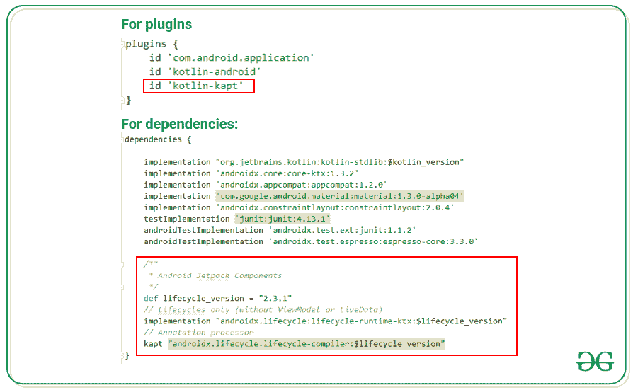
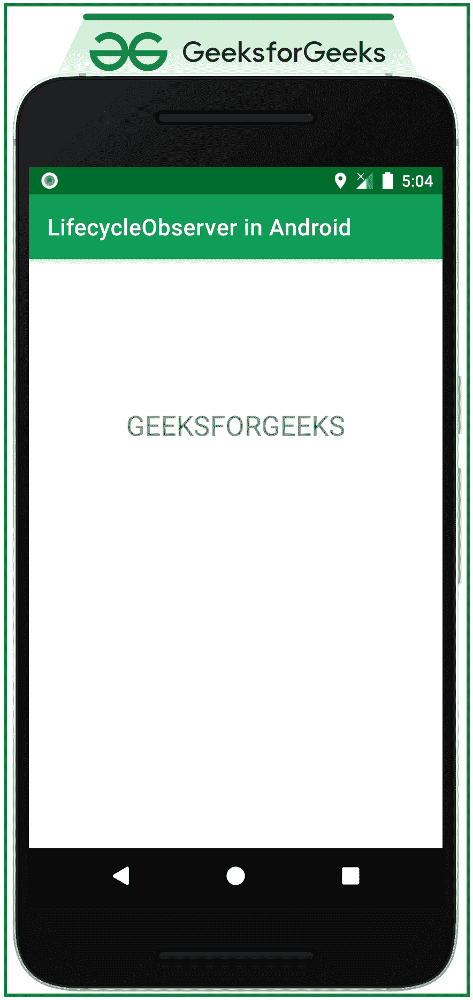

# 生活周期在安卓系统中进行活动

> 原文:[https://www . geesforgeks . org/life cycleeobserver-with-activities-in-Android/](https://www.geeksforgeeks.org/lifecycleobserever-with-activities-in-android/)

LifecycleObserever is Observer 是 Jetpack 架构组件之一，是一个根据生命周期所有者的生命周期更改来观察和执行指定任务的界面。例如，MainActivity 有它自己的生命周期，它本身就是生命周期所有者，我们可以实现 LifecycleObserever 接口，并将这个观察器附加到 MainActivity 上，以便在 MainActivity 的生命周期发生变化时可以执行某些操作。在本文中，已经演示了生命周期所有者的生命周期发生变化时，生命周期所有者如何执行任务。请看下面的视频，了解讨论的概况。

<video class="wp-video-shortcode" id="video-598505-1" width="640" height="360" preload="metadata" controls=""><source type="video/mp4" src="https://media.geeksforgeeks.org/wp-content/uploads/20210502184728/Untitled.mp4?_=1">[https://media.geeksforgeeks.org/wp-content/uploads/20210502184728/Untitled.mp4](https://media.geeksforgeeks.org/wp-content/uploads/20210502184728/Untitled.mp4)</video>

> **注意:**这个讨论是使用 Kotlin 语言实现的。

### **为安卓应用程序实现生命周期加速的步骤**

**第一步:创建一个空的活动项目**

创建一个空的活动安卓工作室项目，选择 **Kotlin** 作为编程语言。参考[安卓|如何在安卓工作室创建/启动新项目？](https://www.geeksforgeeks.org/android-how-to-create-start-a-new-project-in-android-studio/)

**步骤 2:添加所需的依赖关系**

将以下依赖项添加到应用程序级的渐变文件中。依赖关系属于生命周期

> //仅生命周期(无视图模型或实时数据)
> 
> **实现“androidx . life cycle:life cycle-runtime-ktx:2 . 3 . 1”**
> 
> //注释处理器
> 
> **kapt“androidx . life cycle:life cycle-编译器:2 . 3 . 1”**
> 
> **注:**未来版本可能会有所不同。

并在应用级梯度文件下的插件中启用**插件。**

> **插件{**
> 
> **id 'com.android.application '**
> 
> **kot Lin Android id**
> 
> **id ' kot Lin-kapt '**
> 
> **}**

**如果无法获得如何添加依赖项，请看下面的图片。**

****

****第三步:使用 acitivity _ main.xml 文件****

**应用程序的主要布局是 activity_main.xml 文件只包含一个 TextView。要实现用户界面，在 **activity_main.xml** 文件中调用以下代码。**

## **可扩展标记语言**

```
<?xml version="1.0" encoding="utf-8"?>
<LinearLayout 
    xmlns:android="http://schemas.android.com/apk/res/android"
    xmlns:app="http://schemas.android.com/apk/res-auto"
    xmlns:tools="http://schemas.android.com/tools"
    android:layout_width="match_parent"
    android:layout_height="match_parent"
    android:orientation="vertical"
    tools:context=".MainActivity">

    <TextView
        android:layout_width="wrap_content"
        android:layout_height="wrap_content"
        android:layout_gravity="center"
        android:layout_marginTop="128dp"
        android:text="GEEKSFORGEEKS"
        android:textSize="24sp" />

</LinearLayout>
```

****输出 UI:****

****

****第 4 步:创建一个实现 LifecycleObserver 的类****

**创建一个类 **MainActivityObserver.kt** ，该类实现 LifecycleObserver 接口，该接口包含在所有者生命周期发生变化时执行分配任务的功能。在这种情况下，所有者是 **MainActivity.kt** ，它有自己的生命周期。通过下面的课程，观察**主活动**生命周期的变化。在 **MainActivityObserver.kt** 文件中调用以下代码。**

## **我的锅**

```
import android.util.Log
import androidx.lifecycle.Lifecycle
import androidx.lifecycle.LifecycleObserver
import androidx.lifecycle.OnLifecycleEvent

class MainActivityObserver : LifecycleObserver {

    private val TAG = javaClass.simpleName

    // To observe the onCreate state of MainActivity
    // and perform the assigned tasks
    @OnLifecycleEvent(Lifecycle.Event.ON_CREATE)
    fun onCreatePerformTask() {
        // here for demonstration purpose the Log messages are printed in logcat
        // one may perform their own custom tasks
        Log.i(TAG, "I\'m inside Observer of MainActivity ON_CREATE")
    }

    // To observe the onResume state of MainActivity
    // and perform the assigned tasks
    @OnLifecycleEvent(Lifecycle.Event.ON_RESUME)
    fun onResumePerformTask() {
        // here for demonstration purpose the Log messages are printed in logcat
        // one may perform their own custom tasks
        Log.i(TAG, "I\'m inside Observer of MainActivity ON_RESUME")
    }
}
```

****步骤 5:将 MainActivityObserver 附加到 MainActivity.kt 文件****

**现在需要通过附加观察者 **MainActivityObserver** 来通知活动，以便在活动状态改变时可以执行所需的任务。在 **MainActivity.kt** 文件中调用以下代码。**

## **我的锅**

```
import android.os.Bundle
import androidx.appcompat.app.AppCompatActivity

class MainActivity : AppCompatActivity() {
    override fun onCreate(savedInstanceState: Bundle?) {
        super.onCreate(savedInstanceState)
        setContentView(R.layout.activity_main)

        // attach the MainActivityObserver 
          // to the MainActivity as follows
        lifecycle.addObserver(MainActivityObserver())
    }
}
```

****输出:****

**这里输出显示在[日志文件](https://www.geeksforgeeks.org/logcat-window-in-android-studio/)中，因为在观察者类中有一个**信息**日志语句。**

**<video class="wp-video-shortcode" id="video-598505-2" width="640" height="360" preload="metadata" controls=""><source type="video/mp4" src="https://media.geeksforgeeks.org/wp-content/uploads/20210502184728/Untitled.mp4?_=2">[https://media.geeksforgeeks.org/wp-content/uploads/20210502184728/Untitled.mp4](https://media.geeksforgeeks.org/wp-content/uploads/20210502184728/Untitled.mp4)</video>**