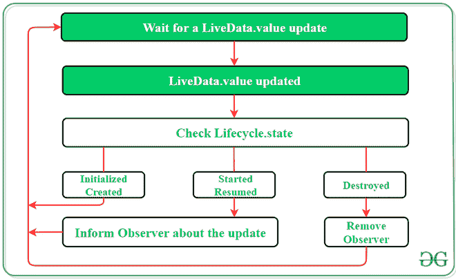

# 安卓架构组件中的 LiveData

> 原文:[https://www . geesforgeks . org/livedata-in-Android-architecture-components/](https://www.geeksforgeeks.org/livedata-in-android-architecture-components/)

LiveData 是[安卓架构组件](https://www.geeksforgeeks.org/jetpack-architecture-components-in-android/)之一。LiveData 是一个**可观察数据持有者类**。这里的可观察是什么意思可观察意味着实时数据可以被其他组件观察到，比如[活动](https://www.geeksforgeeks.org/introduction-to-activities-in-android/)和[片段](https://www.geeksforgeeks.org/introduction-fragments-android/) (Ui 控制器)。LiveData 最重要的一点是，它了解观察者的生命周期，比如活动或片段。这意味着实时数据只更新处于活动生命周期状态的应用程序组件，如活动或片段。实时数据通知处于“已启动”或“已恢复”生命周期状态的观察者(活动或片段)。注册观看 LiveData 对象的非活动观察者不会收到有关更改的通知。这里，非活动观察器是指不处于“已启动”或“已恢复”状态的观察器。我们可以注册一个观察者，该观察者与一个实现 LifecycleOwner 接口的对象配对，我们将在我们的示例中看到这个接口。当相应的生命周期对象的状态变为“已销毁”时，这种关系允许观察者被移除。

这个组件是一个可观察的数据保持器类，即包含的值可以被观察到。LiveData 是一个生命周期感知组件，因此它根据其他应用程序组件的生命周期状态来执行其功能。此外，如果观察者的生命周期状态是活动的，即“已启动”或“已恢复”，则 LiveData 只会更新应用程序组件。LiveData 总是在进行任何更新之前检查观察者的状态，以确保观察者必须处于活动状态才能接收到它。如果观察者的生命周期状态被破坏，LiveData 能够移除它，从而避免内存泄漏。它使数据同步的任务变得更加容易。



需要通过 LiveData 实现**激活**和**激活**方法:

> *类位置实时数据(上下文:Context)*
> 
> *: LiveData <位置>()、AnkoLogger、LocationListener {*
> 
> *私人 val location manager:location manager =*
> 
> *context.getSystemService(上下文。位置 _ 服务)作为位置管理器*
> 
> *覆盖 fun onActive() {*
> 
> *信息(“主动”)*
> 
> *location manager . requestlocationupdates(location manager。GPS_PROVIDER，0，0f，this)*
> 
> *}*
> 
> *取代乐趣的皂苷活性(){*
> 
> *信息(“皂苷活性”)*
> 
> *location manager . remove updates(此)*
> 
> *}*
> 
> *// …。*
> 
> *}*

为了观察一个实时数据组件**观察者(生命周期所有者，观察者< T > )** 方法被调用:

> *fun observer location(){*
> 
> *值位置=位置生活数据(本)*
> 
> *位置观察(这个，*
> 
> *观察者{位置- >*
> 
> *信息(“位置:$位置”)*
> 
> *})*
> 
> *}*
> 
> *}*

### 安卓应用中的实现

在这个例子中，我们将创建一个简单的计数器应用程序，它只计算 5 秒，你可以使用 LiveData 做任何事情，但是现在让我们构建这个小应用程序。

**步骤 1:在你的 build.gradle 文件**中添加这些依赖项

> def lifecycle_version = "2.3.0 "
> 
> // ViewModel
> 
> 实现“androidx . life cycle:life cycle-view model-ktx:$ life cycle _ version”
> 
> 实时数据
> 
> 实现“androidx . life cycle:life cycle-live data-ktx:$ life cycle _ version”
> 
> 实现“androidx . life cycle:life cycle-runtime-ktx:$ life cycle _ version”
> 
> 实现“androidx.core:core-ktx:1.3.2”

**步骤 2:使用 activity_main.xml 文件**

导航到**应用程序> res >布局> activity_main.xml** 并将下面的代码添加到该文件中。下面是 **activity_main.xml** 文件的代码。

## 可扩展标记语言

```kt
<?xml version="1.0" encoding="utf-8"?>
<androidx.constraintlayout.widget.ConstraintLayout
    xmlns:android="http://schemas.android.com/apk/res/android"
    xmlns:app="http://schemas.android.com/apk/res-auto"
    xmlns:tools="http://schemas.android.com/tools"
    android:layout_width="match_parent"
    android:layout_height="match_parent"
    tools:context=".MainActivity">

    <TextView
        android:id="@+id/textView"
        android:layout_width="wrap_content"
        android:layout_height="wrap_content"
        android:text="0"
        android:textSize="25sp"
        app:layout_constraintBottom_toBottomOf="parent"
        app:layout_constraintEnd_toEndOf="parent"
        app:layout_constraintStart_toStartOf="parent"
        app:layout_constraintTop_toTopOf="parent" />

</androidx.constraintlayout.widget.ConstraintLayout>
```

**第三步:**创建一个 Kotlin 类文件**MainActivity view model . kt .**我们的 MainActivity 类文件扩展了 **ViewModel** 类。

> ***参考本文:*** [*如何在 Android Studio 中创建类？*](https://www.geeksforgeeks.org/how-to-create-classes-in-android-studio/)

## 我的锅

```kt
import androidx.lifecycle.ViewModel

class MainActivityViewModel:ViewModel() {

    private val _seconds = MutableLiveData<Int>()
    private val _finished = MutableLiveData<Boolean>()

    // getter method for seconds var
    fun seconds():LiveData<Int>{
        return _seconds
    }

    // getter method for finished var
    fun finished():LiveData<Boolean>{
        return _finished
    }

    // Counter method that uses CountDownTimer()
    fun startCounter(){

        // you can change the millisInFuture value
        object : CountDownTimer(5000, 100) {
            override fun onTick(millisUntilFinished: Long) {
                val time = millisUntilFinished / 1000

                // setting the count value
                _seconds.value = time.toInt()
            }

            override fun onFinish() {
                 // if millisInFuture completed
                 // it set the value true
                _finished.value = true
            }
        }.start()
    }
}
```

> **注**:这里我们使用的是可变数据，没错。但问题是为什么？因为已经有 LiveData 可用，所以 MutableLiveData 扩展了 LiveData 类，两个函数 setValue()和 postValue()是公开可用的。

**第 4 步:使用**T2【主活动. kt】文件

转到 **MainActivity.kt** 文件，参考以下代码。下面是 **MainActivity.kt** 文件的代码。

## 我的锅

```kt
class MainActivity : AppCompatActivity() {
    override fun onCreate(savedInstanceState: Bundle?) {
        super.onCreate(savedInstanceState)
        setContentView(R.layout.activity_main)

        // creating instance of our ViewModel class
        val viewModel = ViewModelProvider(this).get(MainActivityViewModel::class.java)

        // calling start counter methods which is in our viewmodel class
        viewModel.startCounter()

        // observing the second value of our view model class
        viewModel.seconds().observe(this, Observer {

            // setting textview value
            textView.text = it.toString()
        })

        viewModel.finished().observe(this, Observer {
            if(it){
                // if count time finished it set the value
                textView.text = "Finished"
            }
        })
    }
}
```

> **注意:**这里里面的 Observe()“这”是生命周期所有者正如我们上面讨论的观察值，我们应该传递生命周期所有者。这里的意思是主活动，也就是观察者。

**输出:**

<video class="wp-video-shortcode" id="video-577452-1" width="640" height="360" preload="metadata" controls=""><source type="video/mp4" src="https://media.geeksforgeeks.org/wp-content/uploads/20210321131117/livedata.mp4?_=1">[https://media.geeksforgeeks.org/wp-content/uploads/20210321131117/livedata.mp4](https://media.geeksforgeeks.org/wp-content/uploads/20210321131117/livedata.mp4)</video>

### 使用实时数据的优势

*   **无需每次都更新 UI:**LiveData 遵循观察者模式。当发生任何变化时，LiveData 会通知观察者对象。
*   **无内存泄漏:**观察者绑定到 Lifecycle 对象，当其关联的生命周期被破坏时，观察者会自行清理。
*   **不再进行人工生命周期处理:** UI 组件只是观察相关数据，并不停止或恢复观察。LiveData 会自动管理所有这些，因为它在观察时会意识到相关的生命周期状态变化。
*   **正确的配置更改:**如果由于配置更改(如设备轮换)而重新创建了活动或片段，它会立即接收最新的可用数据。