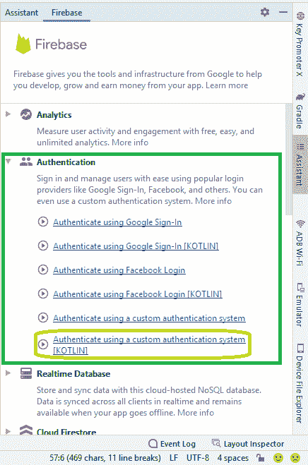
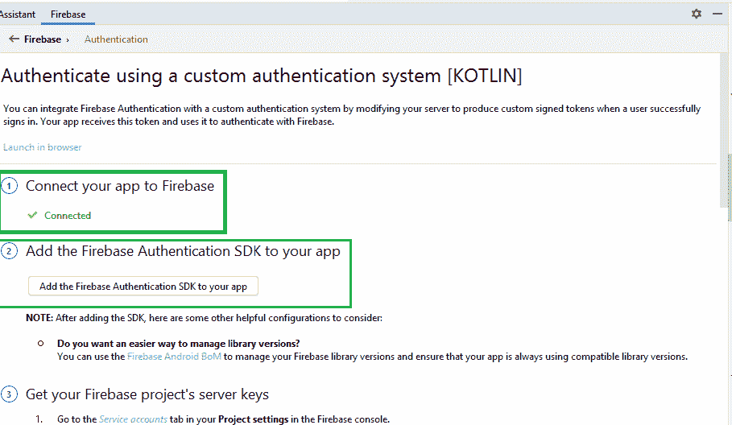

# 使用 Kotlin 中的 Firebase 在安卓系统中登录注册

> 原文:[https://www . geeksforgeeks . org/登录-注册-在安卓系统中使用-firebase-in-kotlin/](https://www.geeksforgeeks.org/login-and-registration-in-android-using-firebase-in-kotlin/)

Firebase 是一个移动和 web 应用程序开发平台。它提供 web 应用程序或移动应用程序可能需要的服务。Firebase 提供电子邮件和密码身份验证，无需为用户身份验证构建后端。在本文中，我们将学习 firebase 身份验证功能。使用它，我们可以在我们的应用程序中创建一个登录和注册页面。

### 逐步实施

**第一步:**首先，我们需要[将我们的项目与 Firebase](https://www.geeksforgeeks.org/adding-firebase-to-android-app/) 连接起来。为此，我们需要转到工具选择 firebase 选项



。

**第二步**:现在我们需要 Firebase 身份验证功能，在身份验证中，我们有不同的选项。在本文中，我们将使用**使用自定义身份验证系统**进行身份验证。我们将点击连接。并将 firebase 身份验证软件开发工具包添加到您的应用程序中。



**步骤 3:** 现在我们将为注册活动创建一个 XML 布局。

## 可扩展标记语言

```
<?xml version="1.0" encoding="utf-8"?>
<androidx.constraintlayout.widget.ConstraintLayout 
    xmlns:android="http://schemas.android.com/apk/res/android"
    xmlns:app="http://schemas.android.com/apk/res-auto"
    xmlns:tools="http://schemas.android.com/tools"
    android:layout_width="match_parent"
    android:layout_height="match_parent">

    <LinearLayout
        android:id="@+id/linearLayout"
        android:layout_width="0dp"
        android:layout_height="0dp"
        android:orientation="vertical"
        android:padding="15dp"
        android:paddingTop="40dp"
        android:paddingBottom="40dp"
        app:layout_constraintBottom_toTopOf="@+id/imageView2"
        app:layout_constraintEnd_toEndOf="parent"
        app:layout_constraintStart_toStartOf="parent"
        app:layout_constraintTop_toTopOf="parent">

        <EditText
            android:id="@+id/etSEmailAddress"
            android:layout_width="match_parent"
            android:layout_height="wrap_content"
            android:layout_marginLeft="15dp"
            android:layout_marginTop="30dp"
            android:layout_marginRight="15dp"
            android:autofillHints="emailAddress"
            android:ems="10"
            android:hint="@string/email"
            android:inputType="textEmailAddress"
            android:minHeight="48dp"
            android:textColorHint="#757575" />

        <EditText
            android:id="@+id/etSPassword"
            android:layout_width="match_parent"
            android:layout_height="wrap_content"
            android:layout_marginLeft="15dp"
            android:layout_marginTop="15dp"
            android:layout_marginRight="15dp"
            android:autofillHints="password"
            android:ems="10"
            android:hint="@string/password"
            android:inputType="textPassword"
            android:minHeight="48dp"
            android:textColorHint="#757575" />

        <EditText
            android:id="@+id/etSConfPassword"
            android:layout_width="match_parent"
            android:layout_height="wrap_content"
            android:layout_marginLeft="15dp"
            android:layout_marginTop="15dp"
            android:layout_marginRight="15dp"
            android:autofillHints="password"
            android:ems="10"
            android:hint="@string/confirm_password"
            android:inputType="textPassword"
            android:minHeight="48dp"
            android:textColorHint="#757575"
            tools:ignore="TextContrastCheck" />

        <Button
            android:id="@+id/btnSSigned"
            android:layout_width="match_parent"
            android:layout_height="wrap_content"
            android:layout_margin="15dp"
            android:background="@drawable/btn_primary"
            android:text="@string/signed" />

        <TextView
            android:id="@+id/tvRedirectLogin"
            android:layout_width="match_parent"
            android:layout_height="wrap_content"
            android:gravity="center_horizontal"
            android:layout_margin="10dp"
            android:text="@string/already_have_an_account_login"
            android:textColor="#18206F"
            android:textSize="16sp" />
    </LinearLayout>

</androidx.constraintlayout.widget.ConstraintLayout>
```

**第 4 步**:现在我们来为注册活动编码

在注册活动中，我们将创建一个 FirebaseAuth 对象，并使用它调用**createuserwithmailand password(电子邮件，传递)**函数。并使用**添加完成 Listener()** 功能进行检查，如果响应成功则显示[吐司](https://www.geeksforgeeks.org/android-what-is-toast-and-how-to-use-it-with-examples/)。

## 我的锅

```
package com.ayush.quizapp.activity.activity

import android.content.Intent
import androidx.appcompat.app.AppCompatActivity
import android.os.Bundle
import android.widget.Button
import android.widget.EditText
import android.widget.TextView
import android.widget.Toast
import com.ayush.quizapp.R
import com.google.firebase.auth.FirebaseAuth
import com.google.firebase.auth.ktx.auth
import com.google.firebase.ktx.Firebase

class SignUpActivity : AppCompatActivity() {
    lateinit var etEmail: EditText
    lateinit var etConfPass: EditText
    private lateinit var etPass: EditText
    private lateinit var btnSignUp: Button
    lateinit var tvRedirectLogin: TextView

      // create Firebase authentication object
    private lateinit var auth: FirebaseAuth  

    override fun onCreate(savedInstanceState: Bundle?) {

        super.onCreate(savedInstanceState)
        setContentView(R.layout.activity_sign_up)

          // View Bindings
        etEmail = findViewById(R.id.etSEmailAddress)
        etConfPass = findViewById(R.id.etSConfPassword)
        etPass = findViewById(R.id.etSPassword)
        btnSignUp = findViewById(R.id.btnSSigned)
        tvRedirectLogin = findViewById(R.id.tvRedirectLogin)

        // Initialising auth object
        auth = Firebase.auth   

        btnSignUp.setOnClickListener {
            signUpUser()
        }

        // switching from signUp Acitity to Login Activity
        tvRedirectLogin.setOnClickListener {
            val intent = Intent(this, LoginActivity::class.java)
            startActivity(intent)
        }

    }

    private fun signUpUser() {
        val email = etEmail.text.toString()
        val pass = etPass.text.toString()
        val confirmPassword = etConfPass.text.toString()

        // check pass
        if (email.isBlank() || pass.isBlank() || confirmPassword.isBlank()) {
            Toast.makeText(this, "Email and Password can't be blank", Toast.LENGTH_SHORT).show()
            return
        }

        if (pass != confirmPassword) {
            Toast.makeText(this, "Password and Confirm Password do not match", Toast.LENGTH_SHORT)
                .show()
            return
        }
        // If all credential are correct
        // We call createUserWithEmailAndPassword 
          // using auth object and pass the
          // email and pass in it.
        auth.createUserWithEmailAndPassword(email, pass).addOnCompleteListener(this) {
            if (it.isSuccessful) {
                Toast.makeText(this, "Successfully Singed Up", Toast.LENGTH_SHORT).show()
                finish()
            } else {
                Toast.makeText(this, "Singed Up Failed!", Toast.LENGTH_SHORT).show()
            }
        }
    }
}
```

**第五步:**现在我们来设计登录活动页面。这是 XML 代码

## 可扩展标记语言

```
<?xml version="1.0" encoding="utf-8"?>
<androidx.constraintlayout.widget.ConstraintLayout 
    xmlns:android="http://schemas.android.com/apk/res/android"
    xmlns:app="http://schemas.android.com/apk/res-auto"
    xmlns:tools="http://schemas.android.com/tools"
    android:layout_width="match_parent"
    android:layout_height="match_parent"
    tools:context=".activity.activity.LoginActivity">

    <LinearLayout
        android:layout_width="0dp"
        android:layout_height="0dp"
        app:layout_constraintBottom_toTopOf="@+id/imageView3"
        android:orientation="vertical"
        app:layout_constraintEnd_toEndOf="parent"
        app:layout_constraintStart_toStartOf="parent"
        app:layout_constraintTop_toTopOf="parent">

        <EditText
            android:id="@+id/etEmailAddress"
            android:layout_width="match_parent"
            android:layout_height="wrap_content"
            android:layout_marginLeft="15dp"
            android:layout_marginTop="30dp"
            android:layout_marginRight="15dp"
            android:autofillHints="emailAddress"
            android:ems="10"
            android:hint="@string/email"
            android:inputType="textEmailAddress"
            android:minHeight="48dp"
            android:textColorHint="#757575" />

        <EditText
            android:id="@+id/etPassword"
            android:layout_width="match_parent"
            android:layout_height="wrap_content"
            android:layout_marginLeft="15dp"
            android:layout_marginTop="15dp"
            android:layout_marginRight="15dp"
            android:autofillHints="password"
            android:ems="10"
            android:hint="@string/password"
            android:inputType="textPassword"
            android:minHeight="48dp"
            android:textColorHint="#757575" />

        <Button
            android:id="@+id/btnLogin"
            android:layout_width="match_parent"
            android:layout_height="wrap_content"
            android:layout_margin="15dp"
            android:background="@drawable/btn_primary"
            android:text="@string/login" />

        <TextView
            android:id="@+id/tvRedirectSignUp"
            android:layout_width="match_parent"
            android:layout_height="wrap_content"
            android:layout_margin="15dp"
            android:gravity="center_horizontal"
            android:text="@string/don_t_have_an_account_sign_in"
            android:textColor="#18206F"
            android:textSize="16sp" />

    </LinearLayout>

</androidx.constraintlayout.widget.ConstraintLayout>
```

**第 6 步:**现在我们将为登录活动编码

在登录活动中，我们将创建一个 FirebaseAuth 对象，使用它我们将调用**signiwithmailandpassword(email，pass)** 函数。并使用**addoncompletetelistener()**功能进行检查，如果响应成功则显示祝酒词。

## 我的锅

```
package com.ayush.quizapp.activity.activity

import android.content.Intent
import androidx.appcompat.app.AppCompatActivity
import android.os.Bundle
import android.widget.Button
import android.widget.EditText
import android.widget.TextView
import android.widget.Toast
import com.ayush.quizapp.R
import com.google.firebase.auth.FirebaseAuth

class LoginActivity : AppCompatActivity() {

    private lateinit var tvRedirectSignUp: TextView
    lateinit var etEmail: EditText
    private lateinit var etPass: EditText
    lateinit var btnLogin: Button

    // Creating firebaseAuth object
    lateinit var auth: FirebaseAuth

    override fun onCreate(savedInstanceState: Bundle?) {
        super.onCreate(savedInstanceState)
        setContentView(R.layout.activity_login)

          // View Binding
        tvRedirectSignUp = findViewById(R.id.tvRedirectSignUp)
        btnLogin = findViewById(R.id.btnLogin)
        etEmail = findViewById(R.id.etEmailAddress)
        etPass = findViewById(R.id.etPassword)

          // initialising Firebase auth object
        auth = FirebaseAuth.getInstance()

        btnLogin.setOnClickListener {
            login()
        }

        tvRedirectSignUp.setOnClickListener {
            val intent = Intent(this, SignUpActivity::class.java)
            startActivity(intent)  
            // using finish() to end the activity
            finish() 
        }
    }

    private fun login() {
        val email = etEmail.text.toString()
        val pass = etPass.text.toString()
        // calling signInWithEmailAndPassword(email, pass) 
          // function using Firebase auth object
        // On successful response Display a Toast
        auth.signInWithEmailAndPassword(email, pass).addOnCompleteListener(this) {
            if (it.isSuccessful) {
                Toast.makeText(this, "Successfully LoggedIn", Toast.LENGTH_SHORT).show()
            } else
                Toast.makeText(this, "Log In failed ", Toast.LENGTH_SHORT).show()
        }
    }

}
```

**输出:**

<video class="wp-video-shortcode" id="video-727177-1" width="640" height="360" preload="metadata" controls=""><source type="video/mp4" src="https://media.geeksforgeeks.org/wp-content/uploads/20211129235307/video_2021-11-29_23-50-32.mp4?_=1">[https://media.geeksforgeeks.org/wp-content/uploads/20211129235307/video_2021-11-29_23-50-32.mp4](https://media.geeksforgeeks.org/wp-content/uploads/20211129235307/video_2021-11-29_23-50-32.mp4)</video>