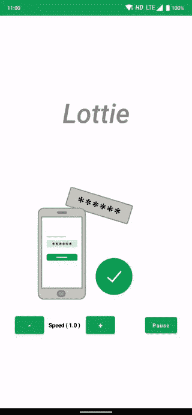
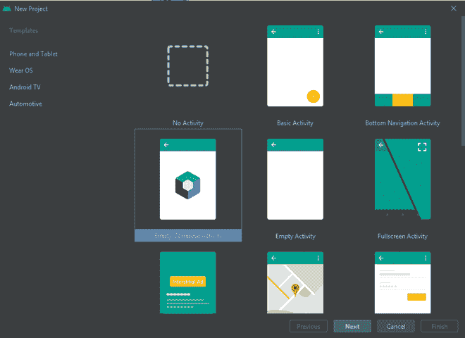
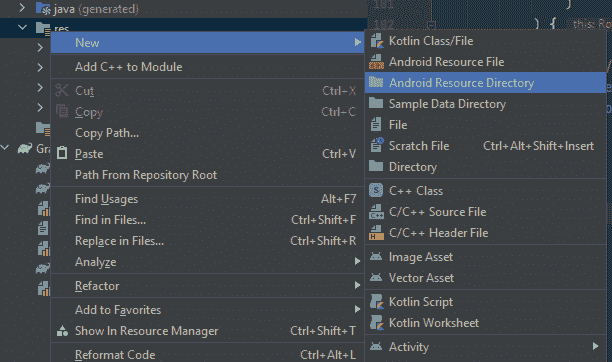

# Android jetpack 中的摔跤动画构成

> 原文:[https://www . geeksforgeeks . org/Lottie-animation-in-Android-jet pack-compose/](https://www.geeksforgeeks.org/lottie-animation-in-android-jetpack-compose/)

[洛蒂](https://www.geeksforgeeks.org/how-to-add-lottie-animation-in-an-android-app/)是一个很棒的库，可以将动画文件添加到你的应用程序中。两天前[喷气背包作曲](https://www.geeksforgeeks.org/basics-of-jetpack-compose-in-android/)稳定了下来，洛蒂也支持作曲。在本文中，我们将看到如何在 compose 应用程序中添加洛蒂动画。

### **这篇文章我们要构建什么？**

我们将建立一个简单的应用程序，显示洛蒂动画与暂停/播放和增加/减少速度按钮。下面给出了一个 GIF 示例，来了解一下我们将在本文中做什么。



**先决条件:**

*   [安卓知识。](https://www.geeksforgeeks.org/android-tutorial/)
*   对[喷气背包作曲](https://www.geeksforgeeks.org/basics-of-jetpack-compose-in-android/)有很好的了解。

### 逐步实施

**步骤 1:创建一个新项目(或在现有的合成项目中使用它)**

*   打开安卓工作室(必须是最新版本(> =2020.3.1)。
*   点击**新项目>空撰写活动。**
*   然后根据您的选择写下应用程序名和包名，并单击完成。等待 Gradle 构建完成。



**步骤 2:添加依赖关系**

打开 [构建 d.gradle(app)](https://www.geeksforgeeks.org/android-build-gradle/) 并添加以下依赖项。

> 实现“com.airbnb.android:洛蒂-compose:4.0.0”

**第三步:下载洛蒂文件放入项目**

右键点击 **res >新建>安卓资源目录。**



键入 **raw** 创建一个 raw 文件夹


现在前往[洛蒂](https://lottiefiles.com/)下载你最喜欢的动画或者使用这篇文章的动画(从[这里](https://github.com/sunny52525/GFG-articles/blob/master/lottie/app/src/main/res/raw/code.json)下载)。下载后拖放到原始文件夹。

**第四步:使用洛蒂动画**

创建一个可组合的函数 ***洛蒂示例()。**T3】*

## 我的锅

```kt
@Composable
fun LottieExample() {
  // codes to be added here
}
```

我们需要创造洛蒂的构图和进步状态。在同一个可组合中添加以下代码，请参考注释进行解释。

> **注意**:一定要(如果安卓工作室没有自动做)**导入 androidx.compose.runtime.***

创建一个保持速度和播放/暂停状态的状态。在函数中添加以下代码

## 我的锅

```kt
// to keep track if the animation is playing
// and play pause accordingly
var isPlaying by remember {
     mutableStateOf(true)
 }

// for speed
var speed by remember {
     mutableStateOf(1f)
 }
```

## 我的锅

```kt
// remember lottie composition, which
// accepts the lottie composition result
val composition by rememberLottieComposition(

        LottieCompositionSpec
              // here `code` is the file name of lottie file
              // use it accordingly
            .RawRes(R.raw.code)
    )

    // to control the animation
    val progress by animateLottieCompositionAsState(
        // pass the composition created above
        composition,

        // Iterates Forever
        iterations = LottieConstants.IterateForever,

        // pass isPlaying we created above,
        // changing isPlaying will recompose
        // Lottie and pause/play
        isPlaying = isPlaying,

        // pass speed we created above,
        // changing speed will increase Lottie
        speed = speed,

        // this makes animation to restart
        // when paused and play
        // pass false to continue the animation 
        // at which is was paused
        restartOnPlay = false

)
```